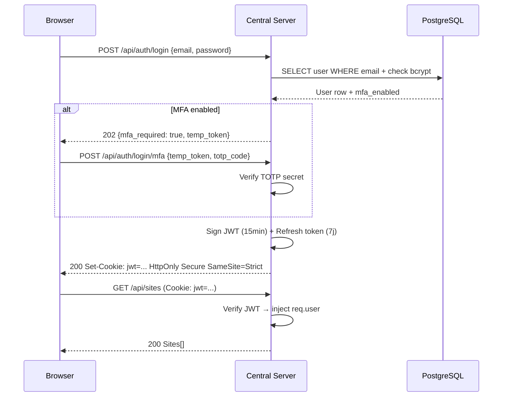
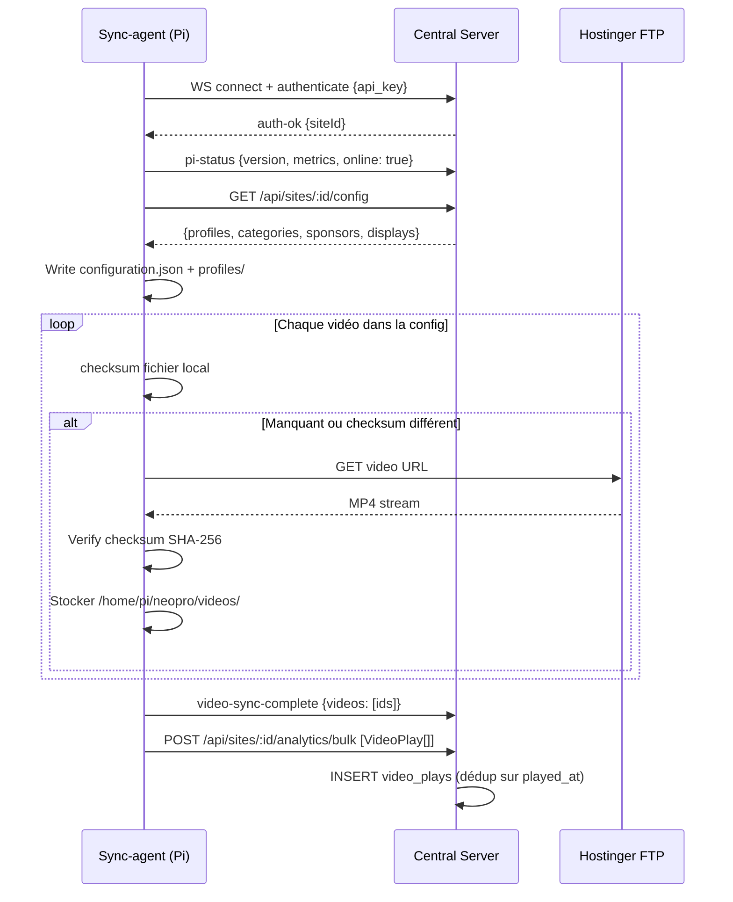
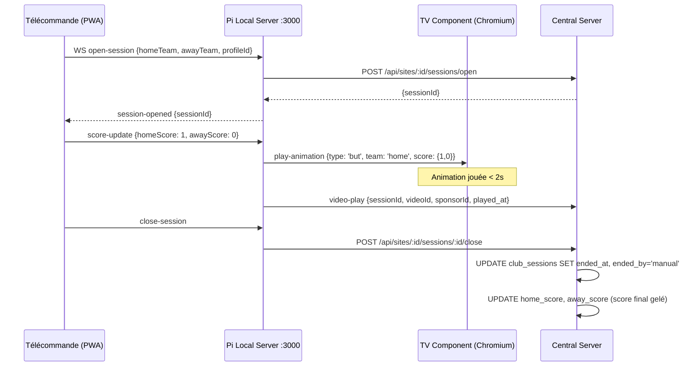
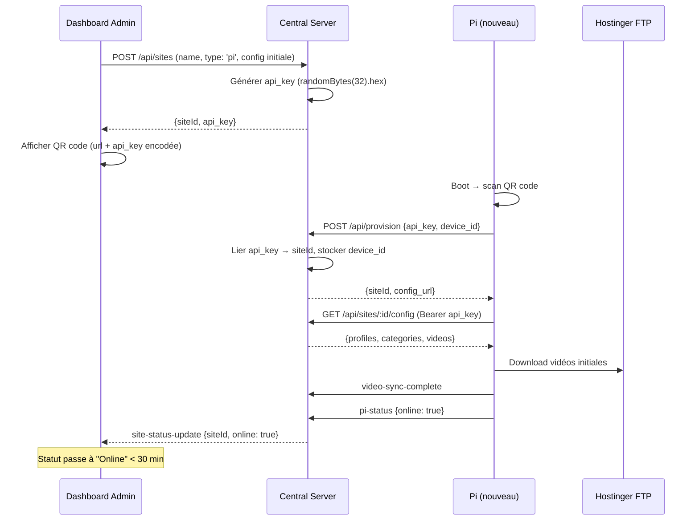

# MadXP — Document de Référence Produit & Technique

> **Document fondateur.** Décrit ce que la plateforme doit être construite pour faire.
> Sert de référence unique pour l'équipe de développement, le product management et les partenaires.
> Synthèse de : SAFe Portfolio · Specs · Proposals · ADRs · Architecture technique.
>
> **v3.0 — juin 2026** | Audience : équipe dev · PM · partenaires co-construction
> `DOIT` = obligatoire · `DEVRAIT` = recommandé · `PEUT` = optionnel V1

---

## Sommaire

1. [Vision & Stratégie](#1-vision--stratégie)
2. [Personae & Cas d'usage](#2-personae--cas-dusage)
3. [Modèles produit & Offre](#3-modèles-produit--offre)
4. [Architecture cible](#4-architecture-cible)
5. [Domaines fonctionnels — V1](#5-domaines-fonctionnels--v1)
6. [Domaines fonctionnels — V2 & Au-delà](#6-domaines-fonctionnels--v2--au-delà)
7. [Backlog SAFe (PI-1 → PI-3 + V2)](#7-backlog-safe-pi-1--pi-3--v2)
8. [Exigences non-fonctionnelles](#8-exigences-non-fonctionnelles)
9. [Contraintes](#9-contraintes)
10. [Risques ROAM](#10-risques-roam)
11. [Roadmap & Jalons](#11-roadmap--jalons)
12. [Ce qu'on ne construit pas — exclusions de périmètre](#12-ce-quon-ne-construit-pas--exclusions-de-périmètre)
13. [Critères d'acceptation clés (Given/When/Then)](#13-critères-dacceptation-clés-givenwhenthens)
14. [Définition de Done (DoD)](#14-définition-de-done-dod)
15. [Contrats d'interface](#15-contrats-dinterface)
16. [Modèle de données détaillé](#16-modèle-de-données-détaillé)
17. [Séquences critiques](#17-séquences-critiques)
18. [Charte technique équipe](#18-charte-technique-équipe)
19. [Glossaire](#19-glossaire)
20. [Annexes](#20-annexes)

---

## 1. Vision & Stratégie

### 1.1 Proposition de valeur

> **POUR** les clubs sportifs amateurs et sponsors locaux
> **QUI** veulent professionnaliser leur image et prouver leur ROI
> **MADXP** est une solution tout-en-un (boîtier + logiciel + support)
> **QUI** transforme les écrans de gymnases en outils de valorisation professionnels et en réseau publicitaire
> **CONTRAIREMENT À** PowerPoint, boucles USB, tableaux manuels qui ne génèrent aucun revenu
> **NOTRE SOLUTION** offre pilotage smartphone, rapports automatiques, et un réseau publicitaire mutualisé

### 1.2 OKRs 2026

| Thème Stratégique          | Objectif                                                                                                |
| -------------------------- | ------------------------------------------------------------------------------------------------------- |
| **TS1 — Monétisation**     | Permettre aux clubs de monétiser leurs sponsors et à MadXP de vendre de la régie publicitaire régionale |
| **TS2 — Expérience Match** | Faire de chaque match un événement professionnel (animations, score live, sponsors en boucle)           |
| **TS3 — Acquisition**      | Rendre l'onboarding d'un nouveau club autonome et réalisable en < 30 minutes                            |
| **TS4 — Excellence Ops**   | Piloter une flotte de 50+ boîtiers sans déplacement physique, avec supervision continue                 |

### 1.3 Value Streams

**OVS1 — Club to Screen** : Du moment où un club signe jusqu'à ce que le contenu tourne sur l'écran du gymnase.

```
Club signe → Boîtier envoyé → Installation 30 min → Config smartphone → Upload contenu → Sync Cloud→Pi → Diffusion
```

Lead time cible : **J+0** (même jour) après installation. Aujourd'hui : J+3 (config SSH manuelle).

**OVS2 — Sponsor to Impression** : Du moment où un sponsor veut de la visibilité jusqu'au rapport de ROI entre ses mains.

```
Sponsor s'inscrit → Upload spot → Validation admin → Rotation automatique → Diffusion matchs → Rapport PDF mensuel
```

Lead time cible : **< 1 jour** (self-service). Aujourd'hui : 1-2 semaines (manuel).

### 1.4 Positionnement marché

| Concurrent                 | Type                    | Force                      | Faiblesse vs MadXP                                        |
| -------------------------- | ----------------------- | -------------------------- | --------------------------------------------------------- |
| **Bodet Sport**            | LED hardware + logiciel | Cert FIBA, animations auto | Pas de cloud multi-tenant, pas de gestion flotte distante |
| **Stramatel**              | LED + apps Android      | Cert FFBB, partage social  | Pas de dashboard cloud, pilotage radio local              |
| **A2Display**              | Logiciel multi-secteur  | Multi-secteur              | Non spécialisé club, pas multi-tenant                     |
| **OBS Studio + bricolage** | Gratuit                 | Zéro coût                  | Temps bénévole, fragilité, 0 rapport, 0 support flotte    |

**Différenciateurs forts MadXP** :

1. SaaS cloud multi-tenant avec gestion de flotte
2. Mode offline garanti (boîtier autonome pendant un match)
3. Réseau publicitaire mutualisé (vente de régie sur la flotte)
4. Rapports de diffusion automatiques avec lien magique
5. Templates vidéo data-driven (animations personnalisées sans code)

---

## 2. Personae & Cas d'usage

| #   | Persona                           | Contexte                                            | Besoin principal                                                                      |
| --- | --------------------------------- | --------------------------------------------------- | ------------------------------------------------------------------------------------- |
| P1  | **Responsable partenariats club** | Bureau ou domicile, accès dashboard                 | Gérer ses sponsors, voir les rapports, valoriser ses partenaires                      |
| P2  | **Staff club / bénévole terrain** | Bord de terrain, smartphone, Wi-Fi gymnase instable | Déclencher but, score, animations — sans compétence technique                         |
| P3  | **Super admin / Operator**        | Bureau, accès complet                               | Piloter la flotte, faire le support à distance, gérer les abonnements                 |
| P4  | **Sponsor local**                 | Bureau, accès portail dédié                         | Voir ses preuves de diffusion, renouveler en confiance                                |
| P5  | **Annonceur régional**            | Bureau, accès portail régie                         | Acheter des packs de gymnases, cibler géographiquement, recevoir un rapport consolidé |
| P6  | **Agence**                        | Dashboard agence                                    | Gérer les campagnes de ses clients sur plusieurs clubs                                |
| P7  | **Spectateur tribune**            | Smartphone en match                                 | Scanner QR code, participer à un jeu live _(V2)_                                      |

### Flux clés bout en bout

**Flux A — Match animé par le staff :**
Staff ouvre télécommande → configure équipes → démarre session → saisit événements (but, score) → animations à l'écran en < 2s → ferme session → historique archivé → sponsor peut filtrer ses stats "pendant le match".

**Flux B — Sponsor démontre son ROI :**
Sponsor reçoit lien magique → consulte rapport PDF (diffusions, durée, taux complétion) → compare ses périodes → renouvelle.

**Flux C — Annonceur régional lance une campagne :**
Annonceur crée compte → sélectionne pack (10 gymnases, Bretagne) → uploade son spot → paie via Stripe → spot tourne en rotation → reçoit rapport consolidé mensuel.

**Flux D — Admin déploie une mise à jour flotte :**
Admin push nouveau firmware → déploiement canary (5 boîtiers) → validation automatique → propagation à la flotte → si échec = rollback automatique.

---

## 3. Modèles produit & Offre

### 3.1 Deux modes de déploiement

|                         | **Mode Pi (boîtier)**                                      | **Mode SaaS (navigateur)**                 |
| ----------------------- | ---------------------------------------------------------- | ------------------------------------------ |
| Terminal                | Raspberry Pi 4/5 + TV HDMI                                 | Navigateur (TV connectée, Fire Stick, PC)  |
| Autonomie               | ✅ Hors-ligne entre deux connexions                        | ❌ Internet permanent requis               |
| Source de vérité config | Pi + Cloud (cloud-wins aujourd'hui)                        | Cloud uniquement                           |
| Argument de vente       | "TV interactive sans dépendance internet pendant le match" | "Zéro matériel, opérationnel en 5 minutes" |
| Admin locale            | ✅ :8080 accessible offline                                | ❌ Non applicable                          |

_Note : les deux modes partagent le même moteur de diffusion, le même backend, et le même dashboard. La différence est uniquement dans la stratégie de délivrance du contenu au terminal (ADR-069)._

### 3.2 Paliers d'abonnement

| Palier      | Prix annuel | Ce qu'il débloque                                                                                    | Persona cible                  |
| ----------- | ----------- | ---------------------------------------------------------------------------------------------------- | ------------------------------ |
| **Play**    | ~790 €      | Boucle vidéo, player web                                                                             | Découverte SaaS                |
| **Club**    | ~1 500 €    | + Télécommande, sessions match, portail club, image→vidéo                                            | Club standard avec matchs      |
| **Pro** ⭐  | ~2 100 €    | + Multi-profils, rotation pondérée, plages horaires, portail sponsor, studio templates, watermark    | Club avec sponsors à valoriser |
| **Premium** | ~3 000 €    | + Multi-écrans, analytics 90j + export, diagnostic distant, marque blanche, studio club, support 24h | Club premium ou multi-sites    |

**Add-ons annuels :** marque blanche 500 €, double écran 350 €, profil supplémentaire 500 €, boîtier additionnel 500 € + 30 €/mois.

**Prestations one-shot :** Pack Media Day 2 500 €, template club 700 €, motion design 800 €, audit partenariat 1 000 €.

**Régie publicitaire (E-11) :** modèle distinct — packs de gymnases vendus à des annonceurs régionaux (hors abonnement club). Revenue split : 90 % MadXP / 10 % club hébergeant la diffusion.

---

## 4. Architecture cible

### 4.1 Vue 3-tiers

```
┌────────────────────────────────────────────────────────────────────┐
│                        DASHBOARD WEB                               │
│   Angular 20 — standalone components                               │
│   Admin central · Portails club/sponsor/agence · SAFe dashboard    │
└──────────────────────────┬─────────────────────────────────────────┘
                           │ API REST (HTTPS) + WebSocket (Socket.IO)
┌──────────────────────────▼─────────────────────────────────────────┐
│                       CLOUD — NOYAU                                │
│   Node.js 20 / Express / TypeScript strict                         │
│   PostgreSQL 18 (Railway) · Stockage FTP (Hostinger)               │
│                                                                    │
│   Auth · Multi-tenant · Contenus · Régie · Analytics               │
│   Sessions match · Abonnements · OTA · Alertes · Métriques         │
└──────────┬──────────────────────────────┬──────────────────────────┘
           │ WebSocket (sync-agent)        │ URL directe (SaaS)
┌──────────▼──────────┐         ┌─────────▼──────────────────────────┐
│  TERMINAL PI (edge) │         │      TERMINAL SAAS / RETAIL        │
│  Raspberry Pi 4/5   │         │      Navigateur (TV, Fire Stick)   │
│                     │         │                                    │
│  Sync-agent (JS)    │         │  Lit contenu via URL FTP directe   │
│  Local server :3000 │         │  Dépend cloud en permanence        │
│  Admin :8080        │         │                                    │
│  Kiosk Chromium     │         │                                    │
│  Hotspot Wi-Fi      │         │                                    │
│  Autonome offline   │         │                                    │
└─────────────────────┘         └────────────────────────────────────┘
```

### 4.2 Principes architecturaux fondamentaux

**Delivery Strategy Pattern (ADR-069)** : le noyau cloud expose un registre de stratégies de délivrance. `deliveryStrategyRegistry.resolve(site)` retourne la bonne stratégie selon `site_type` :

- `PiSocketStrategy` → commandes via WebSocket + sync-agent Pi
- `SaasDirectStrategy` → URLs directes (pas de sync)
- Extension future : stratégie retail, LED, etc.

_Règle : ajouter un type de terminal = ajouter une stratégie. Ne jamais bifurquer le noyau pour un terminal spécifique._

**Edge-cloud separation (ADR-001)** : le terminal Pi est autonome. Il ne dépend du cloud que pour bootstrap, sync périodique, et commandes. En live, il n'y a aucune dépendance réseau.

**Multi-tenant (ADR-005)** : isolation par **Row Level Security PostgreSQL native** (`ENABLE ROW LEVEL SECURITY` + `CREATE POLICY`, fonctions `current_site_id()` / `is_admin()`) — pas seulement un filtre applicatif. ✅ vérifié dans `migrations/enable-row-level-security.sql`.

> ⚠️ **Précision (état actuel)** : l'isolation RLS est aujourd'hui **site + rôle**, **pas `org_id`** — il n'existe ni colonne `org_id` ni table `orgs` en base. Le cloisonnement **par organisation** (et l'isolation `operator` → ses seuls sites) est un **objectif cible non encore garanti** (cf. risque R-10 et chantier transverse « Cloisonnement operator »). Toute exigence de séparation multi-organisations doit donc être conçue, pas supposée acquise.

**Cloud-wins aujourd'hui** : lors d'un conflit config Pi/cloud, le cloud écrase le Pi. Le mécanisme Pi-owns (ADR-120) est spécifié mais pas encore implémenté — à arbitrer en Phase 2.

**Repository pattern (obligatoire)** : 0 `query()` direct dans les controllers. Toutes les données passent par les repositories. ESLint bloquant actif.

### 4.3 Modèle de données clés

| Entité                     | Rôle                                                            | Source de vérité        |
| -------------------------- | --------------------------------------------------------------- | ----------------------- |
| `sites`                    | Un lieu équipé (club, vitrine)                                  | Cloud                   |
| `config_profiles`          | Configuration nommée d'un site (catégories + sponsors + plages) | Cloud (sync → Pi)       |
| `site_videos`              | Vidéos déployées sur un site                                    | Cloud (sync → Pi local) |
| `site_sponsors`            | Sponsors locaux d'un site avec poids                            | Cloud                   |
| `video_plays`              | Chaque diffusion (analytics)                                    | Pi → bufferisé → Cloud  |
| `club_sessions`            | Sessions match (équipes, score, durée)                          | Cloud (via Pi)          |
| `advertisers` / `agencies` | Annonceurs et agences (régie)                                   | Cloud                   |
| `recurring_schedules`      | Tâches CRON (auto-close session, rapports…)                     | Cloud                   |
| `alerts`                   | Alertes flotte (dédoublonnées, ADR-111)                         | Cloud                   |

---

## 5. Domaines fonctionnels — V1

> Chaque domaine liste ses exigences (`EF-XXX`), ses critères d'acceptation principaux, et ses références (SPEC / ADR / PROP).

---

### DOM-01 — Authentification & Sécurité

**Personas** : Tous (P1 → P6) + boîtiers Pi (machine)
**User story** : En tant qu'utilisateur de la plateforme, je veux que mon espace soit strictement séparé de celui des autres tenants et que mes données ne soient accessibles qu'à moi, afin de faire confiance à la plateforme avec les données de mes sponsors et de mes clubs.
**Résultat attendu** : Zéro fuite cross-tenant. Un sponsor ne voit jamais les données d'un autre club.

**Description** : Tout accès à la plateforme est authentifié et scoped au rôle de l'utilisateur. L'auth supporte les sessions web (dashboard) et les tokens machine (boîtiers Pi).

| #         | Exigence                                                                      | Pourquoi                                                                                                                                                                                                                                                   |
| --------- | ----------------------------------------------------------------------------- | ---------------------------------------------------------------------------------------------------------------------------------------------------------------------------------------------------------------------------------------------------------- |
| EF-SEC-01 | Authentification par JWT HttpOnly cookie (web) et Bearer token (API/Pi)       | Le cookie HttpOnly est inaccessible au JS — bloque le vol de token par XSS. Le Bearer token permet l'auth machine (Pi) sans navigateur.                                                                                                                    |
| EF-SEC-02 | Double authentification TOTP obligatoire pour super_admin et operator         | Un mot de passe compromis (phishing, fuite) ne suffit pas à prendre le contrôle de la flotte. _(État actuel : MFA opt-in pour operator/super_admin, forcé seulement pour `admin` — l'obligation pour tous les rôles à privilèges est une cible.)_          |
| EF-SEC-03 | Réinitialisation mot de passe par token email (validité 24h)                  | Un club bloqué hors de son compte sans reset self-service appelle le support — non scalable.                                                                                                                                                               |
| EF-SEC-04 | Isolation multi-tenant par Row Level Security PostgreSQL (policies site/rôle) | Un bug applicatif (oubli d'un filtre `WHERE site_id`) ne doit pas exposer les données d'un autre tenant. La RLS Postgres = dernier filet au niveau DB. _(État actuel : RLS site/rôle réelle ; cloisonnement par organisation = objectif cible, cf. R-10.)_ |
| EF-SEC-05 | Secrets chiffrés AES-256-GCM. 0 secret en clair en base ou en code            | Un PSK ou une api_key en clair en DB = compromission silencieuse de toute la flotte par quiconque lit la DB.                                                                                                                                               |
| EF-SEC-06 | CORS fermé par défaut en production                                           | Bloquer les requêtes cross-origin non autorisées — sinon n'importe quel site tiers peut faire des appels API au nom de l'utilisateur connecté.                                                                                                             |
| EF-SEC-07 | Headers sécurité : CSP, X-Frame-Options, HSTS (Helmet)                        | Mitiger XSS, clickjacking et downgrade HTTPS sans effort côté application.                                                                                                                                                                                 |
| EF-SEC-08 | Journalisation d'audit GDPR sur toutes les actions sensibles                  | Obligation légale + traçabilité indispensable en cas de litige "qui a supprimé ce sponsor ?".                                                                                                                                                              |
| EF-SEC-09 | Droits GDPR : effacement et portabilité en self-service                       | Obligation réglementaire (Art. 17/20). Sans ça, chaque demande passe par l'équipe MadXP.                                                                                                                                                                   |
| EF-SEC-10 | Clés API Pi : format fixe `randomBytes(32).hex` — **ne jamais changer**       | Changer le format = reconfigurer tous les boîtiers déployés en production. Coût catastrophique, risque de mettre la flotte offline.                                                                                                                        |

**Références** : ADR-004, ADR-005, `docs/technical/ROLES.md`, `docs/technical/ROW_LEVEL_SECURITY.md`, `docs/technical/SECURITY_IMPROVEMENTS.md`

---

### DOM-02 — Gestion de contenu & Bibliothèque

**Personas** : P1 (Responsable club), P3 (Operator)
**User story** : En tant que responsable partenariats club, je veux uploader mes vidéos sponsors et mes animations une seule fois depuis mon bureau, et les voir apparaître à l'écran du gymnase sans avoir à y aller physiquement, afin de gérer le contenu comme un réseau social — pas comme un technicien.
**Résultat attendu** : Zéro transfert USB. Zéro SSH. Un upload web = contenu visible sur l'écran dans < 5 minutes.

**Description** : L'admin ou le club uploade des vidéos et images dans le cloud. Elles sont organisées en catégories et déployées sur les terminaux.

| #         | Exigence                                               | Pourquoi                                                                                                                                             |
| --------- | ------------------------------------------------------ | ---------------------------------------------------------------------------------------------------------------------------------------------------- |
| EF-VID-01 | Upload vidéo (MP4) avec vérification checksum SHA-256  | Un fichier corrompu en transit ne remplace pas silencieusement une vidéo sponsor en diffusion.                                                       |
| EF-VID-02 | Compression automatique des vidéos à l'upload          | Un fichier non compressé de 500 Mo = 20+ minutes de sync sur ADSL. La boucle serait bloquée pendant ce temps.                                        |
| EF-VID-03 | Conversion image (JPG/PNG/WEBP) → vidéo MP4 via ffmpeg | Les clubs ont des logos et des photos — pas forcément des vidéos. Sans cette conversion, la majorité de leurs assets sont inutilisables.             |
| EF-VID-04 | Génération automatique de miniatures                   | Sans miniature, l'admin ne peut pas identifier visuellement une vidéo parmi 50 — il doit les regarder une par une.                                   |
| EF-VID-05 | Détection des doublons par empreinte (checksum)        | En prod : 131 rows partageaient le même `storage_path`. Supprimer "une" vidéo supprimait silencieusement tous les sponsors qui l'utilisaient.        |
| EF-VID-06 | Remplacement d'une vidéo sans recréer sa configuration | Un sponsor change de spot en cours de saison. Refaire toute la config de rotation = friction qui décourage le club de mettre à jour.                 |
| EF-VID-07 | Suppression en cascade : boucle + stockage FTP         | Une vidéo supprimée en DB mais toujours sur le FTP = coût de stockage fantôme + risque qu'elle réapparaisse à la prochaine sync.                     |
| EF-VID-08 | Catégories configurables avec poids                    | Les plages horaires et les profils fonctionnent par catégorie. Sans structure, impossible de dire "les sponsors tournent plus pendant le match".     |
| EF-VID-09 | Variantes par type d'écran                             | TV 16:9 ≠ bandeau LED 2000×96 px. La même vidéo non adaptée = image étirée ou illisible sur l'un des deux.                                           |
| EF-VID-10 | Inventaire des fichiers sur chaque terminal            | Situation réelle : des fichiers renommés ou manquants créent des silences dans la boucle sans alerte. L'inventaire détecte la dérive DB ↔ disque Pi. |

**Flux déploiement Pi** : Upload FTP → config site → push → sync-agent détecte → télécharge → boucle reconstruite.
**Flux déploiement SaaS** : Upload FTP → config site → URL directe dans la boucle (pas de copie locale).

**Références** : `docs/specs/features/video-cycle.spec.md`, ADR-025, ADR-100, ADR-121, PROP-010, `docs/technical/VIDEO_STORAGE.md`

---

### DOM-03 — Moteur de diffusion & Boucle

**Personas** : P1 (Club), P4 (Sponsor) — bénéficiaires finaux
**User story** : En tant que club, je veux que mon écran diffuse en continu, fluide et sans coupure, même quand internet est coupé pendant un match, afin que les sponsors ne voient jamais un écran noir et que l'image du club reste professionnelle.
**Résultat attendu** : L'écran ne s'arrête jamais. Un spectateur ne voit jamais un écran noir ou une boucle hachée, même pendant une coupure WiFi de 2h.

**Description** : L'écran joue une boucle de contenus en continu, sans coupure perceptible, selon le profil actif du site.

| #          | Exigence                                                              | Pourquoi                                                                                                                           |
| ---------- | --------------------------------------------------------------------- | ---------------------------------------------------------------------------------------------------------------------------------- |
| EF-PLAY-01 | Boucle continue sans flash entre vidéos (double buffer — ADR-008/016) | Un flash noir entre deux vidéos = image non professionnelle devant les sponsors. Argument "on est comme une TV" cassé.             |
| EF-PLAY-02 | Support contenus mixtes : MP4, image, page web live, HLS              | Un partenariat sponsor peut être une page web live (prix en temps réel, flux score). Limiter à MP4 = perdre ces usages.            |
| EF-PLAY-03 | Vidéos one-shot jouées en priorité puis retour boucle                 | Les animations de but ou d'entrée joueur ne doivent jouer qu'une fois — si elles restent en boucle, l'effet "événement" est perdu. |
| EF-PLAY-04 | Sync multi-écrans < 100ms                                             | Des écrans décalés de 500ms sur terrain + tribune = effet karaoké visible par tous les spectateurs.                                |
| EF-PLAY-05 | Boucle continue offline (vidéos stockées localement)                  | L'argument de vente N°1 : "ça marche sans internet pendant le match". Sans offline, cet argument est faux.                         |
| EF-PLAY-06 | Changement de profil sans coupure visible                             | Un basculement Avant-Match → Match avec écran noir 2 secondes est visible par tout le gymnase — mauvaise image.                    |
| EF-PLAY-07 | Delivery Strategy Pattern (ADR-069)                                   | Ajouter un nouveau type de terminal (retail, LED pilotée, Fire Stick) sans modifier le noyau de diffusion.                         |

**Transitions** : La transition entre deux vidéos est seamless. La vidéo suivante est prête (décodée en mémoire) avant la fin de la précédente.

**Références** : ADR-008, ADR-016, ADR-034, ADR-069, ADR-103, `docs/specs/features/video-cycle.spec.md`, `docs/specs/features/manual-video-transitions.spec.md`

---

### DOM-04 — Profils & Programmation temporelle

**Personas** : P1 (Responsable club), P2 (Staff terrain)
**User story** : En tant que responsable club, je veux créer une fois mes configurations "Avant-Match", "Match" et "Entraînement", et que l'écran bascule automatiquement au bon moment, afin que le bénévole terrain n'ait rien à faire et que l'ambiance soit toujours adaptée sans intervention.
**Résultat attendu** : Zéro manipulation le soir de match. Le bénévole ouvre la télécommande, démarre le match — le reste est automatique.

**Description** : Un profil est une configuration nommée (catégories + sponsors + plages horaires) activable à la demande. Un site peut en avoir plusieurs.

| #          | Exigence                                                   | Pourquoi                                                                                                                                                           |
| ---------- | ---------------------------------------------------------- | ------------------------------------------------------------------------------------------------------------------------------------------------------------------ |
| EF-PROF-01 | CRUD de profils nommés par site                            | Chaque phase de match a une ambiance différente (sponsors actifs, contenu). Sans profils, le bénévole reconfigure tout manuellement à chaque match.                |
| EF-PROF-02 | Activation depuis dashboard distant ET admin locale :8080  | Deux usages distincts : l'admin au bureau change le profil à distance, le bénévole terrain le fait offline sans internet. Les deux doivent fonctionner.            |
| EF-PROF-03 | Activation via télécommande                                | Le bénévole ouvre le match depuis la même app qu'il utilise pour le score — une seule interface, pas deux.                                                         |
| EF-PROF-04 | Plages horaires (time categories)                          | Sans ça, l'admin doit changer manuellement le profil à 19h chaque soir de match. Automatisation = zéro intervention humaine.                                       |
| EF-PROF-05 | Sync profil actif à la reconnexion                         | Un Pi offline pendant 2h a peut-être raté un changement de profil. À la reconnexion, il applique l'état cloud courant.                                             |
| EF-PROF-06 | Politique de conflit Pi/cloud définie avant implémentation | Cloud-wins ou Pi-wins = comportement surprenant en prod si non documenté. Un bénévole qui configure :8080 offline et voit ses changements effacés = bug invisible. |

**Références** : ADR-030, ADR-120, PROP-005, `docs/specs/features/saas-mode.spec.md`, `docs/specs/services/sync-agent-displays-write-through.spec.md`

---

### DOM-05 — Sponsors locaux & Gestion partenaires

**Personas** : P1 (Responsable partenariats club), P4 (Sponsor local)
**User story** :

- _P1_ : En tant que responsable partenariats club, je veux présenter à mon sponsor un rapport PDF avec le nombre exact de fois où son logo a été diffusé ce mois-ci, afin de renouveler son contrat sans avoir à négocier "à l'aveugle".
- _P4_ : En tant que sponsor local, je veux recevoir chaque mois une preuve de diffusion avec un lien que je peux ouvrir depuis mon téléphone, afin de justifier mon investissement auprès de ma direction.
  **Résultat attendu** : Le taux de renouvellement sponsor passe de 40 % à 85 % (objectif E-03). Le sponsor renouvelle seul, sans relance de l'opérateur.

**Description** : Le club gère ses sponsors locaux (logo, vidéo, poids de rotation). Chaque diffusion est attribuée. Un rapport PDF mensuel est généré automatiquement.

| #         | Exigence                                                     | Pourquoi                                                                                                                                               |
| --------- | ------------------------------------------------------------ | ------------------------------------------------------------------------------------------------------------------------------------------------------ |
| EF-SPO-01 | CRUD sponsors locaux par site                                | Le club gère ses partenariats en autonomie — sans appeler l'équipe MadXP pour chaque ajout ou modification.                                            |
| EF-SPO-02 | Rotation pondérée Bresenham (PROP-007)                       | Sans équité garantie, un sponsor poids=10 occupe tout et un sponsor poids=1 ne passe jamais. Litige contractuel garanti.                               |
| EF-SPO-03 | ≥ 20 passages/match/sponsor                                  | Argument de vente et contrat commercial. Sans garantie chiffrée, le sponsor ne peut pas justifier son investissement à sa direction.                   |
| EF-SPO-04 | Attribution de chaque diffusion — jamais anonyme             | Un rapport qui dit "327 diffusions" sans dire qui a diffusé quoi n'est pas une preuve. Il est incontestable uniquement si chaque passage est attribué. |
| EF-SPO-05 | Rapport PDF mensuel auto-généré                              | À 50 sponsors, un rapport manuel = 2h de travail/sponsor/mois = 100h/mois. Non scalable. Le rapport auto = 0 intervention humaine.                     |
| EF-SPO-06 | Accès rapport via lien magique (sans compte)                 | Un sponsor qui doit créer un compte pour voir ses stats abandonne à la 2e étape. Le lien direct = ouvert en 5 secondes depuis le téléphone.            |
| EF-SPO-07 | Modèle annonceur/agence                                      | Un annonceur opère sur plusieurs clubs. Une agence gère plusieurs annonceurs. Sans cette hiérarchie, chaque acteur a besoin d'un compte par club.      |
| EF-SPO-08 | Portail isolé : le sponsor voit uniquement ses propres stats | Un sponsor ne doit jamais voir les tarifs, la part de voix ou les contacts d'un concurrent sur le même club. Fuite = fin du partenariat.               |

**Distinction modèles de droits** :

- `sponsor_local` = partenariat club, attribution sans facturation produit
- `media_sold` = campagne achetée (régie), attribution + preuve + facturation

**Références** : ADR-035, PROP-007, `docs/specs/features/sponsors.spec.md`, Epic E-02 (rotation), Epic E-03 (analytics)

---

### DOM-06 — Régie Publicitaire (E-11)

**Description** : MadXP vend de l'espace publicitaire à des annonceurs régionaux sur la flotte de gymnases. Deux modèles de vente coexistent sur le même moteur de rotation.

**Personas** : P5 (Annonceur régional), P6 (Agence), P3 (Admin MadXP pour validation spots)
**User story** :

- _P5_ : En tant qu'annonceur régional (ex : banque, franchisé sportif), je veux acheter un pack "10 gymnases en Bretagne" en ligne, uploader mon spot, et recevoir chaque mois un rapport prouvant les diffusions, afin de remplacer mes flyers locaux par un canal mesurable.
- _P6_ : En tant qu'agence, je veux gérer les campagnes de plusieurs clients sur la flotte MadXP depuis un seul accès, afin de facturer mes clients sur des données consolidées.
  **Résultat attendu** : Premier annonceur signe et paie sans intervention commerciale manuelle. MadXP perçoit 90 % du revenu, le club 10 % automatiquement.

#### Modèle A — Share of Voice (SoV)

L'annonceur achète un pourcentage de la boucle (ex : 20 % des diffusions sur 10 gymnases). L'algorithme Bresenham distribue équitablement ce % sur la durée. Modèle direct — **le moteur sport actuel le gère déjà sans modification**.

#### Modèle B — Slot booking (créneaux absolus)

L'annonceur réserve des créneaux spécifiques (ex : lundi 19h–21h sur 5 gymnases). Ce modèle **nécessite une couche de réservation** absente du sport : gestion des conflits de booking, politique de sur-réservation, garantie de créneau. Effort réel distinct de SoV.

_Les deux modèles seront implémentés. L'ordre de livraison recommandé : SoV d'abord (moteur prêt), Slot booking en suite de sprint._

| #           | Exigence                                                                                                | Pourquoi                                                                                                                                                                         |
| ----------- | ------------------------------------------------------------------------------------------------------- | -------------------------------------------------------------------------------------------------------------------------------------------------------------------------------- |
| EF-REGIE-01 | Portail annonceur self-service : inscription, upload spot, sélection packs gymnases                     | Sans self-service, chaque campagne nécessite un devis manuel. Non scalable au-delà de 10 annonceurs.                                                                             |
| EF-REGIE-02 | Catalogue de **packs géographiques** : 5, 10, 50 gymnases — ciblage région/département                  | Un annonceur régional (boulangerie, banque) veut couvrir "les gymnases près de mes points de vente", pas nommer un gymnase individuel. Le pack géo = argument de vente direct.   |
| EF-REGIE-03 | **Modèle SoV** : configuration du % de part de voix par campagne — Bresenham distribue                  | Le moteur sport Bresenham distribue déjà ce %. Coût d'implémentation quasi nul. C'est le modèle à livrer en premier.                                                             |
| EF-REGIE-04 | **Modèle Slot** : réservation de créneaux horaires (jour/heure) par gymnase — avec gestion des conflits | Certains annonceurs (franchises food, événements) veulent être présents PENDANT un créneau spécifique (match du vendredi soir). SoV seul ne le garantit pas.                     |
| EF-REGIE-05 | Politique de conflit Slot explicitement définie                                                         | Sans règle publique de conflit, deux annonceurs peuvent réserver le même créneau. Litige = remboursement = perte de confiance. La règle doit être visible avant achat.           |
| EF-REGIE-06 | Paiement en ligne (Stripe) avec récurrence mensuelle                                                    | Un achat par virement + facture manuelle = 1 semaine de délai + comptabilité manuelle. Stripe = paiement à J+0, récurrence automatique.                                          |
| EF-REGIE-07 | Rotation intégrée à la boucle normale — l'algorithme est neutre vis-à-vis du modèle de droits           | Un annonceur qui passe après un sponsor local dans la boucle ne doit pas voir sa SoV dégradée. La neutralité du moteur = contrat commercial garanti.                             |
| EF-REGIE-08 | Attribution de chaque diffusion à la campagne                                                           | Sans attribution, le rapport dit "1000 diffusions". L'annonceur demande "les miennes ?". La preuve contractuelle exige que chaque diffusion soit liée à une campagne spécifique. |
| EF-REGIE-09 | Rapport mensuel consolidé multi-gymnases                                                                | Un annonceur avec 20 gymnases ne peut pas reconstituer manuellement ses chiffres gymnasme par gymnase. Un rapport consolidé = facture auto-justifiée.                            |
| EF-REGIE-10 | **Revenue split automatique** : 90 % MadXP / 10 % club                                                  | Sans split auto, le versement club = virement manuel mensuel par site. À 50 clubs = 50 virements/mois. Non opérable.                                                             |
| EF-REGIE-11 | Validation admin des spots avant diffusion                                                              | Un annonceur mal intentionné peut uploader un contenu illégal (dénigrements, publicité interdite). La modération avant diffusion protège MadXP légalement.                       |
| EF-REGIE-12 | L'algorithme de rotation NE DOIT PAS être modifié selon le modèle de droits — il est neutre             | Si l'algorithme traite différemment les SoV et les Slots, les deux systèmes divergent progressivement. Un seul moteur = un seul invariant à tester, une seule source de bug.     |

**Invariant I-ROTATION-NEUTRE** : `rights_model` (sponsor_local / sov / slot) n'altère jamais l'ordre ou le poids de rotation. Il change uniquement ce qui se passe **après** la diffusion : attribution simple (sponsor local), attribution + preuve (SoV), attribution + preuve + vérification créneau (Slot).

**Dépendances** : E-02 (moteur Bresenham) → E-03 (analytics) → E-11. E-01 (portail annonceur) est un enabler partiel.

**Références** : Epic E-11, `docs/convergence/SPEC-CORE-REGIE-detailed.md`, ADR-035, PROP-007

---

### DOM-07 — Analytics & Reporting

**Personas** : P1 (Club), P3 (Operator), P4 (Sponsor local), P5 (Annonceur régie)
**User story** :

- _P1/P3_ : En tant qu'opérateur, je veux voir en un coup d'œil combien de fois chaque contenu a été diffusé et sur quelle période, afin d'identifier les clubs sous-performants et d'intervenir avant qu'un sponsor parte.
- _P4/P5_ : En tant que sponsor ou annonceur, je veux des chiffres de diffusion impossibles à contester (horodatés, par gymnase, par créneau), afin de renouveler mon investissement en confiance.
  **Résultat attendu** : La preuve de diffusion est automatique et incontestable. Aucun "j'ai l'impression que ça tournait pas beaucoup" de la part d'un sponsor.

**Description** : Tout passage à l'écran est enregistré avec son contexte. Des rapports sont agrégés et mis à disposition des parties prenantes.

| #         | Exigence                                                                                                   | Pourquoi                                                                                                                                                                                  |
| --------- | ---------------------------------------------------------------------------------------------------------- | ----------------------------------------------------------------------------------------------------------------------------------------------------------------------------------------- |
| EF-ANA-01 | Enregistrement de chaque diffusion : vidéo, site, horodatage, durée effective, contexte (match/hors-match) | Sans ce log atomique, aucun rapport n'est possible. C'est la source de vérité de toute la régie et des preuves contractuelles.                                                            |
| EF-ANA-02 | Bufferisation des diffusions Pi hors-ligne, sync sans perte                                                | Un Pi offline 2h perd 120 diffusions si on ne bufferise pas. Le contrat sponsor est rompu sans cette donnée.                                                                              |
| EF-ANA-03 | Agrégation quotidienne CRON                                                                                | Sans agrégation, chaque rapport requête 10 000 rows brutes. Lent, non scalable. L'agrégation pré-calculée rend les rapports instantanés.                                                  |
| EF-ANA-04 | Filtrage par période, contenu, sponsor, contexte événementiel                                              | Un sponsor ne veut voir que ses diffusions pendant les matchs. Sans filtres, il reçoit le tableur complet de toute la flotte.                                                             |
| EF-ANA-05 | Dashboard analytics central                                                                                | L'opérateur gère 50 clubs. Sans vue centrale, il doit ouvrir 50 onglets pour détecter un site qui n'a rien diffusé en 3 jours.                                                            |
| EF-ANA-06 | Rapports PDF mensuels auto-générés                                                                         | La preuve contractuelle doit être livrable sans intervention manuelle. Manual = 1h par rapport = non scalable dès 20 annonceurs.                                                          |
| EF-ANA-07 | Export CSV données brutes (palier Premium)                                                                 | Les annonceurs sophistiqués (agences, grandes enseignes) veulent travailler leurs propres data dans leur BI. C'est un argument Premium.                                                   |
| EF-ANA-08 | Analytics disponibles dans le portail club                                                                 | Le club doit pouvoir répondre seul à la question "est-ce que mon sponsor tourne assez ?" sans appeler le support MadXP.                                                                   |
| EF-ANA-09 | **Distinction stricte** : diffusions ≠ audience humaine                                                    | Confondre les deux = survente juridiquement risquée. Une diffusion = passage à l'écran. Une audience = personne présente. Les deux métriques ont des valeurs et des méthodes différentes. |

**Références** : ADR-093, ADR-099, Epic E-03, `docs/technical/DATA-PIPELINE.md`

---

### DOM-08 — Sessions Match & Télécommande

**Personas** : P2 (Staff terrain / bénévole), P1 (Club — bénéficiaire image)
**User story** : En tant que bénévole terrain sans compétences techniques, je veux déclencher des animations de but ou de score en tapant sur mon téléphone, même si le WiFi du gymnase est coupé, afin que les spectateurs vivent une expérience digne d'un match pro sans que j'aie à savoir ce qu'est un serveur.
**Résultat attendu** : N'importe quel bénévole peut faire "l'animateur TV" après 5 minutes de prise en main. Pas besoin de formation. Pas besoin d'internet pendant le match.

**Description** : Un match est une session ouverte manuellement. Pendant la session, des événements déclenchent des animations. Tout est archivé.

| #           | Exigence                                                                     | Pourquoi                                                                                                                                                                |
| ----------- | ---------------------------------------------------------------------------- | ----------------------------------------------------------------------------------------------------------------------------------------------------------------------- |
| EF-MATCH-01 | Ouverture de session match : équipes, profil actif, type d'événement sportif | Sans session, les animations de but n'ont pas de contexte. Le rapport post-match ne peut pas savoir quelles diffusions se sont passées pendant "Handball vs OAB".       |
| EF-MATCH-02 | Télécommande mobile (PWA) fonctionnant sans internet                         | Le WiFi du gymnase peut tomber pendant le match. La valeur de la télécommande est nulle si elle ne fonctionne que quand tout va bien.                                   |
| EF-MATCH-03 | Actions télécommande : score, but, joueur, changement, fin match             | Un bénévole appuie sur un bouton visible, pas sur un formulaire technique. Chaque action = un événement discret avec une animation dédiée.                              |
| EF-MATCH-04 | Chaque événement déclenche une animation en **< 2 secondes**                 | Un but affiché 5 secondes après le cri du public = brisure d'expérience. 2 secondes = seuil perceptif de synchronicité entre l'action et la réaction visuelle.          |
| EF-MATCH-05 | Persistance de la session : équipes, score final, durée, profil              | Sans persistance, l'historique des matchs est vide. Un sponsor qui finance "les matchs à domicile" ne peut pas vérifier sa couverture.                                  |
| EF-MATCH-06 | Fermeture automatique des sessions abandonnées                               | Un bénévole oublie de fermer la session après le match. Sans CRON, la session reste ouverte → les analytics sont faussées indéfiniment.                                 |
| EF-MATCH-07 | Historique des sessions consultable                                          | Le club veut présenter à son sponsor "le rapport des 10 derniers matchs". Sans historique, c'est impossible.                                                            |
| EF-MATCH-08 | Diffusions "contexte match" identifiées dans les analytics                   | Certains sponsors paient plus cher pour "matcher" que pour le hors-match. Le filtrage est la base du pricing différencié.                                               |
| EF-MATCH-09 | Intégration scoreboards matériels (Bodet, Stramatel)                         | Dans une salle semi-pro, le score est déjà affiché sur un tableau Bodet. Le saisir en double = erreur humaine. L'adaptateur Bodet/Stramatel = zéro saisie, zéro erreur. |

**Télécommande V2** : synchronisation de l'indicateur visuel sur les écrans secondaires (remote-v2-preview-sync).

**Références** : ADR-093, ADR-078, ADR-088, ADR-090, ADR-092, PROP-003, `docs/specs/features/match-sessions.spec.md`, `docs/specs/features/remote.spec.md`, `docs/specs/features/remote-v2-preview-sync.spec.md`

---

### DOM-09 — Studio de Création Vidéo

**Personas** : P1 (Club premium), P3 (Operator / motion designer MadXP)
**User story** :

- _P1_ : En tant que club premium, je veux que les animations "but" affichent les couleurs et le logo de mon club — pas un template générique — afin de montrer à mes sponsors que leur investissement porte une image professionnelle unique.
- _P3_ : En tant qu'opérateur MadXP, je veux créer un nouveau template d'animation en configurant des paramètres (couleurs, zones texte, durées) sans toucher au code, afin de livrer des templates à de nouveaux clubs en quelques heures.
  **Résultat attendu** : Un template "but" club = 1 heure de config, 0 ligne de code. Le club voit la preview avant de déployer.

**Description** : Des animations vidéo paramétrables (but, joueur, fait de jeu) sont générées automatiquement côté serveur à partir de templates définis en base de données.

| #            | Exigence                                                                  | Pourquoi                                                                                                                                                            |
| ------------ | ------------------------------------------------------------------------- | ------------------------------------------------------------------------------------------------------------------------------------------------------------------- |
| EF-STUDIO-01 | Templates définis en **données DB** — 0 code par template                 | Si chaque template nécessite un développeur, 10 clubs = 10 PRs. Avec des templates data-driven, un designer livre un nouveau visuel en une journée.                 |
| EF-STUDIO-02 | Paramètres saisis par l'admin : nom joueur, minute, couleurs, logo, photo | L'admin personnalise chaque animation pour le club sans modifier le template source. Un template = plusieurs identités club.                                        |
| EF-STUDIO-03 | Rendu vidéo automatique côté serveur (Remotion)                           | Le navigateur ne peut pas rendre une vidéo 1080p 25fps de manière reproductible. Le serveur headless Chrome = rendu déterministe, versionnable, rejouable.          |
| EF-STUDIO-04 | Support polices personnalisées (TTF/OTF)                                  | Un club dont les couleurs sont charte graphique voudra sa police. Sans upload de police, l'animation "mais c'est pas notre font".                                   |
| EF-STUDIO-05 | Support images détourées (WebM canal alpha transparent)                   | Pour superposer un joueur sur un fond animé sans halo blanc, il faut un canal alpha. Sans ça, la photo = rectangle opaque sur fond.                                 |
| EF-STUDIO-06 | Vidéo générée déployable comme tout autre contenu                         | Le workflow de déploiement est déjà là. Une animation générée par le studio doit emprunter le même pipe FTP → boucle que n'importe quel MP4 uploadé.                |
| EF-STUDIO-07 | Animations paramétriques (preset + direction)                             | Sans paramétrique, fade-in et fade-out sont deux presets différents avec deux implémentations. Avec paramétrique : une seule implémentation, N combinaisons.        |
| EF-STUDIO-08 | Gestion des couches (layers)                                              | Un template "but" = fond animé + texte joueur + logo club + animation overlay. Sans couches indépendantes, on ne peut pas composer.                                 |
| EF-STUDIO-09 | CLI `template:import` depuis fichier SPEC.md                              | Le workflow designer → développeur doit être contractualisé. Un SPEC.md parsable = livraison vérifiable, sans ambiguïté sur les zones texte ou les assets attendus. |

**Références** : ADR-075, ADR-123, ADR-124, ADR-125, ADR-127, ADR-128, ADR-129, PROP-009, `docs/specs/features/templates-studio.spec.md`, Epic E-05

---

### DOM-10 — Multi-écrans & LED périmétrique

**Personas** : P1 (Club multi-salles ou semi-pro), P4/P5 (Sponsors — visibilité maximale)
**User story** : En tant que club avec une grande salle (entrée + tribune + bord de terrain), je veux que chaque écran et le bandeau LED affichent du contenu adapté à leur emplacement depuis un seul boîtier, afin que les sponsors bénéficient de la visibilité maximale sans que je gère plusieurs systèmes.
**Résultat attendu** : Un seul Pi pilote la TV principale + un Fire Stick en tribune + un bandeau LED périmétrique. Un seul tableau de bord. Une seule boucle à gérer.

**Description** : Un site peut piloter plusieurs écrans avec des contenus adaptés à chacun. Les panneaux LED périmétrique sont modélisés comme une surface paramétrable.

| #           | Exigence                                                                         | Pourquoi                                                                                                                                                    |
| ----------- | -------------------------------------------------------------------------------- | ----------------------------------------------------------------------------------------------------------------------------------------------------------- |
| EF-MULTI-01 | Configuration de **N écrans** par site avec type d'affichage                     | Un club peut avoir une TV entrée + une TV tribune + un LED bord terrain. Sans configuration par écran, tout affiche la même chose.                          |
| EF-MULTI-02 | Écran Pi (kiosk) + écrans secondaires (Fire Stick, navigateur) sur le hotspot Pi | Les gymnases n'ont pas de réseau câblé pour chaque TV. Le hotspot Pi = réseau privé qui connecte tous les écrans sans dépendre du réseau du club.           |
| EF-MULTI-03 | Synchronisation des animations (master/slave, < 100ms)                           | Un but affiché sur la TV entrée 3 secondes avant la TV tribune = expérience incohérente. < 100ms = imperceptible à l'œil humain.                            |
| EF-MULTI-04 | Variantes vidéo par type d'écran (TV principale vs secondaire)                   | Un spot conçu pour 1920×1080 coupé en deux moitiés sur un Fire Stick 720p = pub illisible. La variante permet un format adapté à chaque surface.            |
| EF-MULTI-05 | Support panneaux LED périmétrique (surface continue paramétrable, ADR-135)       | Un LED bord terrain est une seule surface physique dépliée. Sans modélisation correcte, le contenu est répété ou déformé à chaque coin.                     |
| EF-MULTI-06 | Géométrie LED configurable par site                                              | Chaque terrain a une géométrie différente (longueur, nombre de côtés, angles). Sans configuration par site, tous les terrains ont la même géométrie = faux. |
| EF-MULTI-07 | Contenu LED rendu "déplié" sur la géométrie réelle                               | Le fichier source est un rectangle. Le moteur "déplie" automatiquement pour que le contenu s'affiche correctement sur le périmètre 3D du terrain.           |

**Limite V1** : la configuration de contenu est par site, pas par écran individuel. Différencier le contenu par écran = V2 (EF-MULTI-08, E-22.5).

**Références** : ADR-029, ADR-031, ADR-033, ADR-105, ADR-106, ADR-134, ADR-135, PROP-001, PROP-002, PROP-014, `docs/specs/features/led-perimeter.spec.md`, Epics E-22/E-23

---

### DOM-11 — Portails dédiés

**Personas** : P4 (Sponsor local), P5 (Annonceur régie), P6 (Agence), P1 (Club — portail simplifié)
**User story** :

- _P4_ : En tant que sponsor local, je veux accéder à mes diffusions via un lien reçu par email, sans avoir à créer un compte ni contacter le club, afin de voir mes chiffres en 30 secondes depuis mon téléphone.
- _P5/P6_ : En tant qu'annonceur ou agence, je veux un portail dédié avec uniquement mes campagnes et mes rapports, sans voir les données des autres clients, afin de gérer mon budget pub en autonomie.
  **Résultat attendu** : Le sponsor ouvre son lien magique, voit ses preuves, et clique "renouveler" — sans jamais appeler le club.

**Description** : Trois portails spécialisés en plus du dashboard central, chacun avec une vue restreinte à son rôle.

| Portail                 | Accès                            | Fonctionnalités                                                                                                     |
| ----------------------- | -------------------------------- | ------------------------------------------------------------------------------------------------------------------- |
| **Club**                | Rôle `club`, son seul site       | Vidéos du jour, sessions, sponsors, diagnostic, réordonner la boucle, gérer ses partenaires, consulter ses rapports |
| **Sponsor / Annonceur** | Via lien magique ou compte dédié | Ses diffusions, ses campagnes en cours, ses rapports. 0 données des autres                                          |
| **Agence**              | Rôle `agency`                    | Ses annonceurs, leurs campagnes et rapports consolidés                                                              |

**Références** : ADR-035, PROP-006, `docs/technical/MULTI_TENANT.md`, Epic E-01

---

### DOM-12 — Dashboard Flotte & Supervision

**Personas** : P3 (Super admin / Operator MadXP)
**User story** : En tant qu'opérateur MadXP gérant 50+ boîtiers, je veux être alerté automatiquement quand un Pi tombe ou qu'un déploiement est bloqué, et pouvoir résoudre 80 % des incidents depuis mon bureau sans me déplacer, afin de maintenir un SLA élevé sans recruter une équipe terrain.
**Résultat attendu** : Un opérateur seul pilote 50 clubs. Temps de détection d'un incident < 10 min. Résolution à distance dans 80 % des cas.

**Description** : Vue centrale pour l'exploitant : tous les sites, leur statut, les alertes, le déploiement de contenus.

| #           | Exigence                                                                               | Pourquoi                                                                                                                                                                       |
| ----------- | -------------------------------------------------------------------------------------- | ------------------------------------------------------------------------------------------------------------------------------------------------------------------------------ |
| EF-FLEET-01 | Vue de tous les sites avec statut temps réel (en ligne / hors-ligne, version, alertes) | Avec 50 clubs, ouvrir 50 onglets pour vérifier que tout tourne = 2h de travail. La vue centrale = détection d'anomalie en 30 secondes.                                         |
| EF-FLEET-02 | Carte géographique de la flotte (Leaflet)                                              | Un problème réseau régional (panne opérateur) touche des clubs dans une zone géographique. La carte permet de voir instantanément le pattern géographique.                     |
| EF-FLEET-03 | Déploiement de contenus vers un ou plusieurs sites                                     | Sans déploiement centralisé, pousser un nouveau spot sponsor nécessite de se connecter à chaque site individuellement. Avec 50 clubs = 50 clics manuels vs 1.                  |
| EF-FLEET-04 | Gestion des utilisateurs et rôles                                                      | Sans gestion centralisée, un opérateur qui quitte l'équipe garde ses accès indéfiniment. La gestion des rôles = sécurité opérationnelle minimale.                              |
| EF-FLEET-05 | Gestion des abonnements et feature overrides par site                                  | Des clubs beta testent des features en avant-première. Sans override par site, on active pour tout le monde ou personne.                                                       |
| EF-FLEET-06 | Alertes dédoublonnées (ADR-111) : 1 alerte active par type d'incident                  | Sans dédup, un Pi qui reconnecte 40 fois/nuit génère 40 alertes identiques. Le Slack de l'équipe est spammé → alert fatigue → incidents réels ignorés.                         |
| EF-FLEET-07 | Métriques opérationnelles (Prometheus-compatible)                                      | Sans métriques, un problème de performance (CPU, mémoire, latence) est invisible jusqu'à ce qu'un Pi tombe. Les métriques = prédiction avant incident.                         |
| EF-FLEET-08 | Détection de sites silencieux (heartbeat)                                              | Un Pi peut "tourner" localement (boucle OK) tout en étant coupé du cloud depuis 48h. Sans heartbeat, l'opérateur n'est pas alerté → updates non reçues, alertes non remontées. |

**Types d'alertes** : terminal hors-ligne > seuil, déploiement bloqué, session match non fermée, erreur référence vidéo orpheline, expiration abonnement imminente.

**Références** : ADR-026, ADR-111, ADR-098, Epic E-08 (alertes), Epic E-10 (monitoring fleet)

---

### DOM-13 — Administration locale terrain (:8080)

**Personas** : P2 (Staff terrain / technicien d'installation), P3 (Operator en déplacement)
**User story** : En tant que technicien qui installe un boîtier dans un gymnase sans internet, je veux configurer les catégories, les sponsors et le profil actif depuis mon téléphone connecté au Wi-Fi du boîtier, afin de rendre le club opérationnel en 30 minutes sans avoir besoin d'une connexion internet sur place.
**Résultat attendu** : L'installation terrain est autonome. Zéro appel au support cloud pendant l'installation. Zéro SSH.

**Description** : Mini-dashboard sur le boîtier Pi, accessible en LAN (port 8080), fonctionnel même hors-ligne. Pensé pour l'opérateur sur site.

| #         | Exigence                                                         | Pourquoi                                                                                                                                                                              |
| --------- | ---------------------------------------------------------------- | ------------------------------------------------------------------------------------------------------------------------------------------------------------------------------------- |
| EF-ADM-01 | Accessible en LAN via navigateur (PC ou téléphone du technicien) | Le technicien sur place n'a pas de câble réseau. Son téléphone connecté au hotspot Pi = son outil de travail. Pas d'appli native = pas d'AppStore, pas de version à maintenir.        |
| EF-ADM-02 | Fonctionnel **sans connexion internet**                          | C'est la raison d'être du :8080. Si ça nécessite internet, l'opérateur doit attendre que le Pi ait du réseau pour configurer — absurde lors d'une installation dans un gymnase isolé. |
| EF-ADM-03 | Config locale : catégories, sponsors, profils, plages horaires   | L'opérateur terrain personnalise le boîtier pour le club sans être bloqué par la connexion cloud. Tout ce qui est modifiable à distance doit l'être aussi en local.                   |
| EF-ADM-04 | Gestion des vidéos locales                                       | Le technicien vérifie que les vidéos attendues sont bien téléchargées et lisibles sur le boîtier — avant de partir du gymnase.                                                        |
| EF-ADM-05 | Diagnostic réseau : statut Wi-Fi, hotspot, sync cloud            | 80 % des problèmes terrain sont des problèmes réseau. Un diagnostic intégré évite un appel de 20 minutes au support pour savoir "est-ce que le hotspot est actif".                    |
| EF-ADM-06 | Redémarrage, switch profil, changement de club                   | Quand quelque chose ne tourne pas rond, redémarrer le service depuis une interface = 5 secondes. SSH pour faire la même chose = 5 minutes + accès SSH configuré.                      |
| EF-ADM-07 | Gestion du mot de passe hotspot                                  | Le technicien communique le PSK au bénévole du club le jour J. Si le PSK a changé depuis l'installation, il doit pouvoir le lire (et le changer si compromis).                        |
| EF-ADM-08 | Logs locaux visibles                                             | Quand quelque chose ne se lance pas, les logs sont la première chose que regarde le technicien. Sans accès aux logs depuis :8080, il faut SSH ou appeler quelqu'un qui peut SSH.      |

**Contrainte importante** : les modifications faites via :8080 hors-ligne sont aujourd'hui écrasées par le cloud à la reconnexion (cloud-wins). La résolution de ce conflit est spécifiée (ADR-120) mais non implémentée en V1 — à résoudre en V2.

**Références** : ADR-120, `docs/specs/features/admin-pi-local.spec.md`, `docs/specs/features/pi-connectivity-model.spec.md`

---

### DOM-14 — Réseau & Hotspot Wi-Fi

**Personas** : P1 (Club), P2 (Staff terrain)
**User story** : En tant que club, je veux que les écrans secondaires (Fire Stick en tribune) se connectent automatiquement au boîtier sans toucher au Wi-Fi du gymnase (qu'on ne contrôle pas), afin que la solution fonctionne dans n'importe quel gymnase, quel que soit le réseau.
**Résultat attendu** : MadXP fonctionne dans un gymnase sans Wi-Fi club, avec une connexion 4G sur le boîtier Pi. Le mot de passe hotspot peut être changé à distance en cas de compromission.

**Description** : Le terminal Pi crée son propre réseau Wi-Fi pour brancher des écrans secondaires indépendamment du réseau du lieu.

| #         | Exigence                                                   | Pourquoi                                                                                                                                                                                                                                                                  |
| --------- | ---------------------------------------------------------- | ------------------------------------------------------------------------------------------------------------------------------------------------------------------------------------------------------------------------------------------------------------------------- |
| EF-HOT-01 | Terminal crée un hotspot Wi-Fi (interface dédiée wlan1)    | Les gymnases n'ont souvent pas de réseau Wi-Fi club disponible ou contrôlable. Le Pi crée son propre réseau = autonomie totale vis-à-vis du réseau du lieu.                                                                                                               |
| EF-HOT-02 | Portail captif redirige les appareils connectés vers MadXP | Un Fire Stick qui arrive sur le réseau doit afficher le contenu MadXP automatiquement, sans manipulation manuelle. Le portail captif = auto-configuration.                                                                                                                |
| EF-HOT-03 | Mot de passe hotspot modifiable à distance (ADR-074)       | Un bénévole peut diffuser le PSK accidentellement. Sans rotation à distance, il faut envoyer un technicien sur place pour changer le mot de passe.                                                                                                                        |
| EF-HOT-04 | PSK chiffré AES-256-GCM, jamais en clair                   | Le PSK est un secret de sécurité réseau. Stocké en clair en base = fuite DB = accès à tous les hotspots de la flotte.                                                                                                                                                     |
| EF-HOT-05 | Push rotation PSK via `command-queue`                      | Le Pi peut être offline au moment de la rotation. Le command-queue garantit que le changement est livré dès que le Pi reconnecte, sans perte.                                                                                                                             |
| EF-HOT-06 | DNS de secours `resolv.conf.head` (ADR-126)                | Incident NLF 2026-05-14 : quand dhcpcd vide `/etc/resolv.conf`, glibc fallback sur dnsmasq local qui redirige TOUT vers le Pi (wildcard captif). Résultat : le Pi ne peut plus joindre Railway ni le FTP. Le DNS pinné dans `resolv.conf.head` survit aux outages dhcpcd. |
| EF-HOT-07 | Partage internet Pi → appareils hotspot (NAT masquerade)   | Sans NAT, les Fire Sticks ont une IP privée mais pas d'internet. Résultat : le portail captif Amazon bloque le Fire Stick ("réseau sans internet").                                                                                                                       |
| EF-HOT-08 | Fire Stick : DNS hijack portail captif Amazon              | Fire OS détecte si le réseau a internet en interrogeant `firetvcaptiveportal.com`. Sans hijack, il marque le réseau "captif bloqué" et interdit les apps. Le hijack répond "OK, réseau libre" pour les endpoints Amazon uniquement.                                       |

**Références** : ADR-072, ADR-073, ADR-074, ADR-076, ADR-079, ADR-126, `docs/specs/features/hotspot-psk.spec.md`

---

### DOM-15 — Déploiement OTA & Maintenance flotte

**Personas** : P3 (Operator MadXP)
**User story** : En tant qu'opérateur MadXP, je veux pousser une mise à jour logicielle sur 50 boîtiers depuis le dashboard, avec un déploiement progressif (5 boîtiers d'abord) et un rollback automatique si quelque chose casse, afin de ne jamais avoir à envoyer un technicien pour une mise à jour.
**Résultat attendu** : 0 déplacement terrain pour une mise à jour logicielle. Si une release casse 3 boîtiers sur 5, les 47 restants ne sont jamais touchés.

**Description** : Le logiciel des terminaux Pi se met à jour automatiquement depuis le cloud, avec déploiement progressif et retour arrière automatique.

| #         | Exigence                                                                 | Pourquoi                                                                                                                                                                     |
| --------- | ------------------------------------------------------------------------ | ---------------------------------------------------------------------------------------------------------------------------------------------------------------------------- |
| EF-OTA-01 | Mise à jour à distance du firmware Pi sans intervention physique         | Avec 50 clubs répartis en France, un déplacement terrain pour une mise à jour logicielle = ~200€ + une journée. L'OTA = 0€, déclenché depuis le dashboard.                   |
| EF-OTA-02 | Déploiement canary : sous-ensemble d'abord, propagation après validation | Une release buguée déployée sur 50 clubs simultanément = 50 clubs hors-ligne. Le canary limite l'impact à 5 clubs pendant la validation.                                     |
| EF-OTA-03 | Rollback automatique si le terminal ne répond plus                       | Si un Pi démarré avec la nouvelle version ne revient pas en ligne après le délai configuré, la version précédente est restaurée automatiquement — sans intervention humaine. |
| EF-OTA-04 | Rotation du mot de passe système Pi via OTA (ADR-132)                    | Un technicien qui part avec le mot de passe root d'un Pi = faille de sécurité ouverte. La rotation OTA = révocation à distance sans toucher physiquement au boîtier.         |
| EF-OTA-05 | Rapport de déploiement dans le dashboard                                 | Sans retour, l'opérateur ne sait pas si sa release est déployée sur 50/50 ou 12/50. Le rapport = visibilité sur l'état réel de la flotte.                                    |
| EF-OTA-06 | Historique des versions par terminal                                     | Quand un incident arrive, la première question est "quelle version tourne sur ce Pi ?". Sans historique, l'investigation part à l'aveugle.                                   |

**Références** : ADR-132, `docs/technical/SYNC_AGENT_CONFIG.md`, `docs/technical/SYNC_ARCHITECTURE.md`

---

### DOM-16 — Onboarding automatisé (E-06)

**Personas** : P3 (Admin MadXP), P1 (Club — bénéficiaire)
**User story** : En tant qu'admin MadXP, je veux envoyer un boîtier par courrier à un nouveau club avec un QR code imprimé dans la boîte, et que le club soit opérationnel après avoir branché le câble HDMI et scanné le QR code, afin de passer de 1 club/semaine à 5 clubs/semaine déployés sans recruter d'équipe terrain.
**Résultat attendu** : Onboarding complet en < 30 minutes, réalisé par le club lui-même. Zéro SSH. Zéro appel au support. L'opérateur MadXP reçoit une notification "Site online" quand c'est prêt.

**Description** : Un nouveau club peut être opérationnel en < 30 minutes, sans intervention SSH manuelle de l'équipe MadXP.

| #         | Exigence                                                               | Pourquoi                                                                                                                                                  |
| --------- | ---------------------------------------------------------------------- | --------------------------------------------------------------------------------------------------------------------------------------------------------- |
| EF-ONB-01 | Auto-provisioning via QR code (lien inscription)                       | Sans QR code, le club doit appeler MadXP pour avoir un identifiant. Avec un QR code dans la boîte = zéro appel, zéro intervention humaine MadXP.          |
| EF-ONB-02 | Wizard de configuration guidée (Wi-Fi, club, contenus initiaux)        | Le responsable technique d'un club de handball n'est pas un sysadmin. Le wizard = 4 écrans avec des boutons, pas une ligne de commande.                   |
| EF-ONB-03 | Premier déploiement de contenus automatique après wizard               | Un club qui finit le wizard et voit un écran vide pendant 10 minutes pense que "ça marche pas". Le premier déploiement auto = expérience "wow" immédiate. |
| EF-ONB-04 | Validation end-to-end : la boucle tourne avant de valider l'onboarding | L'onboarding n'est pas terminé tant que la boucle n'est pas visible sur l'écran TV. Valider le wizard sans valider la boucle = fausse validation.         |

**Références** : Epic E-06, OVS1 (cible J+0)

---

## 6. Domaines fonctionnels — V2 & Au-delà

> Ces fonctionnalités sont planifiées (SAFe PI-2/PI-3/beyond) mais non prioritaires pour V1. Elles doivent être architecturées sans les bloquer.

---

### DOM-V2-01 — Contenu différencié par écran (E-22)

Config de contenu par écran individuel (pas seulement par site). Un magasin ou un club multi-salles peut avoir des contenus distincts sur chaque écran.

_Implique une refonte du modèle de config (config par `display_id`, pas par `site_id`). À arbitrer en conception avant V1._

**Références** : PROP-002, Epics E-22, `docs/specs/services/sync-agent-displays-write-through.spec.md`

---

### DOM-V2-02 — A/B Testing créas sponsors (E-17)

Deux versions d'un spot testées en parallèle sur une partie de la flotte. Mesure du taux de complétion par variante.

---

### DOM-V2-03 — Rapports email automatiques (E-16)

Envoi mensuel automatique des rapports PDF aux sponsors et annonceurs (sans que l'admin déclenche manuellement).

---

### DOM-V2-04 — Marque blanche club (E-13)

Personnalisation visuelle par club : logo, palette couleurs (CSS variables), police, écran d'accueil. Preview dans le dashboard avant activation. "Powered by MadXP" optionnel.

---

### DOM-V2-05 — API Partenaires OAuth (E-21)

**F-21.1** : API OAuth 2.0 pour partenaires externes (agences, annonceurs multi-clubs) — accès sécurisé à leurs données sans connexion dashboard.

**F-21.2** : API publique MadXP Live Scores — exposition des scores de matchs amateurs en temps réel. MadXP devient un hub de données du sport amateur français. Vision : effet réseau (plus de clubs équipés → plus de matchs couverts → plus de clients API).

**Références** : Epic E-21, PROP-003 §Vision API publique, ADR-049

---

### DOM-V2-06 — Audience réelle & Capteurs (E-18/E-19)

**E-18** : Intégration billetterie (Weezevent, Eventbrite) pour remplacer l'estimation d'audience par le nombre réel de billets vendus.

**E-19** : Capteurs de comptage physique (caméra, compteur entrées) pour mesure d'audience automatique.

_Nécessite table d'audience séparée de `video_plays` (ADR-099 pattern)._

---

### DOM-V2-07 — Analytics prédictives ML (E-20)

Prédictions d'engagement futur et de risques d'incident Pi à partir des historiques. Alerte préventive avant défaillance.

---

### DOM-V2-08 — QR code & Jeu live spectateur (L-01 Roadmap)

QR code affiché à l'écran pendant le match. Le spectateur scanne et participe à un jeu live (pronostic, vote, quiz). Wow persona P7. Upsell sponsor premium (×5).

---

### DOM-V2-09 — Highlights post-match réseaux sociaux (L-05 Roadmap)

Génération automatique de clips highlights (but, action) et publication assistée sur Instagram/TikTok après le match.

---

### DOM-V2-10 — Fonds de solidarité sport (E-14)

2 % des revenus régie alimentent automatiquement un fonds de solidarité pour les clubs modestes. Page publique avec impact chiffré + formulaire de candidature.

---

### DOM-V2-11 — Pi-wins (résolution conflit offline, ADR-120)

Mécanisme permettant aux modifications locales (:8080, offline) d'être préservées à la reconnexion cloud, plutôt qu'écrasées. Spécifié, non implémenté en V1.

**Références** : ADR-120, `docs/specs/features/admin-pi-local.spec.md`

---

## 7. Backlog SAFe (PI-1 → PI-3 + V2)

### PI-1 — Fondations (objectifs engagés)

> Objectif PI-1 : VS1 onboarding self-service + VS2 rotation + analytics actifs. **Program Predictability target > 80 %.**

| Epic     | Titre                            | WSJF | SP  | Statut                     | Objectif                                                   | Dépendances |
| -------- | -------------------------------- | ---- | --- | -------------------------- | ---------------------------------------------------------- | ----------- |
| **E-01** | Portail Sponsor Self-Service     | 13   | ~15 | ⚠️ Partiel                 | Sponsors s'inscrivent et uploadent sans intervention MadXP | —           |
| **E-02** | Rotation Sponsors (Bresenham)    | 10   | ~8  | ⚠️ Partiel                 | ≥ 20 passages/match/sponsor garanti                        | —           |
| **E-03** | Analytics Sponsors + Rapport PDF | 20   | ~18 | ⚠️ Partiel (18/23 SP done) | Dashboard impressions + export mensuel automatisé          | E-02        |
| **E-06** | Onboarding Automatisé Club       | 20   | ~13 | Backlog                    | Nouveau club opérationnel < 30 min (wizard + QR code)      | —           |

**Epics Done avant PI-1 :**

| Epic | Titre                                        | WSJF | SP réel | Statut  |
| ---- | -------------------------------------------- | ---- | ------- | ------- |
| E-04 | Profils Config Match                         | 8    | ~10     | ✅ Done |
| E-07 | Résilience WiFi V2                           | 12   | ~10     | ✅ Done |
| E-08 | Alertes Prédictives Dashboard                | 10   | ~12     | ✅ Done |
| E-09 | Architecture Audit (repository pattern)      | 6    | ~8      | ✅ Done |
| E-10 | Monitoring Fleet (carte Leaflet + métriques) | 8    | ~10     | ✅ Done |

### PI-2 — Monétisation & Régie

> Objectif PI-2 : régie opérationnelle (annonceurs régionaux actifs) + score automatique (déblocage commercial) + multi-écrans.

| Epic     | Titre                                       | WSJF | SP  | Statut                       | Objectif                                                                                                                                           | Dépendances                                          |
| -------- | ------------------------------------------- | ---- | --- | ---------------------------- | -------------------------------------------------------------------------------------------------------------------------------------------------- | ---------------------------------------------------- |
| **E-11** | Régie Publicitaire Régionale                | 18   | ~20 | Backlog                      | Annonceurs régionaux achètent des packs gymnases (SoV + Slot)                                                                                      | E-01, E-02, E-03 — **Go/No-Go si ≥ 15 clubs actifs** |
| **E-22** | Contenus Différenciés TV + Écran secondaire | 12   | ~8  | Partiel (dual-kiosk livré)   | Variantes vidéo par type d'écran, LED périmétrique                                                                                                 | Spike hardware F-22.0                                |
| **E-15** | Score Live Phase 2 — Table de marque        | 12   | ~48 | Backlog                      | Lecture directe Stramatel/Bodet (Scorebox Pi Zero), fallback OCR. F-15.1 API fédérations ⏸ en veille (aucune API publique FFHB/FFBB/FFVB n'existe) | —                                                    |
| **E-05** | Motion Design Personnalisé                  | 7    | ~13 | Partiel (studio V1/V3 livré) | Templates d'animations paramétrables (but, joueur, fait de jeu)                                                                                    | —                                                    |
| **E-16** | Rapports Email Automatiques                 | 10   | ~8  | Backlog                      | Envoi mensuel auto sponsors/annonceurs (SendGrid)                                                                                                  | E-03                                                 |
| **E-17** | A/B Testing Créas Sponsors                  | —    | ~13 | Backlog                      | 2-3 variantes d'un spot testées en parallèle, χ² automatique                                                                                       | E-02, E-03                                           |
| **E-23** | Résilience HDMI & Accès Navigateur          | —    | —   | Backlog                      | Détection HDMI, boot sans écran, hotplug, accès navigateur                                                                                         | —                                                    |

### PI-3 — Scale & Différenciation

| Epic     | Titre                                        | WSJF | SP  | Statut  | Objectif                                                 | Dépendances            |
| -------- | -------------------------------------------- | ---- | --- | ------- | -------------------------------------------------------- | ---------------------- |
| **E-12** | Multi-Écrans Synchronisés                    | 8    | ~15 | Backlog | 2-4 écrans synchronisés master/slave (< 100 ms)          | E-22                   |
| **E-13** | Marque Blanche Club                          | 6    | ~8  | Backlog | Thématisation par club (logo, couleurs, police)          | —                      |
| **E-14** | Fonds de Solidarité Sport                    | 5    | ~5  | Backlog | 2 % revenus régie → fonds clubs modestes                 | E-11, ARR régie > 50K€ |
| **E-21** | API Partenaires OAuth + Live Scores (F-21.2) | —    | —   | Backlog | API tierce + hub scores sport amateur (fondation : E-15) | E-15                   |
| **E-18** | Intégrations Billetterie (Weezevent)         | —    | —   | Backlog | Audience réelle (billets vendus) dans les analytics      | E-03                   |
| **E-19** | Capteurs Présence Hardware                   | —    | —   | Backlog | Comptage spectateurs automatique                         | E-18                   |
| **E-20** | Analytics Prédictives ML                     | —    | —   | Backlog | Prédiction engagement + risques incident                 | E-03                   |

**WSJF global — tableau de priorité**

| Rang | Epic                              | WSJF | PI      |
| ---- | --------------------------------- | ---- | ------- |
| 1    | E-03 Analytics Sponsors           | 20   | PI-1    |
| 1    | E-06 Onboarding Automatisé        | 20   | PI-1    |
| 3    | E-11 Régie Publicitaire           | 18   | PI-2    |
| 4    | E-01 Portail Sponsor              | 13   | PI-1    |
| 5    | E-07 Résilience WiFi              | 12   | PI-1 ✅ |
| 5    | E-22 Contenus Différenciés TV+LED | 12   | PI-2    |
| 5    | E-15 Score Live / Table de marque | 12   | PI-2    |
| 8    | E-02 Rotation Sponsors            | 10   | PI-1    |
| 8    | E-08 Alertes Prédictives          | 10   | PI-1 ✅ |
| 8    | E-16 Rapports Email               | 10   | PI-2    |
| 11   | E-04 Profils Match                | 8    | PI-1 ✅ |
| 11   | E-10 Monitoring Fleet             | 8    | PI-1 ✅ |
| 11   | E-12 Multi-Écrans                 | 8    | PI-3    |
| 14   | E-05 Motion Design                | 7    | PI-2    |
| 15   | E-09 Architecture Audit           | 6    | PI-1 ✅ |
| 15   | E-13 Marque Blanche               | 6    | PI-3    |
| 17   | E-14 Fonds Solidarité             | 5    | PI-3    |

### V2 / Beyond

| Item                                  | Horizon | Description                                                         |
| ------------------------------------- | ------- | ------------------------------------------------------------------- |
| QR code spectateur (L-01)             | M4-6    | Jeu live tribune, upsell sponsor premium                            |
| Overlay multi-sport (L-04)            | M5-8    | Scoreboard customisable tous sports (handball, basket, volleyball…) |
| Highlights post-match (L-05)          | M6+     | Clips auto Instagram/TikTok                                         |
| Sponsor Portal V2 (L-06)              | M8+     | Pricing dynamique + marketplace pub                                 |
| Pi-wins / offline-first (ADR-120)     | M3-4    | Modifications :8080 préservées au reconnect                         |
| Streaming live + score overlay (L-10) | M6+     | Live streaming social avec score intégré                            |
| Internationalisation (L-08)           | M9+     | Belgique, Suisse, Espagne                                           |

---

## 8. Exigences non-fonctionnelles

| #      | Domaine                  | Exigence                                                                                                                         |
| ------ | ------------------------ | -------------------------------------------------------------------------------------------------------------------------------- |
| ENF-01 | **Sécurité**             | API 100 % authentifiées. Secrets AES-256-GCM. SQL paramétré (0 injection). Headers Helmet.                                       |
| ENF-02 | **Disponibilité cloud**  | ≥ 99,5 % hors maintenance planifiée.                                                                                             |
| ENF-03 | **Latence commandes**    | Commande dashboard → écran terminal : < 2 secondes (réseau normal).                                                              |
| ENF-04 | **Autonomie Pi**         | Terminal Pi fonctionnel en mode dégradé ≥ 72h sans internet (boucle + événements locaux).                                        |
| ENF-05 | **Performance lecture**  | Boucle fluide sans a-coup sur Raspberry Pi 4 (contrainte GPU : 1 flux vidéo HD simultané par écran).                             |
| ENF-06 | **Observabilité**        | Métriques Prometheus exposées. Tout incident flotte génère une alerte < 10 min.                                                  |
| ENF-07 | **Scalabilité**          | Architecture supportant 200 sites actifs sans refonte.                                                                           |
| ENF-08 | **Qualité code**         | TypeScript strict (0 `any`). Repository pattern (0 SQL direct dans controllers). Logger Winston (0 `console.log` en production). |
| ENF-09 | **Couverture tests**     | Toute fonctionnalité livrée couverte par au moins 1 test. Smoke tests passants avant tout merge.                                 |
| ENF-10 | **Temps de démarrage**   | Boot Express + Socket.IO + migrations < 120 s (healthcheck Railway).                                                             |
| ENF-11 | **RGPD**                 | Données isolées par tenant. 0 tracking audience humaine sans consentement explicite.                                             |
| ENF-12 | **Internationalisation** | Interface EN / FR / ES. Ajout de langue sans modification code.                                                                  |

---

## 9. Contraintes

### Contraintes techniques fixes

| Contrainte                  | Détail                                                          | Conséquence                                                                       |
| --------------------------- | --------------------------------------------------------------- | --------------------------------------------------------------------------------- |
| **GPU Pi 5**                | Mesa V3D : 1 seul décodage vidéo HD simultané par écran         | 2 flux HD sur le même écran = impossible sans libération de l'ancien              |
| **Sync-agent : vanilla JS** | Pas de TypeScript compilé sur Pi                                | Imports TS interdits dans sync-agent                                              |
| **Clés API Pi**             | Format `randomBytes(32).hex` (64 chars) — fixé à la fabrication | Changer le format = remplacer tous les boîtiers déployés                          |
| **Migrations DB**           | Les migrations déjà appliquées en prod sont immuables           | Toute évolution = nouvelle migration (`ALTER TABLE ... ADD COLUMN IF NOT EXISTS`) |
| **FTP Hostinger**           | Stockage vidéos mono-compte (pas de CDN en V1)                  | Suffisant pour 50 sites ; anticiper CDN avant 200 sites                           |

### Contraintes d'hébergement

| Service          | Contrainte                                         | Note                                 |
| ---------------- | -------------------------------------------------- | ------------------------------------ |
| Railway (API)    | Budget cible ≤ 10 $/mois                           | Optimiser sleep des services staging |
| Railway          | Dockerfile builder uniquement (pas Nixpacks)       |                                      |
| Railway          | `healthcheckTimeout` ≥ 150s (boot > 100s possible) |                                      |
| Cloudflare Pages | Frontend dashboard + SaaS                          | ADR-071                              |
| FTP Hostinger    | Vidéos                                             | Migration CDN planifiable            |

### Contraintes de déploiement

- **Push direct sur `main` interdit** — branche protégée, PR obligatoire
- **`--no-verify` interdit** sauf urgence justifiée dans le corps du commit
- **0 secret committé** (`.env`, credentials)

### 9.4 Hypothèses & engagements (qui fournit quoi)

> Ces hypothèses conditionnent la faisabilité du périmètre. Si l'une tombe, l'exigence associée est renégociée — elle ne relève **pas** d'un défaut de réalisation. Toute exigence qui en dépend est livrable **uniquement si** l'hypothèse est tenue.

| #      | Hypothèse / engagement                                                                                                           | Porteur           | Si non tenue                                                            |
| ------ | -------------------------------------------------------------------------------------------------------------------------------- | ----------------- | ----------------------------------------------------------------------- |
| HYP-01 | Les boîtiers Pi (modèle, image OS de base, accès physique pour le premier flash) sont fournis et provisionnés                    | Côté MadXP        | Pas d'onboarding terrain (DOM-16) testable end-to-end                   |
| HYP-02 | Comptes et quotas des services tiers (Railway, FTP Hostinger, Cloudflare, Stripe, SendGrid) ouverts avec accès admin             | Côté MadXP        | Blocage build sur le domaine concerné (régie/paiement, email, stockage) |
| HYP-03 | Au moins 3 sponsors/annonceurs beta réels disponibles pour valider portail + rapports avant GA                                   | Côté MadXP        | E-01/E-03 validés sur données simulées seulement — risque R-03          |
| HYP-04 | Accès à ≥ 1 gymnase pilote avec conditions réseau réelles (Wi-Fi instable, 4G) pour recette terrain                              | Côté MadXP        | Résilience réseau (DOM-14) non validable en conditions réelles          |
| HYP-05 | Les contraintes techniques fixes (§9.1) sont des **invariants imposés**, pas des choix d'architecture rouverts par l'intégrateur | Contractuel       | Sur-coût de re-conception + risque de casser la flotte déployée         |
| HYP-06 | Le contenu vidéo (spots, masters LED) est fourni dans les formats spécifiés (codec, alpha WebM, résolution)                      | Côté club/sponsor | Studio (DOM-09) et LED (DOM-10) ne peuvent garantir le rendu            |
| HYP-07 | Les protocoles des scoreboards matériels ciblés (Bodet/Stramatel) sont documentés ou accessibles pour reverse                    | Côté MadXP        | EF-MATCH-09 reporté (pas d'adaptateur sans protocole)                   |
| HYP-08 | La maintenance corrective post-livraison (run, astreinte, incidents flotte) fait l'objet d'un engagement séparé                  | Contractuel       | Ambiguïté sur la responsabilité des incidents prod après recette        |

---

## 10. Risques ROAM

| #    | Risque                                                       | Catégorie      | Statut    | Mitigation                                                                   |
| ---- | ------------------------------------------------------------ | -------------- | --------- | ---------------------------------------------------------------------------- |
| R-01 | Capacité solo-dev insuffisante                               | Capacité       | Accepted  | Objectifs étendus = buffer. Recruter dev #2 en M3-4.                         |
| R-02 | Wi-Fi gymnase instable pendant les tests                     | Technique      | Mitigated | Mode offline + routeur dédié + clé USB WiFi backup (E-07 ✅)                 |
| R-03 | 0 sponsor inscrit pour valider le portail                    | Business       | Owned     | Identifier ≥ 3 sponsors beta avant dev. Prototype clickable Sprint 1.        |
| R-04 | Config par-écran (DOM-V2-01) incompatible avec modèle V1     | Architecture   | Owned     | Décision modèle de données à prendre en Phase 1 (pas rétrocompatible)        |
| R-05 | Cloud-wins écrase les édits offline (ADR-120 non implémenté) | Produit        | Accepted  | Documenter la limitation. Implémenter Pi-wins en V2.                         |
| R-06 | FTP mono-compte = SPOF stockage vidéos                       | Infrastructure | Mitigated | Cloudflare devant FTP (NX-05). Procédure bascule R2/S3 documentée.           |
| R-07 | Bus factor : 1 développeur sur le noyau                      | Humain         | Owned     | Documentation + tests + onboarding dev #2 M3-4                               |
| R-08 | Facturation manuelle ne scale pas                            | Business       | Accepted  | Stripe en V2. Préparer interface billing dès V1.                             |
| R-09 | API fédérations sport inexistante (F-15.1)                   | Externe        | Accepted  | En veille. F-15.2 (table de marque directe) prend le relais.                 |
| R-10 | Operator voit tous les sites (cloisonnement absent)          | Sécurité       | Owned     | Table d'assignation + guard à ajouter avant ouverture à des revendeurs tiers |

---

## 11. Roadmap & Jalons

_Référence complète : `docs/ROADMAP.md` (revue mensuelle)._

### Jalons de livraison

> Un sprint = 2 semaines. Capacité cible : ~26 SP/sprint.

#### M1 — Fondations (Sprint 1-3, ~6 semaines)

**Objectif** : La plateforme est démarrable en dev. Une boucle tourne sur un navigateur. Un sponsor peut uploader un spot. Les pipes CI/CD, DB migrations et tests sont en place.

| Livrable                                                       | Epic / Ref           | SP         |
| -------------------------------------------------------------- | -------------------- | ---------- |
| Schéma DB initial (migrations + seed)                          | Infra                | 5          |
| Auth JWT + Bearer + rôles (club, operator, advertiser, agency) | DOM-01               | 8          |
| Boucle vidéo SaaS (navigateur) — MP4, categories, poids        | DOM-03               | 8          |
| Profils config (CRUD + switch)                                 | DOM-04 / E-04        | 5          |
| CI/CD : build, smoke tests, lint                               | Infra                | 5          |
| Portail annonceur V1 — inscription + upload spot               | E-01 / F-01.1-F-01.3 | 13         |
| **Total M1**                                                   |                      | **~44 SP** |

**Go/No-Go M1** : Un navigateur joue une boucle avec un spot validé, end-to-end, sans intervention manuelle.

---

#### M2 — Rotation + Analytics + Onboarding (Sprint 4-7, ~8 semaines)

**Objectif** : Le sponsor peut voir ses preuves de diffusion. L'onboarding d'un club = QR code. La rotation est équitable.

| Livrable                                                   | Epic / Ref           | SP         |
| ---------------------------------------------------------- | -------------------- | ---------- |
| Algorithme Bresenham + compteur passages                   | E-02 / F-02.1-F-02.2 | 8          |
| Dashboard analytics (impressions, graphiques) + export PDF | E-03 / F-03.1-F-03.2 | 13         |
| Wizard onboarding club (QR code + auto-provisioning)       | E-06 / F-06.1-F-06.2 | 13         |
| Admin locale :8080 (config offline)                        | DOM-13               | 13         |
| Hotspot Wi-Fi + PSK cloud-managed                          | DOM-14 / ADR-074     | 8          |
| Sessions match + télécommande PWA                          | DOM-08               | 13         |
| **Total M2**                                               |                      | **~68 SP** |

**Go/No-Go M2** : Un club sans internet peut configurer sa boucle depuis :8080, un match peut être animé par télécommande, un sponsor reçoit un PDF de ses diffusions.

---

#### M3 — Régie + Score automatique + Multi-écrans (Sprint 8-13, ~12 semaines)

**Objectif** : Premier annonceur régional paie. Le score arrive automatiquement depuis la table de marque. Un site peut avoir 2 écrans synchronisés.

| Livrable                                                   | Epic / Ref      | SP         |
| ---------------------------------------------------------- | --------------- | ---------- |
| Régie SoV — portail annonceur + Stripe + rapport consolidé | E-11 (Modèle A) | 21         |
| Régie Slot — booking créneaux + gestion conflits           | E-11 (Modèle B) | 13         |
| Scorebox Pi Zero 2 W — parser Stramatel + Bodet            | E-15 / F-15.2   | 23         |
| Dual screen — dual kiosk + synchronisation                 | E-22            | 8          |
| Rapports email automatiques                                | E-16            | 8          |
| OTA — déploiement canary + rollback                        | DOM-15          | 8          |
| **Total M3**                                               |                 | **~81 SP** |

**Go/No-Go M3** : Un annonceur régional a payé via Stripe, sa campagne tourne sur 5 gymnases, il reçoit son rapport consolidé. La table de marque Stramatel est lue automatiquement sur 1 gymnase pilote.

---

#### M4 — Scale & Différenciation (Sprint 14+)

Marque blanche · API partenaires OAuth · F-21.2 Live Scores · Multi-écrans synchronisés · QR spectateur · Pi-wins offline-first.

---

### Chantiers transverses (tout au long)

| Chantier                                         | Horizon | Urgence                       |
| ------------------------------------------------ | ------- | ----------------------------- |
| Sentry + observabilité erreurs (3 apps)          | M1      | Haute — démarrer en Sprint 1  |
| Backup DB automatisé + procédure de restauration | M1      | Haute                         |
| CDN devant FTP vidéos                            | M1-M2   | Moyenne                       |
| Cloisonnement operator par site (RLS + guard)    | M2      | Haute — sécurité multi-tenant |
| Migration métriques `neopro_*` → `madxp_*`       | M2-M3   | Moyenne (rebrand ADR-133)     |

---

## 12. Ce qu'on ne construit pas — exclusions de périmètre

> **Règle de clôture du périmètre** : le périmètre **V1 livrable** est celui des domaines **DOM-01 à DOM-16 (§5)** uniquement. Tout ce qui figure en §6 (V2 & Au-delà) est **hors périmètre de la livraison initiale** — architecturé pour ne pas être bloqué, mais **non dû** au titre de V1. Toute fonctionnalité **non listée en §5** est réputée **hors scope** jusqu'à avenant écrit. Le tableau ci-dessous liste les refus explicites (demandes prévisibles auxquelles la réponse est « non, et voici pourquoi »).

| Refus                                | Raison                                             | Réponse type                               |
| ------------------------------------ | -------------------------------------------------- | ------------------------------------------ |
| Coaching vidéo / replay tactique     | Hudl, Veo dominent — angle différent               | "On reste centré matchday + sponsor"       |
| Billetterie en ligne                 | Weezevent, BilletWeb dominent — marché saturé      | "On s'intègre avec votre billetterie"      |
| App mobile native supporters         | Maintenance iOS/Android store = enfer              | "Le canal spectateur = QR code en tribune" |
| Customisation structurelle dashboard | Multiplie les bugs, casse les conventions UX       | "White-label visuel oui, structure fixe"   |
| Panneau LED homologué fédération     | Certifications FIBA/FFBB lourdes (Bodet/Stramatel) | "On affiche sur la TV existante"           |
| Hardware LED propriétaire            | 30 ans d'expertise Bodet/Stramatel                 | "Pas de catalogue LED chez MadXP"          |
| Pupitre tactile dédié                | SAV hardware + stock + formation                   | "La télécommande MadXP = PWA mobile"       |
| Vertical retail complet              | Le partenaire retail a sa propre plateforme        | "Notre périmètre = sport + régie pub"      |

---

## 13. Critères d'acceptation clés (Given/When/Then)

> Ces ACs sont contractuels — un dev qui implémente un domaine DOIT être capable de les faire passer.

---

### AC-BOUCLE — Transition seamless

**Given** une boucle active avec 3 vidéos (A=30s, B=15s, C=45s)
**When** la vidéo A se termine
**Then** la vidéo B démarre **sans coupure visible** (< 1 frame de noir), le buffer de B est prêt avant la fin de A

---

### AC-MATCH-01 — Saisie événement → animation

**Given** une session match ouverte (équipe A vs équipe B)
**When** le staff saisit "but équipe A" via la télécommande
**Then**

- Une animation but est jouée à l'écran en **< 2 secondes**
- Un enregistrement `video_plays` est créé avec le `session_id` de la session courante
- Le score affiché en overlay passe de N à N+1 pour l'équipe A

---

### AC-MATCH-02 — Session abandonnée fermée automatiquement

**Given** une session match ouverte depuis plus de `match_autoclose_hours` heures
**When** le CRON `match_session_autoclose` s'exécute
**Then**

- `ended_at` est renseigné dans `club_sessions`
- `ended_by` vaut `'timeout'`
- La métrique `neopro_match_sessions_autoclosed_total{reason="timeout"}` est incrémentée

---

### AC-ANALYTICS-01 — Sync analytics Pi offline

**Given** un Pi offline depuis 2h avec 50 diffusions bufferisées localement
**When** le Pi se reconnecte au cloud
**Then**

- Les 50 `video_plays` sont insérés en DB **sans doublon** (vérification par `(site_id, played_at, video_id)`)
- Aucune diffusion n'est perdue ni comptée deux fois
- Le `last_sync_at` du site est mis à jour

---

### AC-ANALYTICS-02 — Attribution diffusion sponsor

**Given** un spot sponsor actif avec `rights_model = 'media_sold'`
**When** il est diffusé une fois
**Then**

- Un `video_plays` est créé avec `sponsor_id` renseigné
- Aucune diffusion `media_sold` n'est anonyme (violation de I-NO-ANONYMOUS)

---

### AC-REGIE-SOV — Part de voix respectée

**Given** une campagne régie avec SoV cible 30 % dans une boucle de 3 spots
**When** la boucle tourne 100 cycles
**Then** la campagne est diffusée entre **28 et 32 fois** (tolérance ±2 % — algorithme Bresenham)

---

### AC-REGIE-SLOT — Créneau réservé respecté

**Given** une campagne avec un créneau réservé lundi 19h–21h sur le gymnase G1
**When** la boucle tourne le lundi à 19h01 sur G1
**Then**

- La campagne apparaît en priorité dans la boucle pendant la fenêtre
- En dehors de la fenêtre (19h01 le mardi), la campagne n'apparaît **pas** sur G1

---

### AC-REGIE-CONFLIT — Politique de conflit Slot explicite

**Given** deux annonceurs tentent de réserver le même créneau sur G1
**When** le second annonceur soumet sa réservation
**Then** le système retourne une réponse déterministe : refus 409 (si premier-arrivé) OU dégradation à un créneau adjacent avec notification (si politique dégradée) — la politique **DOIT être configurée et documentée** avant implémentation

---

### AC-ONBOARDING-01 — QR code → boucle active

**Given** un Pi avec image MadXP flashée et une connexion Wi-Fi disponible
**When** l'opérateur scanne le QR code généré dans le dashboard
**Then** en **< 30 minutes** :

- Le Pi est enregistré (`api_key` générée et stockée)
- La config initiale est téléchargée
- Les vidéos initiales sont synchronisées
- La boucle tourne sur l'écran
- Le statut du site dans le dashboard passe à "Online"

---

### AC-ALERTE-DEDUP — Dédoublonnage alertes (ADR-111)

**Given** une alerte `(site_id=42, alert_type='offline_too_long')` déjà active
**When** la même condition est détectée à nouveau 5 minutes plus tard
**Then**

- Aucune nouvelle row `alerts` n'est créée
- `last_seen_at` et `occurrences` de la row existante sont mis à jour
- La métrique `neopro_alerts_dedup_skipped_total{type="offline_too_long"}` est incrémentée

---

### AC-HOTSPOT-PSK — Rotation PSK cloud-managed

**Given** un admin clique "Rotation PSK" dans le dashboard pour le site S1
**When** la rotation est confirmée
**Then**

- Le nouveau PSK est chiffré AES-256-GCM et stocké en DB
- Une commande `rotate_psk` est poussée via `command-queue` vers le Pi S1
- Le Pi met à jour `hostapd.conf` et redémarre le service hotspot
- Le PSK n'est **jamais en clair** dans les logs, la DB, ou le réseau

---

### AC-AUTH-RBAC — Cloisonnement multi-tenant

**Given** un utilisateur `operator` assigné aux seuls sites S1 et S2
**When** il appelle `GET /api/sites/S3/...` (un site non assigné)
**Then**

- La réponse est `403 Forbidden` (ni `200`, ni fuite de données partielles)
- Aucune donnée de S3 n'apparaît dans une liste, un agrégat ou une recherche
- La tentative est journalisée (audit trail, EF-SEC-08)

> _Couvre le risque R-10 (operator voit tous les sites). Sans cet AC, le cloisonnement n'est pas vérifiable à la recette._

---

### AC-OTA-ROLLBACK — Retour arrière automatique

**Given** un déploiement OTA poussé sur un Pi, et la nouvelle version ne revient pas en ligne dans le délai `ota_health_timeout`
**When** le délai expire sans heartbeat sain
**Then**

- La version précédente est restaurée automatiquement (sans intervention humaine)
- Le Pi revient en ligne sur l'ancienne version
- Le rapport de déploiement marque ce terminal en `rolled_back` (pas `success`, pas `failed` silencieux)
- Les autres terminaux du canary non touchés ne sont pas propagés

---

### AC-ADMIN-OFFLINE — Limite cloud-wins assumée (V1)

**Given** un Pi `site_type='pi'` offline, et un opérateur modifie une catégorie via :8080
**When** le Pi se reconnecte au cloud
**Then** — **comportement V1 attendu et contractuel** :

- La config cloud **écrase** la modification locale (cloud-wins, ADR-120 non implémenté en V1)
- Ce comportement est **documenté à l'écran :8080** (avertissement « modifications écrasées au reconnect »)
- **Ce n'est pas un défaut** : la préservation des édits offline (Pi-wins) est explicitement V2 (DOM-V2-11)

> _Cet AC protège l'intégrateur : il fige par écrit que la perte d'édits offline est une limite assumée, pas un bug de réalisation. Sans lui, chaque reconnect litigieux devient une réclamation._

---

### AC-STUDIO-RENDER — Rendu déterministe & formats gardés

**Given** un template DB paramétré (nom joueur, couleurs, logo) et des assets conformes (HYP-06)
**When** le rendu serveur (Remotion) est lancé deux fois avec les mêmes paramètres
**Then**

- Les deux vidéos générées sont **identiques** (rendu déterministe, rejouable)
- Un asset WebM **sans canal alpha** sur un slot `respect_alpha:true` est **rejeté avec une erreur explicite** (pas un rendu silencieusement cassé)
- La vidéo générée est déployable via le même pipe FTP→boucle que tout MP4 uploadé

---

### AC-MULTI-SYNC — Synchronisation multi-écrans

**Given** un site avec un écran master (Pi kiosk) et un écran slave (Fire Stick sur hotspot)
**When** une animation de but est déclenchée
**Then**

- L'animation démarre sur master et slave avec un écart **< 100 ms**
- Si le slave est déconnecté, le master diffuse normalement (pas de blocage en attente du slave)

---

### AC-LED-UNFOLD — Dépliage géométrie LED

**Given** un site avec une surface LED périmétrique configurée (N côtés, dimensions, géométrie)
**When** un contenu LED (fichier source rectangulaire) est diffusé
**Then**

- Le contenu est rendu « déplié » sur la géométrie réelle configurée (ADR-134) — pas répété ni déformé aux coins
- Changer la géométrie d'un site n'affecte **que** ce site (config par `site`, EF-MULTI-06)

---

## 14. Définition de Done (DoD)

### DoD globale — s'applique à chaque Feature

Toute Feature est Done uniquement si :

| Critère                | Détail                                                                                                      |
| ---------------------- | ----------------------------------------------------------------------------------------------------------- |
| **Tests**              | ≥ 1 smoke test ou unit test couvrant le contrat observable de la feature (pas le code source)               |
| **TypeScript**         | 0 `any` explicite. Types stricts sur tous les inputs/outputs                                                |
| **Repository pattern** | 0 `query()` direct dans les controllers. ESLint passant                                                     |
| **Validation**         | Joi sur tous les inputs API (body, params, query)                                                           |
| **Logger**             | Toute action métier tracée avec Winston `logger.info('Action', { context })`. 0 `console.log` en production |
| **Sécurité**           | SQL paramétré. Secrets hors code. 0 secret commité                                                          |
| **PR review**          | ≥ 1 reviewer. Conventional commit. Smoke tests passants avant merge                                         |
| **Intégration**        | Feature testée manuellement en staging avant merge sur main                                                 |

### DoD par domaine

| Domaine             | Critère spécifique                                                                                             |
| ------------------- | -------------------------------------------------------------------------------------------------------------- |
| **Régie**           | Rapport PDF contient le breakdown par gymnase + revenue split 90/10 affiché. Stripe webhook testé en mode test |
| **Analytics**       | Aucune diffusion anonyme en DB. Compteur `occurrences` incrémenté correctement pour les doublons               |
| **Match / Remote**  | Animation testée avec délai mesuré sur terminal réel (pas simulateur)                                          |
| **Pi / Sync-agent** | Sync-agent reste vanilla JS. Comportement offline testé en déconnectant le réseau manuellement                 |
| **Hotspot**         | PSK jamais en clair dans les logs. `chmod 0600` sur le cache hotspot vérifié                                   |
| **Auth**            | Token rotation testé. Expiration gérée côté client (refresh ou redirect login)                                 |
| **OTA**             | Rollback testé sur un Pi de staging avant déploiement flotte                                                   |
| **Multi-tenant**    | Requête cross-tenant impossible — vérifié par test avec deux tenants distincts                                 |

---

## 15. Contrats d'interface

> ⚠️ **Statut des contrats §15 — cible normalisée, pas miroir du code actuel.** Ces endpoints/événements décrivent l'**interface cible** (REST ressource-orientée, events nommés). Le code existant en diverge sur la **forme** — à connaître avant estimation :
>
> - **Vidéos** : aujourd'hui `/api/content/videos` (pas `/api/sites/:id/videos`).
> - **Régie** : aujourd'hui `/api/campaigns` (pas `/api/advertisers/:id/campaigns`).
> - **Sessions match** : aujourd'hui `/api/analytics/sessions` (pas `/sessions/open|close`).
> - **Analytics Pi→cloud** : aujourd'hui le Pi POST sur `/api/analytics/video-plays` (batch, HTTP), pas `/api/sites/:id/analytics/bulk`.
> - **OTA** : ❌ **aucune route REST** aujourd'hui — le déploiement passe par la `command-queue`. Les routes `/api/ota/*` sont **greenfield**.
> - **Auth** : MFA via `/api/mfa/verify` (pas `/api/auth/login/mfa`) ; pas de `/api/auth/refresh` exposé.
> - **Socket.IO** : l'implémentation actuelle est **command-based** (`command` + `type:'update_config'|'deploy_video'`) et le heartbeat s'appelle `heartbeat`, pas `pi-status`. Les noms ci-dessous sont la cible sémantique ; un mapping vers l'archi command-based est nécessaire (ou une normalisation des events).

### 15.1 API REST — Endpoints clés

> Toutes les routes sont préfixées `/api`. Auth : Bearer token (Pi) ou cookie JWT (dashboard).

**Authentification**

```
POST   /api/auth/login              Body: {email, password} → {token, user}
POST   /api/auth/login/mfa          Body: {token, totp_code} → {jwt}
POST   /api/auth/logout
POST   /api/auth/refresh
```

**Sites & Config**

```
GET    /api/sites                   → Site[]
GET    /api/sites/:id               → Site (config complète)
GET    /api/sites/:id/config        → config_profiles actifs → Pi
PUT    /api/sites/:id/config        → SaaS uniquement (save local)
POST   /api/sites/:id/deploy        → Push config vers Pi (Pi only)
GET    /api/sites/:id/match-history?from=&to= → MatchSession[]
```

**Profils**

```
GET    /api/sites/:id/profiles               → ConfigProfile[]
POST   /api/sites/:id/profiles               Body: {name, categories, sponsors, timeCategories}
PUT    /api/sites/:id/profiles/:profileId
DELETE /api/sites/:id/profiles/:profileId
POST   /api/sites/:id/profiles/:profileId/activate
```

**Contenus & Vidéos**

```
POST   /api/sites/:id/videos        Body: multipart/form-data (MP4)
DELETE /api/sites/:id/videos/:videoId
POST   /api/sites/:id/videos/:videoId/deploy
GET    /api/videos/library          → vidéos communes (admin)
```

**Sponsors**

```
GET    /api/sites/:id/sponsors
POST   /api/sites/:id/sponsors      Body: {name, logo, video_id, weight}
PUT    /api/sites/:id/sponsors/:sId
DELETE /api/sites/:id/sponsors/:sId
GET    /api/sites/:id/sponsors/:sId/report?from=&to= → PDF report URL (magic link)
```

**Régie**

```
POST   /api/advertisers             Body: {name, email, company} → Advertiser
GET    /api/advertisers/:id/campaigns
POST   /api/advertisers/:id/campaigns    Body: {model: 'sov'|'slot', packs, sov_pct?, slots?, start, end}
GET    /api/advertisers/:id/campaigns/:cId/report → PDF consolidé URL
POST   /api/advertisers/:id/campaigns/:cId/upload  Body: multipart/form-data
```

**Analytics**

```
GET    /api/sites/:id/analytics?from=&to=&granularity=day → VideoPlaysAggregated[]
GET    /api/sites/:id/analytics/sponsors → SponsorStats[]
POST   /api/sites/:id/analytics/bulk    Body: VideoPlay[] (Pi sync, auth Bearer)
```

**Match / Scoreboard**

```
POST   /api/sites/:id/sessions/open    Body: {home_team, away_team, profile_id, event_type}
POST   /api/sites/:id/sessions/:sId/close
POST   /api/scoreboard/:siteId/state   Body: MatchState (auth site-key, Scorebox push)
```

**Hotspot**

```
GET    /api/sites/:id/hotspot-config
POST   /api/sites/:id/hotspot-config/rotate
```

**OTA**

```
POST   /api/ota/deploy              Body: {sites: string[], version: string, canary_pct?: number}
GET    /api/ota/status/:deploymentId
```

---

### 15.2 Socket.IO — Événements critiques

> Rooms : `site:{siteId}` (Pi + dashboard abonnés à ce site), `pi:{siteId}` (Pi uniquement).

**Cloud → Pi**

```
sync-config         { config, profiles, sponsors }      Nouvelle config à appliquer
deploy-videos       { videos: [{id, url, checksum}] }   Vidéos à télécharger
rotate-psk          { encrypted_psk }                   Nouveau PSK hotspot
command             { type, payload }                    Commande arbitraire
```

**Pi → Cloud**

```
pi-status           { siteId, online, version, metrics } Heartbeat ~30s
video-play          { videoId, sponsorId, sessionId, played_at, duration } Diffusion
video-sync-complete { siteId, videos: string[] }         Sync terminée
```

**Remote (télécommande) → Cloud → Pi**

```
score-update        { homeScore, awayScore, sessionId }
match-config        { homeTeam, awayTeam, profileId, eventType }
remote-command      { command, target?, displayIndex? }
scoreboard-state-push { score, chrono, period, vendor }  (F-15.2 Scorebox)
```

**Cloud → Dashboard**

```
site-status-update  { siteId, online, alerts }
alert-created       { siteId, type, severity, occurrences }
deployment-progress { deploymentId, siteId, progress, status }
match-session-opened { siteId, sessionId, homeTeam, awayTeam }
```

**SaaS spécifique**

```
saas-register       { siteId }                           Enregistrement client SaaS
config-updated      { siteId, config }                   Mise à jour config en live
```

---

### 15.3 Contrat Pi ↔ Cloud (sync-agent)

Le sync-agent est vanilla JS (pas TypeScript). Il communique uniquement via HTTPS + WebSocket — jamais de dépendance à des modules TypeScript compilés.

| Phase              | Fréquence                         | Action                                                                           |
| ------------------ | --------------------------------- | -------------------------------------------------------------------------------- |
| **Heartbeat**      | 30 s                              | `pi-status` WebSocket → cloud met à jour `last_seen_at`                          |
| **Config sync**    | À la connexion + sur événement    | GET `/api/sites/:id/config` → écriture locale `configuration.json` + `profiles/` |
| **Video sync**     | Après config sync                 | Compare checksums → télécharge les manquantes → supprime les orphelines          |
| **Analytics push** | À la connexion + toutes les 5 min | POST `/api/sites/:id/analytics/bulk` avec buffer local                           |
| **PSK sync**       | Sur commande `rotate_psk`         | GET `/api/sites/:id/hotspot-config` → écriture `hostapd.conf` → restart service  |
| **OTA**            | Sur commande `ota_update`         | Télécharge archive → vérifie hash → installe → reboot                            |

---

## 16. Modèle de données détaillé

> Tables principales. Référence complète : `central-server/src/scripts/full-schema.sql`. **Noms/types ci-dessous = schéma réel vérifié** (✅ croisé avec `full-schema.sql`) ; les écarts entre le doc précédent et le schéma ont été corrigés.

### `sites`

| Colonne              | Type réel    | Contrainte                     | Description                                                                                                                                                                    |
| -------------------- | ------------ | ------------------------------ | ------------------------------------------------------------------------------------------------------------------------------------------------------------------------------ |
| `id`                 | UUID         | PK                             | Identifiant unique                                                                                                                                                             |
| `site_name`          | VARCHAR(255) | NOT NULL                       | Nom du lieu                                                                                                                                                                    |
| `site_type`          | VARCHAR(20)  | CHECK `'pi'`/`'saas'`/`'demo'` | Mode de déploiement (contrainte CHECK, pas type ENUM)                                                                                                                          |
| `api_key`            | VARCHAR(255) | NOT NULL                       | Clé machine du Pi (`randomBytes(32).hex`, 64 chars) — **valeur immuable** (la colonne est large, le format est fixe)                                                           |
| `subscription_plan`  | VARCHAR      | CHECK 6 valeurs                | ⚠️ S'appelle `subscription_plan` (**pas** `subscription_tier`). Valeurs réelles : `trial`/`standard`/`premium`/`play`/`club`/`pro`. À rationaliser lors de la refonte pricing. |
| `feature_overrides`  | JSONB        | DEFAULT `{}`                   | Feature flags per-site                                                                                                                                                         |
| `displays`           | JSONB        |                                | Config des écrans (`[{type, receiver, ...}]`)                                                                                                                                  |
| `wifi_psk_encrypted` | BYTEA        |                                | PSK hotspot chiffré AES-256-GCM (binaire, pas TEXT)                                                                                                                            |
| `last_seen_at`       | TIMESTAMP    |                                | Dernier heartbeat Pi (sans timezone)                                                                                                                                           |
| `location`           | JSONB        |                                | Coordonnées (objet JSON, **pas** type POINT)                                                                                                                                   |

> ❌ **Pas de colonne `org_id`** sur `sites` (et pas de table `orgs`) — voir §4.2. Le tenant multi-organisation est un objectif cible, non présent en base aujourd'hui.

### `config_profiles`

> ⚠️ **Écart structurel vérifié** : en base, les catégories/sponsors/plages **ne sont pas des colonnes top-level** — elles sont imbriquées dans une colonne unique `configuration` JSONB. Le flag actif s'appelle `is_default` (pas `is_active`). La cible (colonnes dédiées) est un choix de conception ; l'état actuel est ci-dessous.

| Colonne         | Type réel       | Description                                                                            |
| --------------- | --------------- | -------------------------------------------------------------------------------------- |
| `id`            | UUID PK         |                                                                                        |
| `site_id`       | UUID FK → sites |                                                                                        |
| `name`          | VARCHAR         | Ex : "Avant-Match", "Match", "Entraînement"                                            |
| `configuration` | JSONB           | Bloc imbriqué : `{categories:[...], sponsors:[...], timeCategories:[...]}`             |
| `is_default`    | BOOLEAN         | Profil par défaut (le profil diffusé est marqué côté Pi via `profiles/active-profile`) |

### `video_plays` — table d'analytics (append-only)

| Colonne           | Type             | Description                                                                                                                                                                                                                          |
| ----------------- | ---------------- | ------------------------------------------------------------------------------------------------------------------------------------------------------------------------------------------------------------------------------------ |
| `id`              | UUID PK          |                                                                                                                                                                                                                                      |
| `site_id`         | UUID FK          |                                                                                                                                                                                                                                      |
| `video_id`        | UUID FK          |                                                                                                                                                                                                                                      |
| `sponsor_id`      | UUID FK nullable | NULL = contenu générique, non NULL = attribué                                                                                                                                                                                        |
| `category`        | VARCHAR          | ✅ existe — porte aujourd'hui la sémantique de droits (`sponsor`, `sponsor_local`, …). ⚠️ **`rights_model` n'existe pas encore** — l'ENUM `sponsor_local`/`media_sold` du modèle régie est **greenfield** (à ajouter par migration). |
| `session_id`      | UUID FK nullable | Lien session match (analytics filtrables par match)                                                                                                                                                                                  |
| `played_at`       | TIMESTAMP        | Horodatage diffusion (envoyé par le Pi)                                                                                                                                                                                              |
| `duration_played` | INTEGER          | ⚠️ S'appelle `duration_played` (**pas** `duration_ms`), unité ms implicite                                                                                                                                                           |
| `campaign_id`     | UUID FK nullable | ✅ existe en base — lien campagne régie                                                                                                                                                                                              |

> **Règle : jamais de UPDATE sur `video_plays`** — table append-only. Toute correction = nouvelle row avec flag.

### `club_sessions` — sessions match (ADR-093)

| Colonne      | Type               | Description                                                                                                           |
| ------------ | ------------------ | --------------------------------------------------------------------------------------------------------------------- |
| `id`         | UUID PK            |                                                                                                                       |
| `site_id`    | UUID FK            |                                                                                                                       |
| `home_team`  | VARCHAR            | Équipe domicile                                                                                                       |
| `away_team`  | VARCHAR            | Équipe visiteur                                                                                                       |
| `home_score` | INTEGER            | Score final domicile                                                                                                  |
| `away_score` | INTEGER            | Score final visiteur                                                                                                  |
| `profile_id` | UUID FK            | Profil actif pendant le match                                                                                         |
| `event_type` | VARCHAR            | Ex : `'handball'`, `'basketball'`                                                                                     |
| `started_at` | TIMESTAMP          |                                                                                                                       |
| `ended_at`   | TIMESTAMP nullable | NULL = session en cours                                                                                               |
| `ended_by`   | VARCHAR(50)        | Valeurs `'manual'`/`'timeout'`/`'remote'` (VARCHAR, **pas** ENUM enforced — le badge ⏲️ auto se base sur `'timeout'`) |

### `alerts` — alertes flotte dédoublonnées (ADR-111)

| Colonne        | Type             | Description                                                       |
| -------------- | ---------------- | ----------------------------------------------------------------- |
| `id`           | UUID PK          |                                                                   |
| `site_id`      | UUID FK nullable | NULL = alerte globale                                             |
| `alert_type`   | VARCHAR          | Ex : `'offline_too_long'`, `'deployment_stuck'`                   |
| `status`       | VARCHAR          | `'active'`/`'acknowledged'`/`'resolved'` (3 états en base, pas 2) |
| `occurrences`  | INTEGER          | Compteur de ré-déclenchements (dédup)                             |
| `last_seen_at` | TIMESTAMPTZ      | Mise à jour à chaque dédup                                        |
| `created_at`   | TIMESTAMPTZ      | Date de la **première** occurrence                                |

> Index partiel : `idx_alerts_dedup_active` sur `(site_id, alert_type)` WHERE `status = 'active'`.

### `advertisers` / `campaigns`

> ⚠️ **Écart majeur vérifié — la régie est partiellement greenfield.** Les tables `advertisers`, `agencies`, `campaigns`, `campaign_videos`, `campaign_sites` **existent** ✅, mais le modèle commercial cible (SoV/Slot + facturation Stripe) **n'est pas en base** :
>
> - `advertisers` n'a **pas** de `stripe_customer_id` (métadonnées en JSONB), **pas** d'`org_id`.
> - `campaigns` a `campaign_type` (`standard`/`regional`/`ab_test`) et `target_sites` (UUID[]) — **pas** `model` (sov/slot), **pas** `sov_pct`, **pas** `pack_ids`, **pas** `stripe_subscription_id`.
> - Table `campaign_slots` : **n'existe pas** → tout le **modèle Slot (DOM-06 Modèle B)** est à construire (table + booking + conflits).
> - **Aucune intégration Stripe** en base aujourd'hui → la facturation récurrente (EF-REGIE-06, revenue split) est greenfield.

| Table            | État                        | Colonnes clés réelles / à créer                                                                                                                                                 |
| ---------------- | --------------------------- | ------------------------------------------------------------------------------------------------------------------------------------------------------------------------------- |
| `advertisers`    | ✅ existe                   | `id`, `name`, `contact_email`, (métadonnées JSONB) — ➕ à ajouter cible : `stripe_customer_id`                                                                                  |
| `agencies`       | ✅ existe                   | `id`, `name`                                                                                                                                                                    |
| `campaigns`      | ✅ existe, modèle à étendre | réel : `id`, `advertiser_id`, `campaign_type`, `target_sites` (UUID[]), `start_date`, `end_date`, `status` — ➕ cible : `model` (sov/slot), `sov_pct`, `stripe_subscription_id` |
| `campaign_slots` | ❌ **à créer**              | cible : `id`, `campaign_id`, `site_id`, `day_of_week`, `start_time`, `end_time` (modèle Slot)                                                                                   |

---

## 17. Séquences critiques

> ⚠️ **Statut §17 — flux cibles, écarts vérifiés vs code actuel ci-dessous.** Les diagrammes décrivent les flux **cibles** (sémantiquement justes). L'implémentation actuelle diverge sur ces points (✅ croisé avec le code) — à connaître avant de coder :
>
> **SEQ-01 (Auth)** — le diagramme montre une cible **durcie** ; l'état actuel est moins strict :
>
> - JWT **7 jours** aujourd'hui (pas 15 min), **aucun refresh token** (le diagramme propose 15 min + refresh 7j = cible recommandée).
> - Cookie `sameSite` = **`'none'` en prod** (pas `'strict'`), pour le cross-origin dashboard↔API.
> - Flow MFA réel : login → `200 {requireMfa:true, userId}` → `POST /api/mfa/verify {userId, code}`. **Pas de `202`, pas de `temp_token`** ; le `userId` transite en clair (à durcir — préférer un challenge token signé, comme dans le diagramme).
> - MFA **opt-in** aujourd'hui pour operator/super_admin ; seul `admin` est forcé. EF-SEC-02 (MFA obligatoire) est donc un **objectif cible**.
>
> **SEQ-02 (Sync)** : event d'auth = `authenticated` (pas `auth-ok`) ; la config arrive par event `sync_profiles` (pas un `GET /config` HTTP). Checksum SHA-256 ✅ réel.
>
> **SEQ-03 (Match)** : ouverture session = `POST /api/analytics/sessions {action:'start'|'end'}` (pas `/sessions/open`) ; animation relayée via event `command`→`action` (pas `play-animation`). Gel du score final sur `club_sessions` ✅ réel.
>
> **SEQ-04 (Onboarding)** : **pas de `POST /api/provision` ni de `device_id`** — le Pi s'identifie par `(siteId, apiKey)` puis reçoit `sync_profiles` ; le bootstrap hotspot est `/api/sites/:id/hotspot-config/bootstrap`. Génération `api_key = randomBytes(32).hex` ✅ réel.

### SEQ-01 — Authentification Web (JWT HttpOnly)



---

### SEQ-02 — Sync Pi ↔ Cloud (sync-agent)



---

### SEQ-03 — Session match + animation



---

### SEQ-04 — Onboarding Pi (QR code)



---

## 18. Charte technique équipe

> Document d'intégration pour tout nouveau développeur. À lire avant la première PR.

### Stack — résumé exécutif

```
Backend    : Node.js 20 / Express 4 / TypeScript strict / PostgreSQL 18
Frontend   : Angular 20 standalone components / SCSS / Chart.js / Socket.IO client
Pi         : Node.js 20 vanilla JS (sync-agent) + Angular 20 (player) + Express (admin)
Tests      : Jest + Supertest (backend), Karma (Angular), Playwright (E2E)
CI/CD      : GitHub Actions → Railway (API, Docker) + Cloudflare Pages (frontend)
Monitoring : Prometheus /metrics + Winston logs (JSON) + Sentry
```

### Les 10 règles non-négociables

| #   | Règle                                                      | Pourquoi                                                                         |
| --- | ---------------------------------------------------------- | -------------------------------------------------------------------------------- |
| 1   | **TypeScript strict — 0 `any`**                            | Les bugs de type sont découverts à la compile, pas en prod                       |
| 2   | **Repository pattern — 0 SQL direct dans les controllers** | ESLint bloquant. Un controller ne connaît pas la DB                              |
| 3   | **Joi validation sur tous les inputs**                     | Boundary externe = seul endroit à valider                                        |
| 4   | **Winston logger — 0 `console.log` dans central-server**   | Structuré, niveau configurable, Sentry compatible                                |
| 5   | **Migrations immutables**                                  | Une migration déployée en prod ne change plus jamais                             |
| 6   | **Sync-agent = vanilla JS**                                | Le Pi n'a pas de step de build. TS compilé = cassé silencieusement               |
| 7   | **SQL paramétré — jamais d'interpolation de string**       | Injection SQL = vulnérabilité critique                                           |
| 8   | **0 secret committé**                                      | `.env` dans `.gitignore`. Secrets via Railway env vars                           |
| 9   | **Push direct sur `main` interdit**                        | Branche protégée. PR obligatoire + review                                        |
| 10  | **Conventional commits**                                   | `feat(scope):`, `fix(scope):`, `docs(scope):` — génération changelog automatique |

### Workflow pour ajouter un nouveau domaine

Checklist dans l'ordre :

```
1. Écrire la SPEC (docs/specs/features/<domaine>.spec.md) — AVANT le code
2. Écrire le Lean Business Case si c'est un Epic SAFe
3. Créer la migration DB (central-server/src/scripts/migrations/<date>-<domaine>.sql)
4. Implémenter le repository (src/repositories/<domaine>.repository.ts)
5. Implémenter le service (src/services/<domaine>.service.ts)
6. Implémenter le controller (src/controllers/<domaine>.controller.ts)
7. Câbler la route dans server.ts
8. Exporter le repository dans repositories/index.ts (barrel)
9. Écrire au moins 1 test (src/__tests__/<domaine>.test.ts ou smoke)
10. Mettre à jour full-schema.sql (snapshot staging)
```

### Environnements

| Env            | URL API                          | DB                                  | Déclencheur                |
| -------------- | -------------------------------- | ----------------------------------- | -------------------------- |
| **Local dev**  | http://localhost:3001            | PostgreSQL local ou Railway staging | `npm run dev`              |
| **Staging**    | Railway `central-server-staging` | `neopro-staging-db`                 | Push sur branche `develop` |
| **Production** | Railway `neopro-central`         | `postgres-prod`                     | Merge PR sur `main`        |

> ⚠️ `central-server/.env` local peut pointer sur une DB stale. Toujours vérifier `DATABASE_URL` avant de requêter via psql.

### Comment lancer les tests

```bash
# Après une modif dans central-server/ :
npm run test:smoke:smart        # Suites liées au git diff (~2-5s)

# Avant un commit final :
npm run test:smoke              # Toutes les 13 suites (~28s)

# Tests API complets :
npm run test:server             # Jest API ~2700 tests

# Tests dashboard :
npm run test:central            # Karma ~520 tests
```

---

## 19. Glossaire

| Terme                 | Définition                                                                    |
| --------------------- | ----------------------------------------------------------------------------- |
| **Site**              | Un lieu équipé : club (Pi ou SaaS) ou démo                                    |
| **Terminal**          | L'équipement qui joue les contenus (Pi, navigateur, Fire Stick)               |
| **Boucle**            | Séquence de contenus jouée en continu à l'écran                               |
| **Profil**            | Configuration nommée (catégories + sponsors + plages) activable à la demande  |
| **Catégorie**         | Groupe de vidéos (ex : "Ambiance", "Sponsors Or", "Animations but")           |
| **Poids / SoV**       | Part de voix (%) d'un contenu dans la boucle                                  |
| **Sponsor local**     | Partenaire du club, attribution sans facturation produit                      |
| **Annonceur / Régie** | Marque tierce qui achète de l'espace sur la flotte (E-11)                     |
| **Diffusion**         | Un passage d'un contenu à l'écran — l'unité de mesure analytics               |
| **Session match**     | Fenêtre temporelle d'un match (ouverture → fermeture)                         |
| **OTA**               | Mise à jour du logiciel des terminaux Pi à distance                           |
| **Hotspot**           | Point d'accès Wi-Fi créé par le Pi pour les écrans secondaires                |
| **Portail captif**    | Page de redirection automatique pour les appareils connectés au hotspot       |
| **Sync-agent**        | Programme Pi qui synchronise config et contenus avec le cloud                 |
| **:8080**             | Mini-dashboard d'administration local du Pi (accessible offline)              |
| **Cloud-wins**        | Politique actuelle : le cloud écrase le Pi en cas de conflit                  |
| **Pi-wins**           | Politique cible (ADR-120, non implémenté) : les édits locaux sont préservés   |
| **Delivery Strategy** | Adaptateur qui traduit les commandes cloud pour un type de terminal           |
| **Feature gate**      | Mécanisme qui conditionne l'accès d'une fonctionnalité au palier d'abonnement |
| **Revenue split**     | Régie : 90 % MadXP / 10 % club hébergeant la diffusion                        |
| **Bresenham**         | Algorithme de rotation pondérée équitable (PROP-007)                          |
| **master/slave**      | Mode multi-écrans : le Pi master synchronise les lecteurs slaves              |
| **Lien magique**      | URL signée temporaire donnant accès à un rapport sans compte                  |
| **WSJF**              | Weighted Shortest Job First — score de priorisation SAFe                      |

---

## 20. Annexes

### Annexe A — Stack technique

| Composant          | Technologie                                                              | Rôle                             |
| ------------------ | ------------------------------------------------------------------------ | -------------------------------- |
| Dashboard web      | Angular 20 (standalone components)                                       | Admin + portails                 |
| Écran de diffusion | Angular 20 + Socket.IO client                                            | Lecture sur terminal             |
| Backend cloud      | Node.js 20, Express, TypeScript strict                                   | API REST + WebSocket             |
| Base de données    | PostgreSQL 18 (Railway, pool 5)                                          | Source de vérité cloud           |
| Sync-agent Pi      | Node.js vanilla JS                                                       | Sync config + contenus           |
| Serveur local Pi   | Node.js, Socket.IO                                                       | Télécommande + commandes locales |
| Admin local Pi     | Node.js + Angular                                                        | Dashboard :8080                  |
| Stockage vidéos    | FTP Hostinger → CDN (V2)                                                 | Assets vidéo                     |
| Rendu animations   | Remotion (Node.js, Chromium headless)                                    | Génération vidéo templates       |
| Hébergement cloud  | Railway (Dockerfile node:20-slim)                                        | API + PostgreSQL                 |
| CDN frontend       | Cloudflare Pages (ADR-071)                                               | Dashboard + SaaS                 |
| Temps réel         | Socket.IO (rooms par site)                                               | Commandes Pi + télécommande      |
| Métriques          | Prometheus (format `/metrics`)                                           | Supervision                      |
| Tests              | Jest + Supertest (~2700), Karma (~520), Playwright (E2E), Jest Pi (~265) | Couverture                       |

### Annexe B — Index des ADRs clés

| ADR     | Décision                                     | Impact                                                   |
| ------- | -------------------------------------------- | -------------------------------------------------------- |
| ADR-001 | Architecture edge-cloud séparée              | Pi autonome offline — fondation                          |
| ADR-002 | Socket.IO pour le temps réel                 | Rooms par site, reconnexion automatique                  |
| ADR-004 | JWT HttpOnly + Bearer auth                   | Modèle d'authentification                                |
| ADR-005 | Multi-tenant RLS PostgreSQL                  | Isolation des données                                    |
| ADR-006 | Système d'abonnements + feature gates        | Modèle commercial                                        |
| ADR-013 | Stratégie merge config Pi/cloud              | Cloud-wins aujourd'hui                                   |
| ADR-029 | Dual output TV + LED                         | Multi-sorties depuis un Pi                               |
| ADR-035 | Séparation sponsor local / annonceur         | 2 modèles de droits, 1 moteur                            |
| ADR-049 | Architecture multi-constructeurs scoreboards | Pattern adaptateur Bodet/Stramatel                       |
| ADR-069 | Delivery Strategy Pattern                    | Extension à de nouveaux terminaux sans modifier le noyau |
| ADR-074 | PSK hotspot cloud-managed                    | Sécurité mot de passe Wi-Fi                              |
| ADR-075 | Templates vidéo Remotion                     | Données DB + assets, 0 code par template                 |
| ADR-093 | Persistance sessions match                   | Base analytics filtrées par match                        |
| ADR-111 | Dédoublonnage alertes                        | 1 alerte active par incident, compteur récurrences       |
| ADR-120 | Modèle propriété Pi/cloud                    | Cloud-wins spécifié, Pi-wins en V2                       |
| ADR-126 | DNS fallback resolv.conf.head                | Survie aux coupures dhcpcd                               |
| ADR-129 | Kill templates studio V2 legacy              | V1 data-driven uniquement                                |
| ADR-133 | Rebrand NEOPRO → MadXP                       | Migration progressive, ne pas renommer "à la volée"      |
| ADR-135 | LED périmétrique par côtés                   | Géométrie paramétrable par site                          |

### Annexe C — Index des Specs & Proposals

**Specs features :**
`video-cycle` · `saas-mode` · `sponsors` · `match-sessions` · `remote` · `remote-v2-preview-sync` · `templates-studio` · `led-perimeter` · `hotspot-psk` · `admin-pi-local` · `pi-connectivity-model` · `web-live-content` · `manual-video-transitions` · `pi-password-ota`

**Specs services :**
`sync-agent-displays-write-through` · `sync-agent-auth-preservation` · `socket-service` · `command-queue` · `cron-scheduler` · `alert-repository` · `cloudflare-pages-saas-routing`

**Proposals :**
`PROP-001` multi-écrans Pi · `PROP-002` contenus différenciés par écran · `PROP-003` scoreboards multi-constructeurs · `PROP-005` programmation locale vs serveur · `PROP-006` portail sponsor self-service · `PROP-007` Bresenham rotation · `PROP-009` motion design · `PROP-010` auto-génération variantes · `PROP-012` modes delivery · `PROP-014` LED périmétrique

**Référence SAFe :**
`docs/safe/FEATURES.md` · `docs/safe/USER-STORIES.md` · `docs/safe/LEAN-BUSINESS-CASES.md` · `docs/safe/PI-OBJECTIVES.md` · `docs/safe/PORTFOLIO.md` · `docs/safe/OVS1-CLUB-TO-SCREEN.md` · `docs/safe/OVS2-SPONSOR-TO-IMPRESSION.md` · `docs/safe/ROAM.md`

**Architecture technique :**
`docs/technical/ARCHITECTURE.md` · `docs/technical/MULTI_TENANT.md` · `docs/technical/SYNC_ARCHITECTURE.md` · `docs/technical/DATA-PIPELINE.md` · `docs/technical/ROLES.md` · `docs/technical/VIDEO_STORAGE.md` · `docs/technical/COMMAND_QUEUE.md`
