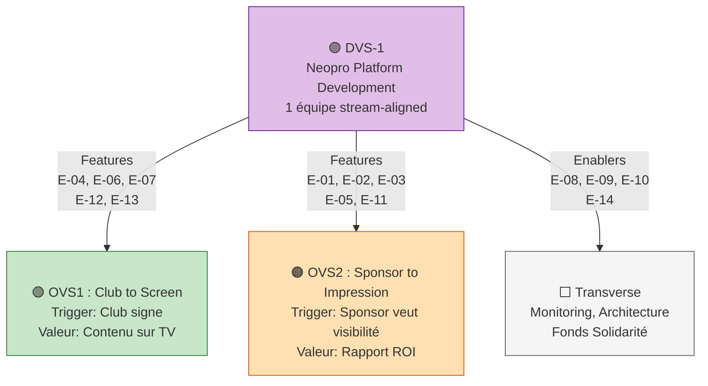
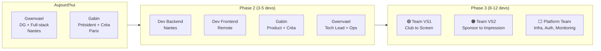
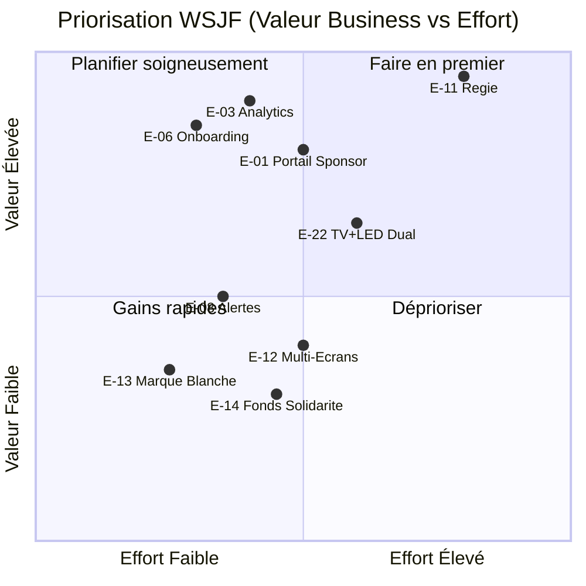

# 🟣 DVS-1 — Neopro Platform Development

> _Le Development Value Stream unique qui alimente les deux OVS._

**Notion** : [DVS-1 Canvas](https://www.notion.so/30bc27de363881b2945ae69ea554816b)

---

## Relation OVS ↔ DVS

---

## Development Value Stream Canvas

### 🎯 Proposition de Valeur

> **POUR** les clubs sportifs amateurs et sponsors locaux
> **QUI** veulent professionnaliser leur image et prouver leur ROI
> **LA** Plateforme Neopro
> **EST UNE** solution tout-en-un boîtier + logiciel + support
> **QUI** transforme les écrans de gymnases en outils de valorisation pro
> **CONTRAIREMENT À** PowerPoint, Canva, boucles USB qui ne génèrent aucun revenu
> **NOTRE SOLUTION** offre un pilotage smartphone, des rapports auto, et un réseau publicitaire

### 🛠️ Solutions développées

| Composant             | Stack                            | OVS servi   |
| --------------------- | -------------------------------- | ----------- |
| Frontend Raspberry Pi | Angular 20, Socket.IO, SCSS      | OVS1        |
| Frontend Dashboard    | Angular 20, Chart.js, Leaflet    | OVS1 + OVS2 |
| Backend API           | Node.js 18+, Express, TypeScript | OVS1 + OVS2 |
| Base de données       | PostgreSQL 15 (Supabase)         | OVS1 + OVS2 |
| Stockage média        | FTP Hostinger                    | OVS1 + OVS2 |
| Auth                  | JWT HttpOnly + MFA (TOTP)        | Transverse  |
| Monitoring            | Prometheus + Grafana             | Transverse  |

### 🎫 Solution Context

| Segment            | Contexte d'usage                                     |
| ------------------ | ---------------------------------------------------- |
| Bénévole club      | Smartphone en bord de terrain, WiFi gymnase instable |
| Admin club         | Dashboard web, bureau ou domicile                    |
| Sponsor            | Dashboard web, bureau                                |
| Annonceur régie    | Portail web self-service                             |
| Super admin NEOPRO | Dashboard central, monitoring flotte                 |

### 👥 Équipe & Localisation

---

## Segments clients

| Segment                 | Taille marché | Pénétration actuelle      |
| ----------------------- | ------------- | ------------------------- |
| Handball                | ~2 400 clubs  | 2 clubs (NARH, NLF)       |
| Basketball              | ~3 800 clubs  | 0                         |
| Volleyball              | ~1 350 clubs  | 0                         |
| Hockey                  | ~200 clubs    | 2 clubs (RACC, Corsaires) |
| Futsal                  | ~500+ clubs   | 0                         |
| **Total indoor France** | **~7 500+**   | **4 clubs (0.05%)**       |

## Canaux de développement

| Canal     | Usage                             |
| --------- | --------------------------------- |
| GitHub    | Code source, PRs, CI/CD           |
| Railway   | Hébergement API                   |
| Hostinger | Hébergement Dashboard + FTP média |
| Supabase  | PostgreSQL managé                 |
| Notion    | SAFe, backlog, docs               |
| Slack     | Communication équipe              |

## Budget & Économie Unitaire

| Poste                  | Coût               | Notes                    |
| ---------------------- | ------------------ | ------------------------ |
| Hardware / club        | 150€               | Raspberry Pi + boîtier   |
| Hosting / club / an    | 5€                 | Cloud + maintenance      |
| Coût total / club      | 155€               | Année 1                  |
| **Revenu / club / an** | **1 500 - 3 000€** | Selon formule            |
| **Marge brute**        | **~90%**           |                          |
| Break-even             | 4-5 clubs          |                          |
| LTV (3 ans)            | 3 600 - 7 200€     | Selon upsells            |
| CAC                    | ~0€                | Acquisition réseau sport |

## KPIs Développement

| KPI                      | Cible         | Mesure                    |
| ------------------------ | ------------- | ------------------------- |
| Vélocité                 | ~26 SP/sprint | Sprint Tracker            |
| Temps de cycle           | < 3 jours     | PR ouverte → fusionnée    |
| Couverture tests         | > 80%         | Jest (1464) + Karma (554) |
| Uptime production        | > 98.5%       | Prometheus                |
| Déploiement              | < 30 min      | Pipeline CI/CD            |
| Incidents critiques / PI | < 2           | Alerting                  |

## Priorisation Économique (WSJF)

---

**Retour** : [SAFe Neopro](README.md) · [Documentation principale](../00-INDEX.md)
