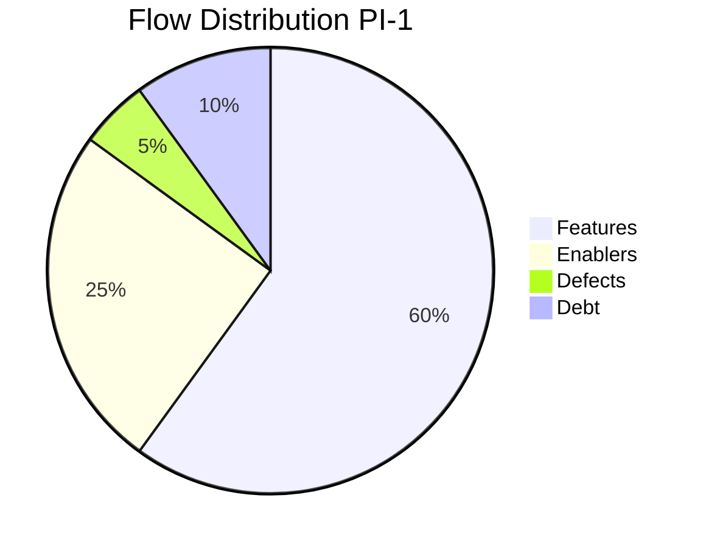

# Flow Metrics — Value Stream Level

> **Dernière mise à jour** : 11 Avril 2026
> **Framework** : SAFe 6.0 — Flow Framework (Mik Kersten)
> Les Flow Metrics mesurent la santé des Value Streams au-delà de la vélocité dev.

---

## Les 6 Flow Metrics

| Métrique                | Définition                                                       | Unité        | Cible PI-1                                     |
| ----------------------- | ---------------------------------------------------------------- | ------------ | ---------------------------------------------- |
| **Flow Distribution**   | Répartition du travail par type (feature, enabler, defect, debt) | %            | 60% feature, 15% enabler, 15% defect, 10% debt |
| **Flow Velocity**       | Nombre d'items complétés par unité de temps                      | items/sprint | 8 items/sprint                                 |
| **Flow Time**           | Temps entre l'entrée d'un item dans le flux et sa complétion     | jours        | < 10 jours                                     |
| **Flow Load**           | Nombre d'items en cours de traitement (WIP)                      | items        | < 5 items                                      |
| **Flow Efficiency**     | % du temps actif (travail) vs temps total (travail + attente)    | %            | > 30%                                          |
| **Flow Predictability** | Variation de la vélocité entre sprints                           | écart-type   | < 20% variation                                |

---

## Définition des types d'items

| Type        | Description                                          | Exemples NEOPRO                                  |
| ----------- | ---------------------------------------------------- | ------------------------------------------------ |
| **Feature** | Nouvelle capacité business visible par l'utilisateur | Portail sponsor, Analytics, Profils match        |
| **Enabler** | Travail technique qui active de futures features     | Migration repository, monitoring, audit sécurité |
| **Defect**  | Correction d'un bug existant en production           | Bug overlay, problème sync, erreur heartbeat     |
| **Debt**    | Remboursement de dette technique                     | Refactoring controllers, mise à jour dépendances |

---

## OVS1 — Club to Screen

### Flow Board

```
┌──────────┐   ┌──────────┐   ┌──────────┐   ┌──────────┐   ┌──────────┐
│  Backlog  │ → │ Analysis │ → │   Dev    │ → │  Review  │ → │  Done    │
│           │   │          │   │          │   │ & Test   │   │          │
└──────────┘   └──────────┘   └──────────┘   └──────────┘   └──────────┘
     WIP: -         WIP: 2        WIP: 3        WIP: 2         WIP: -
```

### Métriques OVS1

| Métrique              | Sprint 1    | Sprint 2 | Sprint 3 | Moyenne PI-1 | Cible    |
| --------------------- | ----------- | -------- | -------- | ------------ | -------- |
| Flow Velocity (items) | _à mesurer_ |          |          |              | 4/sprint |
| Flow Time (jours)     |             |          |          |              | < 10     |
| Flow Load (WIP)       |             |          |          |              | < 3      |
| Flow Efficiency (%)   |             |          |          |              | > 30%    |

### Flow Distribution OVS1 (PI-1)

| Type      | Items planifiés                   | SP     | % du total |
| --------- | --------------------------------- | ------ | ---------- |
| Feature   | E-04 (Profils), E-06 (Onboarding) | 28     | 74%        |
| Enabler   | E-07 (WiFi V2)                    | 10     | 26%        |
| Defect    | -                                 | 0      | 0%         |
| Debt      | -                                 | 0      | 0%         |
| **Total** | **3 Epics**                       | **38** | **100%**   |

### Lead Time OVS1 (opérationnel)

| Étape                      | Temps actuel       | Cible fin PI-1      | Cible PI-2              |
| -------------------------- | ------------------ | ------------------- | ----------------------- |
| Club signe → Envoi boîtier | 2-3 jours          | 1 jour              | Même jour               |
| Envoi → Installation       | 3-5 jours (postal) | 3-5 jours           | 1-2 jours (stock local) |
| Installation → Config      | 2-3 heures (SSH)   | 30 minutes (wizard) | 15 minutes              |
| Config → Premier contenu   | 1 heure            | 30 minutes          | 10 minutes              |
| **Total Lead Time**        | **7-12 jours**     | **5-7 jours**       | **2-3 jours**           |

---

## OVS2 — Sponsor to Impression

### Flow Board

```
┌──────────┐   ┌──────────┐   ┌──────────┐   ┌──────────┐   ┌──────────┐
│  Backlog  │ → │ Analysis │ → │   Dev    │ → │  Review  │ → │  Done    │
│           │   │          │   │          │   │ & Test   │   │          │
└──────────┘   └──────────┘   └──────────┘   └──────────┘   └──────────┘
     WIP: -         WIP: 2        WIP: 3        WIP: 2         WIP: -
```

### Métriques OVS2

| Métrique              | Sprint 1    | Sprint 2 | Sprint 3 | Moyenne PI-1 | Cible    |
| --------------------- | ----------- | -------- | -------- | ------------ | -------- |
| Flow Velocity (items) | _à mesurer_ |          |          |              | 5/sprint |
| Flow Time (jours)     |             |          |          |              | < 10     |
| Flow Load (WIP)       |             |          |          |              | < 4      |
| Flow Efficiency (%)   |             |          |          |              | > 30%    |

### Flow Distribution OVS2 (PI-1)

| Type      | Items planifiés                                   | SP     | % du total |
| --------- | ------------------------------------------------- | ------ | ---------- |
| Feature   | E-01 (Portail), E-02 (Rotation), E-03 (Analytics) | 53     | 100%       |
| Enabler   | -                                                 | 0      | 0%         |
| Defect    | -                                                 | 0      | 0%         |
| Debt      | -                                                 | 0      | 0%         |
| **Total** | **3 Epics**                                       | **53** | **100%**   |

### Lead Time OVS2 (opérationnel)

| Étape                                 | Temps actuel     | Cible fin PI-1          | Cible PI-2   |
| ------------------------------------- | ---------------- | ----------------------- | ------------ |
| Sponsor contacte NEOPRO → Compte créé | 1-2 semaines     | < 1 jour (self-service) | < 1 heure    |
| Upload spot → Validation              | 48h (email)      | < 4h (dashboard)        | < 1h         |
| Validation → Première diffusion       | 24h              | < 2h                    | Immédiat     |
| Match → Rapport disponible            | Jamais (manuel)  | J+1 (auto)              | Temps réel   |
| **Total Lead Time**                   | **2-3 semaines** | **2-3 jours**           | **< 1 jour** |

---

## DVS-1 — Neopro Platform Development

### Flow Distribution DVS-1 (PI-1)



| Type      | Epics                     | SP       | %        |
| --------- | ------------------------- | -------- | -------- |
| Feature   | E-01, E-02, E-03, E-04    | 63       | 50%      |
| Enabler   | E-06, E-07, E-08, E-10    | 51       | 40%      |
| Defect    | Buffer bugs production    | ~5       | 4%       |
| Debt      | E-09 (Architecture Audit) | 8        | 6%       |
| **Total** |                           | **~127** | **100%** |

> **Observation** : La distribution Feature (50%) / Enabler (40%) est déséquilibrée vers les enablers pour PI-1 (normal pour un PI "Fondations"). La cible PI-2 est 70% Feature / 15% Enabler / 10% Defect / 5% Debt.

### Cumulative Flow Diagram (CFD)

> _À remplir au fur et à mesure des sprints._

| Semaine | Backlog | Analysis | Dev | Review | Done |
| ------- | ------- | -------- | --- | ------ | ---- |
| Sem 8   | 41      | 0        | 0   | 0      | 0    |
| Sem 9   |         |          |     |        |      |
| Sem 10  |         |          |     |        |      |
| Sem 11  |         |          |     |        |      |
| Sem 12  |         |          |     |        |      |
| Sem 13  |         |          |     |        |      |

---

## WIP Limits

| Colonne       | WIP Limit | Justification                                  |
| ------------- | --------- | ---------------------------------------------- |
| Analysis      | 2         | Solo dev → limiter le multitasking             |
| Dev           | 3         | Max 3 US en parallèle (1 complexe + 2 simples) |
| Review & Test | 2         | Code review solo → auto-review + tests         |
| **Total WIP** | **5**     | **Solo dev : 5 items max en cours**            |

> **Règle** : Si le WIP atteint la limite, finir un item avant d'en commencer un nouveau. Le WIP limit est le levier N°1 pour réduire le Flow Time.

---

## Tableau de bord Flow (à remplir en Sprint Review)

### Sprint 1

| Métrique             | OVS1 | OVS2 | DVS-1 Global |
| -------------------- | ---- | ---- | ------------ |
| Items complétés      |      |      |              |
| Flow Time moyen      |      |      |              |
| WIP moyen            |      |      |              |
| Items bloqués (> 3j) |      |      |              |

### Sprint 2

| Métrique             | OVS1 | OVS2 | DVS-1 Global |
| -------------------- | ---- | ---- | ------------ |
| Items complétés      |      |      |              |
| Flow Time moyen      |      |      |              |
| WIP moyen            |      |      |              |
| Items bloqués (> 3j) |      |      |              |

### Sprint 3

| Métrique             | OVS1 | OVS2 | DVS-1 Global |
| -------------------- | ---- | ---- | ------------ |
| Items complétés      |      |      |              |
| Flow Time moyen      |      |      |              |
| WIP moyen            |      |      |              |
| Items bloqués (> 3j) |      |      |              |

---

**Retour** : [SAFe Neopro](README.md) · [Inspect & Adapt](INSPECT-ADAPT.md) · [PI Objectives](PI-OBJECTIVES.md)
