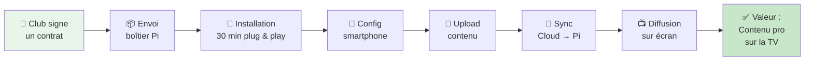
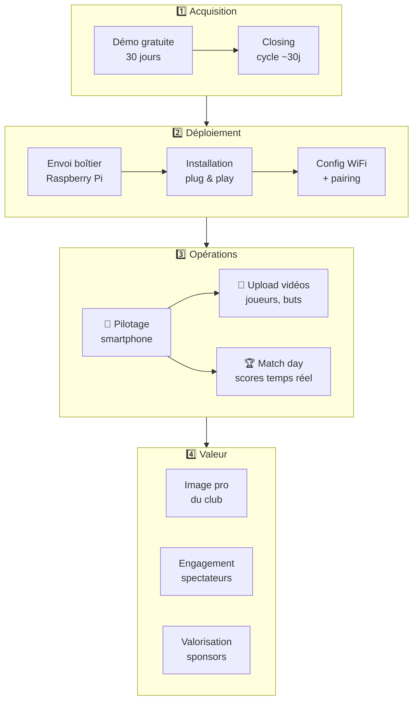

# 🟢 OVS1 — Club to Screen

> _Du moment où un club signe jusqu'à ce que le contenu tourne sur l'écran du gymnase._

**Notion** : [OVS1 Canvas](https://www.notion.so/30bc27de363881399568db3d78b4b774)

---

## Flux Opérationnel

---

## Canvas OVS

### 🎯 Trigger

> Un club sportif amateur signe un contrat NEOPRO (Essentiel, Autonomie ou Premium)

### 💰 Valeur délivrée

> Contenu professionnel diffusé en temps réel sur l'écran du gymnase — scores, vidéos joueurs, spots sponsors, animations match day

### ⏱️ Lead Time

| Métrique              | Actuel                 | Cible PI-2               |
| --------------------- | ---------------------- | ------------------------ |
| Onboarding club       | 2-3 jours (SSH manuel) | 30 minutes (wizard auto) |
| Déploiement contenu   | ~1 heure               | < 5 minutes              |
| Premier match diffusé | J+3 après installation | J+0 (même jour)          |

### 🚧 Bottleneck actuel

> **Onboarding SSH manuel** — Chaque nouveau club nécessite une config manuelle par terminal. Non scalable au-delà de 15 clubs.
>
> **Solution en cours** : Epic E-06 Onboarding Automatisé (PI-1)

---

## Étapes détaillées

---

## Segments clients

| Segment                   | Profil                      | Besoin principal      | Formule type          |
| ------------------------- | --------------------------- | --------------------- | --------------------- |
| Clubs semi-pro            | N1-N3, budget > 5K€ comm    | Image pro + sponsors  | Premium (3 000€/an)   |
| Clubs amateurs structurés | Régional, 3+ sponsors       | Valorisation sponsors | Autonomie (2 100€/an) |
| Petits clubs              | Départemental, 1-2 sponsors | Débuter la diffusion  | Essentiel (1 500€/an) |

## Canaux

- **Bouche-à-oreille** sportif (CAC ~0€)
- **Démos gratuites** 30 jours
- **Ligues et fédérations** (FFHB, FFBB, FFVolley)
- **Tournois** (Cup En Sambre, mai 2026)
- **Prescripteurs** (présidents de ligue, arbitres vidéo)

## Epics alignés

| Epic                           | PI   | Statut  |
| ------------------------------ | ---- | ------- |
| E-04 Profils Config Match      | PI-1 | Backlog |
| E-06 Onboarding Automatisé     | PI-1 | Backlog |
| E-07 Résilience WiFi V2        | PI-1 | Backlog |
| E-12 Multi-Écrans Synchronisés | PI-3 | Backlog |
| E-13 Marque Blanche Club       | PI-3 | Backlog |

## KPIs

| KPI                       | Cible 2026 | Cible 2028 |
| ------------------------- | ---------- | ---------- |
| Clubs équipés             | 15         | 300        |
| Uptime                    | 98.5%      | 99.5%      |
| Temps onboarding          | < 30 min   | < 15 min   |
| Matchs diffusés / semaine | 20         | 500+       |
| NPS clubs                 | > 50       | > 70       |

---

**Retour** : [SAFe Neopro](README.md) · [Documentation principale](../00-INDEX.md)
