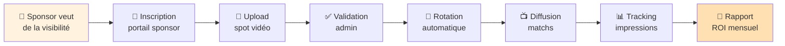
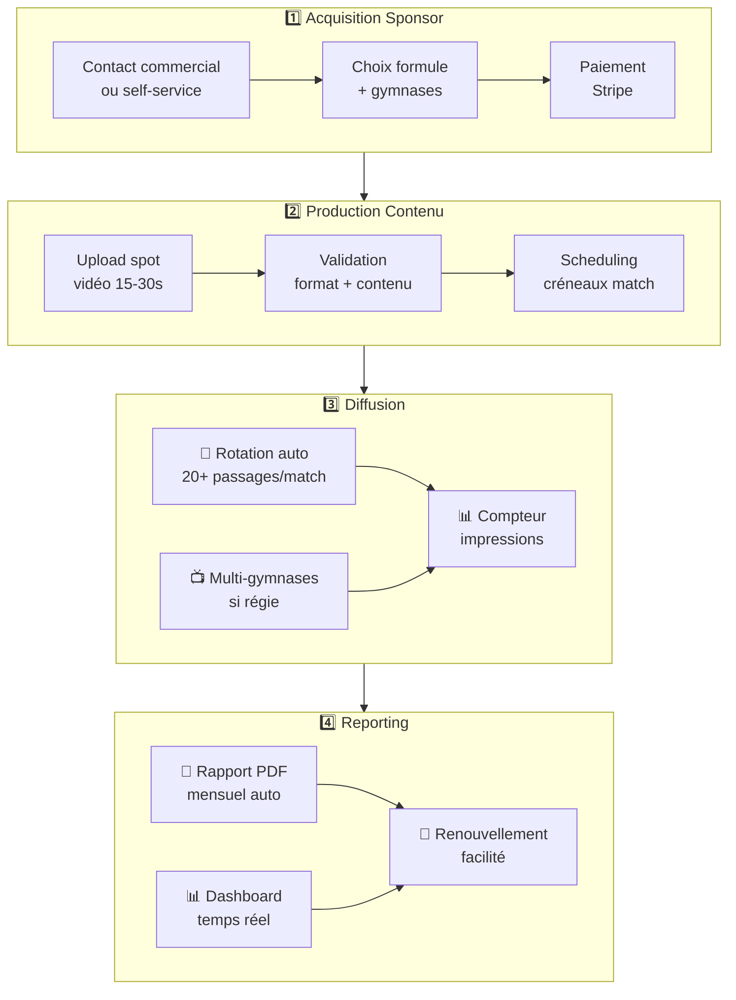
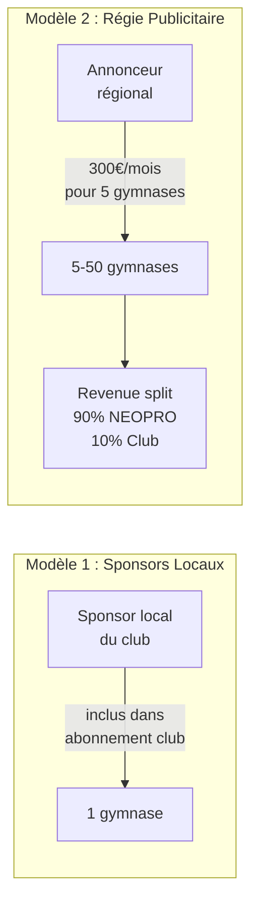

# 🟠 OVS2 — Sponsor to Impression

> _Du moment où un sponsor veut de la visibilité jusqu'au rapport de ROI entre ses mains._

**Notion** : [OVS2 Canvas](https://www.notion.so/30bc27de3638814db77df0880d35613d)

---

## Flux Opérationnel

---

## Canvas OVS

### 🎯 Trigger

> Un sponsor local/régional cherche de la visibilité auprès d'une audience sportive captive

### 💰 Valeur délivrée

> Rapport de diffusion mensuel avec preuves d'impressions, facilitant le renouvellement et la prospection de nouveaux partenaires

### ⏱️ Lead Time

| Métrique           | Actuel                | Cible PI-2              |
| ------------------ | --------------------- | ----------------------- |
| Onboarding sponsor | 1-2 semaines (manuel) | < 1 jour (self-service) |
| Upload → diffusion | ~48h                  | < 2h (après validation) |
| Génération rapport | Manuel (jamais fait)  | Automatique mensuel     |

### 🚧 Bottleneck actuel

> **Pas de self-service sponsor** — Tout passe par l'équipe NEOPRO. Aucun rapport de diffusion automatisé. Zéro preuve pour les sponsors = churn.
>
> **Solutions en cours** : E-01 Portail Sponsor (PI-1) + E-03 Analytics (PI-1)

---

## Étapes détaillées

---

## Deux modèles de revenus

## Segments clients

| Segment            | Profil                                 | Modèle               | Volume                    |
| ------------------ | -------------------------------------- | -------------------- | ------------------------- |
| Sponsors locaux    | Boulanger, garagiste, assureur du coin | Inclus dans abo club | 3-5 par club              |
| Sponsors régionaux | Chaînes locales, concessions, banques  | Régie 300€/mois      | 3-6 annonceurs cible 2027 |
| Sponsors nationaux | Marques sport, équipementiers          | Régie premium        | Phase 3 (2028+)           |

## Canaux

- **Portail self-service** (E-01)
- **Démarchage commercial** (Gwenvael)
- **Réseau clubs** → intro sponsors locaux
- **Salon sport / RSE** pour sponsors nationaux

## Epics alignés

| Epic                              | PI   | Statut  |
| --------------------------------- | ---- | ------- |
| E-01 Portail Sponsor Self-Service | PI-1 | Backlog |
| E-02 Rotation Sponsors            | PI-1 | Backlog |
| E-03 Analytics Sponsors Avancé    | PI-1 | Backlog |
| E-05 Motion Design Personnalisé   | PI-2 | Backlog |
| E-11 Régie Publicitaire Régionale | PI-2 | Backlog |

## KPIs

| KPI                            | Cible 2026    | Cible 2028 |
| ------------------------------ | ------------- | ---------- |
| Sponsors actifs (locaux)       | 30-50         | 500+       |
| Annonceurs régie               | 0 (lancement) | 15+        |
| Passages/match/sponsor         | 20+           | 20+        |
| Taux renouvellement sponsor    | 60%           | 85%        |
| ARR régie                      | 0€            | 350K€      |
| Revenus passifs reversés clubs | 0€            | 35K€       |

---

**Retour** : [SAFe Neopro](README.md) · [Documentation principale](../00-INDEX.md)
