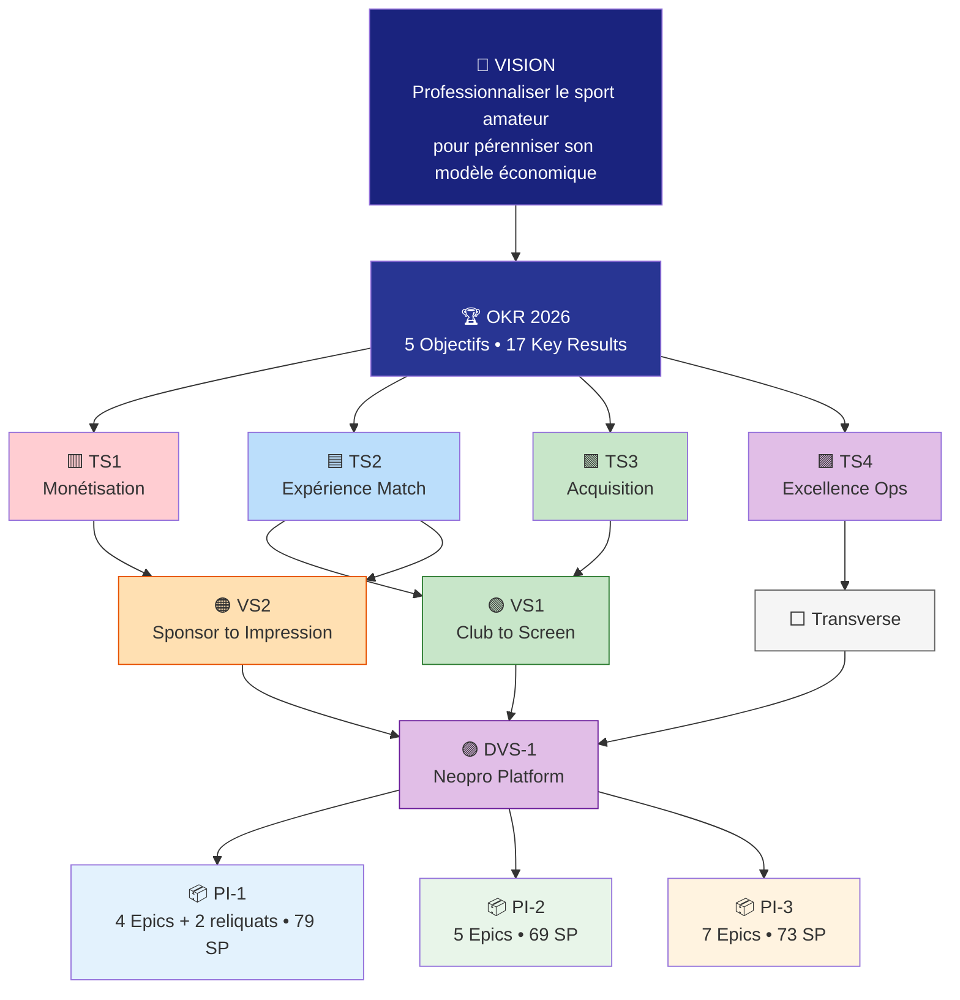
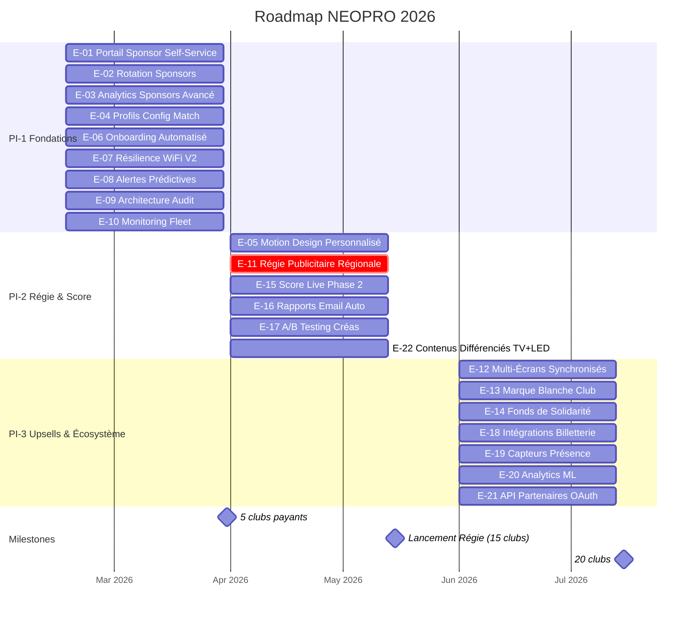
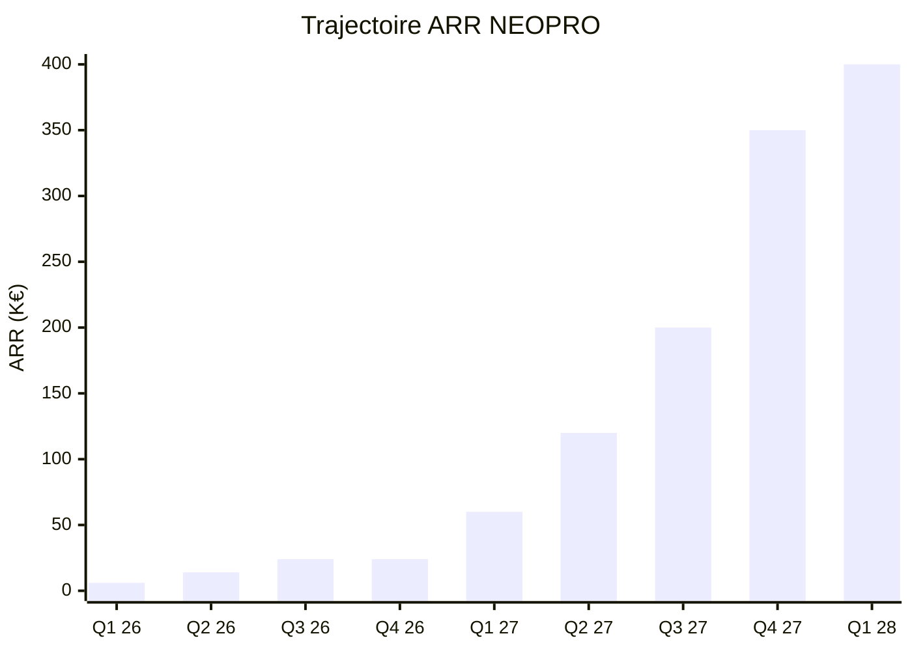
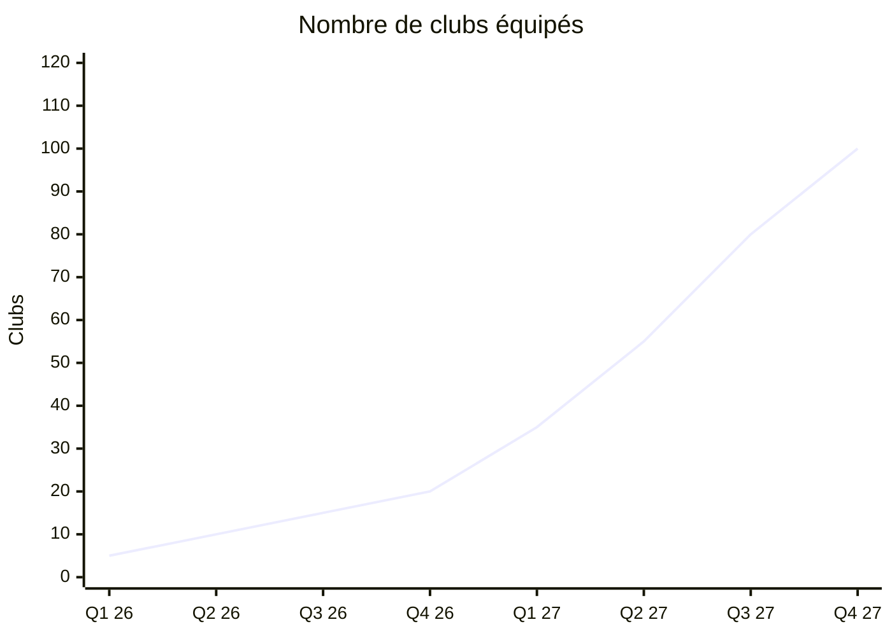

# 📊 Portfolio SAFe — Vue d'ensemble

> _Vision complète du portefeuille produit, de la stratégie aux User Stories._

**Notion** : [Portfolio SAFe](https://www.notion.so/30bc27de363881538a17cf41f3c402f3)

---

## Architecture SAFe NEOPRO

---

## Roadmap Produit 2026

---

## Métriques Clés

### Trajectoire Business

### Croissance Clubs

---

## Tableau de Bord Portfolio

### Par Value Stream

| Value Stream                 | Epics  | Features | US (planifiées) | SP estimés |
| ---------------------------- | ------ | -------- | --------------- | ---------- |
| 🟢 VS1 Club to Screen        | 9      | 16       | 22              | ~113 SP    |
| 🟠 VS2 Sponsor to Impression | 6      | 13       | 21              | ~103 SP    |
| ⬜ Transverse                | 7      | 10       | 6               | ~44 SP     |
| **Total**                    | **22** | **39**   | **49**          | **260 SP** |

> **Note** : Ce tableau concerne les 40 US futures (PI-1 à PI-3). 178 US supplémentaires ont été livrées avant le PI Planning (voir [IMPLEMENTED-BACKLOG.md](IMPLEMENTED-BACKLOG.md)).

### Par PI

| PI   | Période        | Epics | SP  | Focus                                                   | Milestone                     |
| ---- | -------------- | ----- | --- | ------------------------------------------------------- | ----------------------------- |
| Done | Avant PI-1     | 5     | ~41 | Profils, WiFi, Alertes, Audit, Monitoring               | -                             |
| PI-1 | Fév-Mars 2026  | 4+2   | 79  | Sponsors self-service, analytics, onboarding            | 5 clubs payants               |
| PI-2 | Avr-Mai 2026   | 6     | 108 | Régie publicitaire, score live, email auto, A/B, TV+LED | Lancement régie à 15 clubs    |
| PI-3 | Juin-Juil 2026 | 7     | 73  | Multi-écrans, marque blanche, billetterie, ML, OAuth    | 20 clubs, premiers annonceurs |

### Par Thème Stratégique

| Thème                   | Epics                                    | OKR     | Impact principal        |
| ----------------------- | ---------------------------------------- | ------- | ----------------------- |
| 🟥 TS1 Monétisation     | E-01, E-02, E-03, E-05, E-11, E-17, E-21 | O2 + O4 | ARR + revenus régie     |
| 🟦 TS2 Expérience Match | E-04, E-12, E-13, E-15, E-18, E-19, E-22 | O3 + O5 | Engagement + image pro  |
| 🟩 TS3 Acquisition      | E-06, E-07, E-14                         | O1 + O5 | Scalabilité déploiement |
| 🟪 TS4 Excellence Ops   | E-08, E-09, E-10, E-16, E-20             | O3 + O4 | Fiabilité + monitoring  |

---

## Navigation

| Page                                                                         | Description                          |
| ---------------------------------------------------------------------------- | ------------------------------------ |
| [🟢 OVS1 — Club to Screen](OVS1-CLUB-TO-SCREEN.md)                           | Canvas du flux club → écran          |
| [🟠 OVS2 — Sponsor to Impression](OVS2-SPONSOR-TO-IMPRESSION.md)             | Canvas du flux sponsor → rapport ROI |
| [🟣 DVS-1 — Neopro Platform](DVS1-NEOPRO-PLATFORM.md)                        | Canvas de développement complet      |
| [🏆 OKR NEOPRO 2026](https://www.notion.so/2ddc27de363880c9931af8f16684916d) | 5 Objectifs, 17 Key Results          |
| [SAFe Neopro — Hub](README.md)                                               | Hub principal avec databases         |

---

**Retour** : [SAFe Neopro](README.md) · [Documentation principale](../00-INDEX.md)
