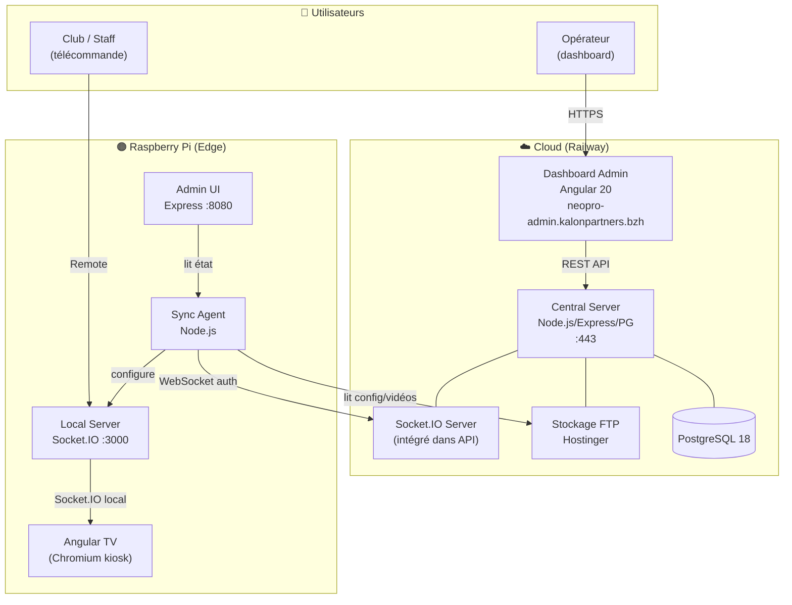
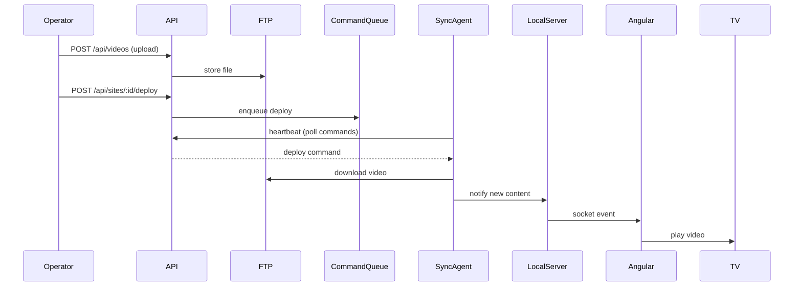

# Carte du projet Neopro

> **Je cherche…**
> - *comment une vidéo arrive sur la TV* → [[#Flux Vidéo]]
> - *comment un match est géré* → [[#Domaine Match & Scoreboard]]
> - *pourquoi un Pi ne se connecte pas* → [Troubleshooting](../guides/TROUBLESHOOTING.md)
> - *un ADR spécifique* → [[#Index ADR par domaine]]
> - *quel fichier fait quoi* → [[#Index des fichiers clés]]

---

## Architecture 3 tiers

**Règle d'or :** le Pi ne connaît pas la DB. Il parle uniquement au Central Server via WebSocket (sync-agent) ou FTP (vidéos). Tout état persistant est dans PostgreSQL.

---

## Domaines métier

### Domaine Contenu Vidéo

**Ce que c'est :** upload → FTP → déploiement vers Pi → lecture en boucle sur TV.

| Quoi | Où |
|---|---|
| Spec | [video-cycle.spec.md](../specs/features/video-cycle.spec.md) |
| ADRs clés | ADR-050 (contenu unifié SaaS/Pi), ADR-069 (delivery pattern), ADR-098 (orphans) |
| Controller | `central-server/src/controllers/video.controller.ts` |
| Service | `central-server/src/services/deployment.service.ts` |
| Smoke test | `smoke-deploy-ota` |
| ⚠️ Piège | Un storage_path peut être partagé par N rows — supprimer l'une affecte toutes |

**Flux :**

---

### Domaine Match & Scoreboard

**Ce que c'est :** démarrage d'un match → scoreboard live → historique persisté.

| Quoi | Où |
|---|---|
| Spec | [match-sessions.spec.md](../specs/features/match-sessions.spec.md) |
| ADR source de vérité | [ADR-093](../adr/ADR-093-match-sessions-persistence-and-history.md) |
| ADRs liés | ADR-049 (score live), ADR-090 (scoreboard state), ADR-092 (remote v2) |
| Handler Pi | `raspberry/server/src/handlers/match-config.handler.ts` |
| Handler score | `raspberry/server/src/handlers/score-update.handler.ts` |
| Table DB | `club_sessions` (avec colonnes home_team, away_team, home_score, away_score) |
| CRON auto-close | `cron-scheduler.service.ts` → `executeMatchAutoCloseTask()` |
| Smoke test | `smoke-analytics-sponsors` (période filtrée), `smoke-socket-realtime` |

---

### Domaine Sponsors & Analytics

**Ce que c'est :** vidéos sponsors → impressions trackées → rapports PDF pour annonceurs.

| Quoi | Où |
|---|---|
| Spec | [sponsors.spec.md](../specs/features/sponsors.spec.md) |
| ADRs clés | ADR-099 (uptime source de vérité), ADR-082 (video club grants) |
| Services | `analytics.service.ts`, `billing.service.ts`, `campaign-deployment.service.ts` |
| Rapports PDF | [analytics/PDF_REPORTS_GUIDE.md](../analytics/PDF_REPORTS_GUIDE.md) |
| Smoke test | `smoke-analytics-sponsors` |

---

### Domaine Template Studio (Remotion)

**Ce que c'est :** templates vidéo data-driven — un template = rows DB + assets, pas de .tsx spécifique.

| Quoi | Où |
|---|---|
| Spec | [templates-studio.spec.md](../specs/features/templates-studio.spec.md) |
| ADRs clés | ADR-075, ADR-077, ADR-084, ADR-086, ADR-095, ADR-108, ADR-109 |
| Runtime | `templates-remotion/src/runtime/TemplateRuntime.tsx` |
| Repository | `templateStudioRepository` |
| CLI import | `central-server/src/scripts/import-template-spec.ts` |
| Smoke test | `smoke-remotion` |
| ⚠️ Règle | Jamais créer un .tsx par template — tout passe par le moteur générique |

---

### Domaine Hotspot & Réseau

**Ce que c'est :** PSK WiFi du club géré depuis le cloud, jamais hardcodé sur le Pi.

| Quoi | Où |
|---|---|
| Spec | [hotspot-psk.spec.md](../specs/features/hotspot-psk.spec.md) |
| ADR source de vérité | [ADR-074](../adr/ADR-074-hotspot-psk-single-source-of-truth.md) |
| Service cloud | `hotspot-config.service.ts` |
| Sync Pi | `raspberry/sync-agent/src/services/hotspot-sync.js` |
| ⚠️ Règle | PSK stocké chiffré AES-256-GCM dans `sites.wifi_psk_encrypted` — jamais en clair |

---

### Domaine Mode SaaS

**Ce que c'est :** club sans Pi — navigateur uniquement, vidéos servies via URLs FTP directement.

| Quoi | Où |
|---|---|
| Spec | [saas-mode.spec.md](../specs/features/saas-mode.spec.md) |
| ADR source de vérité | [ADR-037](../adr/ADR-037-saas-mode-architecture.md) |
| ADRs liés | ADR-071 (Cloudflare Pages), ADR-096 (saas relay handler) |
| `site_type` | `'pi'` \| `'saas'` \| `'demo'` |
| Smoke test | `smoke-saas` |
| ⚠️ Piège | SaaS ≠ Internet obligatoire — possible Pi serveur + receiver LAN (PROP-012) |

---

### Domaine Auth & Multi-tenant

**Ce que c'est :** JWT cookie + Bearer, MFA TOTP, 6 rôles hiérarchiques.

| Quoi | Où |
|---|---|
| Référence | [technical/MULTI_TENANT.md](../technical/MULTI_TENANT.md) |
| Middleware | `central-server/src/middleware/auth.middleware.ts` |
| Rôles | `super_admin > admin > operator > viewer \| advertiser \| agency \| club` |
| Smoke test | `smoke-server-core` (auth, CORS, headers) |

---

### Domaine OTA & Déploiement Pi

**Ce que c'est :** mise à jour du logiciel Pi depuis le cloud, sans intervention physique.

| Quoi | Où |
|---|---|
| ADR clé | ADR-069 (delivery pattern) |
| Service | `canary-deployment.service.ts`, `deployment-retry.util.ts` |
| Command queue | [technical/COMMAND_QUEUE.md](../technical/COMMAND_QUEUE.md) |
| Smoke test | `smoke-deploy-ota` |

---

### Domaine Socket.IO & Sync

**Ce que c'est :** canal temps réel cloud ↔ Pi (heartbeat, commandes, état).

| Quoi | Où |
|---|---|
| Spec | [socket-service.spec.md](../specs/services/socket-service.spec.md) |
| ADRs clés | ADR-063 (disconnect filter), ADR-096 (saas relay), ADR-106 (preview slave sync) |
| Sync architecture | [technical/SYNC_ARCHITECTURE.md](../technical/SYNC_ARCHITECTURE.md) |
| Smoke tests | `smoke-wiring`, `smoke-socket-realtime` |
| ⚠️ Piège | Handlers attachés dans un `register` parent ne s'exécutent jamais si le client skip ce register |

---

## Index des fichiers clés

### Central Server (`central-server/src/`)

| Fichier | Rôle |
|---|---|
| `server.ts` | Point d'entrée, montage routes + middleware |
| `controllers/` | 1 controller = 1 domaine REST (video, site, user, sponsor…) |
| `services/cron-scheduler.service.ts` | Toutes les tâches CRON (match auto-close, analytics, OTA) |
| `services/deployment.service.ts` | Orchestrateur déploiement vidéo vers Pi |
| `services/command-queue.service.ts` | File d'attente pour Pi hors-ligne |
| `repositories/` | Accès DB — **jamais de query() dans les controllers** |
| `middleware/auth.middleware.ts` | JWT + rôles |
| `scripts/migrations/` | Migrations SQL (ne jamais modifier celles en prod) |

### Raspberry Pi (`raspberry/`)

| Fichier | Rôle |
|---|---|
| `src/app/components/tv/` | Composant Angular TV (lecture vidéo, kiosk) |
| `src/app/components/remote/` | Télécommande locale |
| `server/src/handlers/` | Handlers Socket.IO local (match, score, remote) |
| `sync-agent/src/agent.js` | Sync avec cloud (heartbeat, commands, hotspot) |
| `admin/` | Interface admin Pi (port 8080) |

### Dashboard (`central-dashboard/src/app/features/`)

| Dossier | Rôle |
|---|---|
| `sites/` | Gestion clubs (5 onglets : overview, content, analytics, sponsors, settings) |
| `analytics/` | Rapports impressions, PDF, stats flotte |
| `users/` | Gestion utilisateurs et rôles |
| `safe/` | Dashboard SAFe (sprints, velocity) |

---

## Index ADR par domaine

| Domaine | ADRs |
|---|---|
| **Architecture globale** | ADR-001, ADR-003, ADR-037, ADR-070 |
| **Vidéo & Contenu** | ADR-050, ADR-065, ADR-069, ADR-089, ADR-094, ADR-098, ADR-100, ADR-103 |
| **Match & Scoreboard** | ADR-049, ADR-090, ADR-092, ADR-093 |
| **Sponsors & Analytics** | ADR-027, ADR-082, ADR-099 |
| **Template Studio** | ADR-054, ADR-055, ADR-075, ADR-077, ADR-084, ADR-086, ADR-095, ADR-108, ADR-109 |
| **Hotspot & Réseau** | ADR-073, ADR-074, ADR-079 |
| **Auth & Sécurité** | ADR-014 |
| **Socket & Sync** | ADR-063, ADR-096, ADR-106 |
| **OTA & Déploiement** | ADR-069 |
| **Dashboard refactoring** | ADR-035, ADR-041, ADR-042, ADR-043 |
| **Multi-tenant / SaaS** | ADR-037, ADR-050, ADR-071 |
| **Infra & DB** | ADR-003, ADR-070, ADR-091 |
| **Remote V2** | ADR-092, ADR-102, ADR-105 |
| **CRON tasks** | ADR-093 (match), ADR-097 (extract modules) |

---

## Smoke tests → domaine

| Suite | Ce qu'elle protège |
|---|---|
| `smoke-server-core` | Auth, routes, CORS, validation, headers sécurité |
| `smoke-wiring` | Socket.IO, services, repos, middleware exports |
| `smoke-consistency` | Config Pi, cohérence route/handler/repo |
| `smoke-socket-realtime` | Alerting, remote relay, propriétés socket |
| `smoke-kiosk-pi` | Kiosk, GPU, watchdog, admin panel, systemd |
| `smoke-display` | HDMI, résolution, composant TV |
| `smoke-network-wifi` | WiFi, hotspot, bgscan, IPv6 |
| `smoke-analytics-sponsors` | Analytics, stats sponsor, rotation pondérée |
| `smoke-deploy-ota` | OTA, déploiement, canary |
| `smoke-dashboard-guards` | DataService, validation, injection SQL |
| `smoke-saas` | Portal club, ADR-037 |
| `smoke-adr-refactoring` | Multi-profil, SAFe, ADR-035/041/042/043 |
| `smoke-remotion` | Render async, versions templates |
| `smoke-prop003-scoreboard` | Corrections protocolaires PROP-003 |
| `smoke-service-test-coverage` | Tout nouveau service a ≥1 test |

---

## Pour aller plus loin

- [Architecture complète](../technical/ARCHITECTURE.md) — diagrammes de séquence détaillés
- [SYNC_ARCHITECTURE.md](../technical/SYNC_ARCHITECTURE.md) — protocole sync Pi ↔ Cloud
- [TROUBLESHOOTING.md](../guides/TROUBLESHOOTING.md) — diagnostic Pi (53K)
- [ADR README](../adr/README.md) — index complet des 103 ADRs
- [docs/specs/README.md](../specs/README.md) — index des specs métier actives
