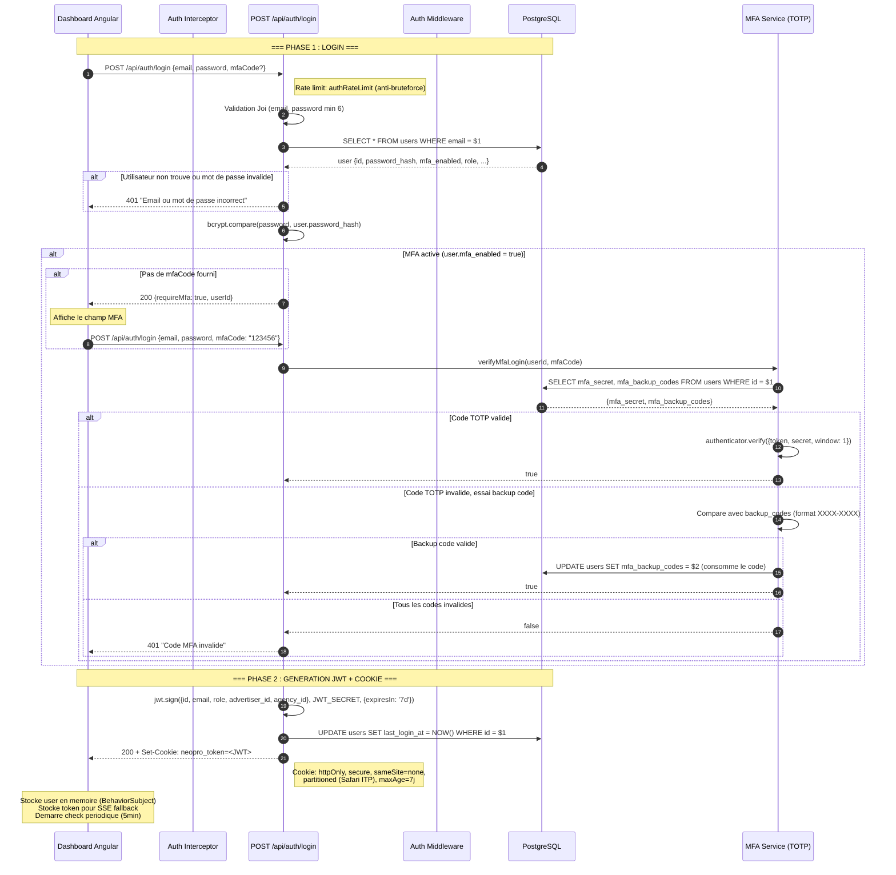
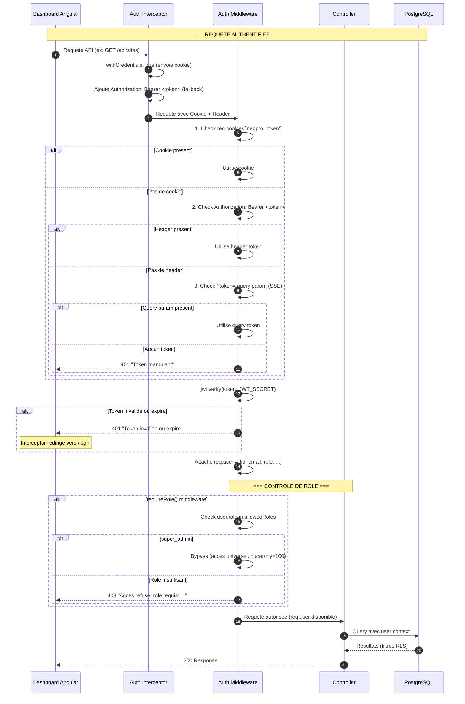
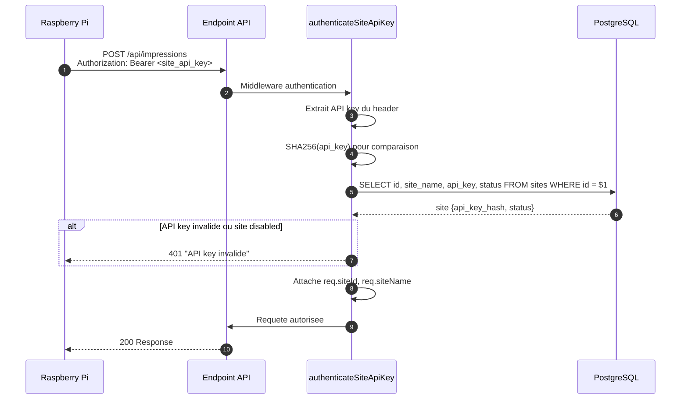
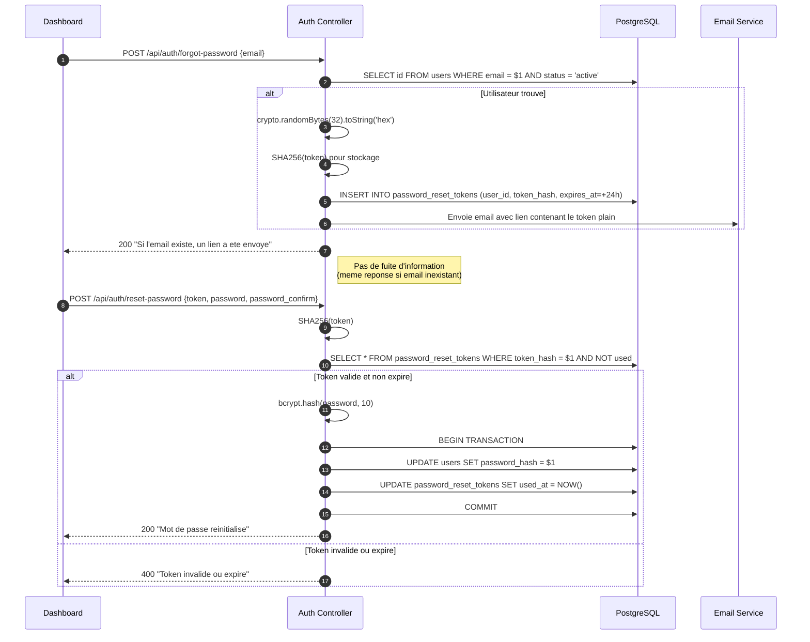

# Diagramme de Sequence : Authentification

> Flux complet : Login -> JWT -> MFA -> Cookie -> Requetes authentifiees

## Flux Principal (Login)



## Requetes Authentifiees (3-tier fallback)



## Authentification Raspberry Pi (API Key)



## Flux Reset Password



## Hierarchie des Roles

```
super_admin (100) ─── Acces total, bypass toutes les verifications
    │
admin (80) ─────── Dashboard admin, gestion users/sites/content
    │
operator (60) ──── Gere ses clubs assignes, upload videos
    │
viewer (40) ────── Lecture seule
    │
advertiser (30) ── Upload pubs, gere ses propres videos
agency (30) ────── Gere plusieurs advertisers
```

## Points de Securite

| Mecanisme         | Implementation                                         |
| ----------------- | ------------------------------------------------------ |
| Hash mot de passe | bcrypt, 10 rounds                                      |
| Token JWT         | 7 jours, signe avec JWT_SECRET                         |
| Cookie securise   | httpOnly + secure + sameSite=none + partitioned        |
| Anti-bruteforce   | Rate limiting strict sur /auth/\*                      |
| MFA               | TOTP (otplib) + 8 backup codes (XXXX-XXXX)             |
| Reset password    | Token SHA256 en DB, jamais stocke en clair, expire 24h |
| Anti-enumeration  | forgot-password retourne toujours 200                  |
| SQL injection     | Requetes parametrees exclusivement ($1, $2)            |
