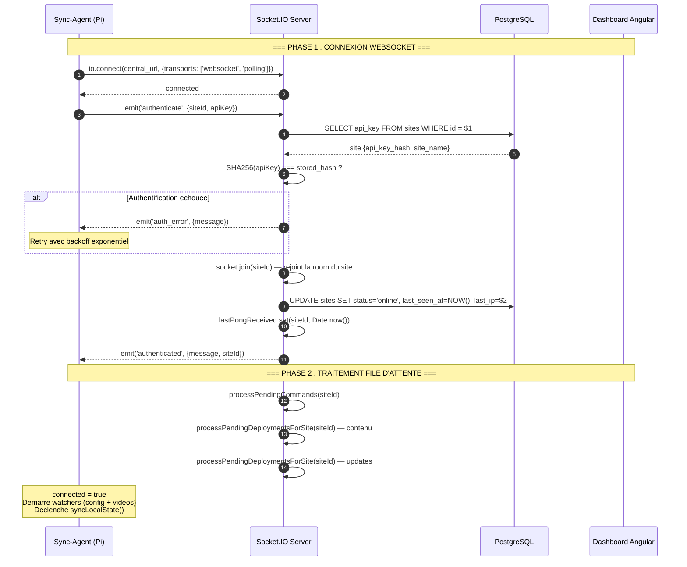
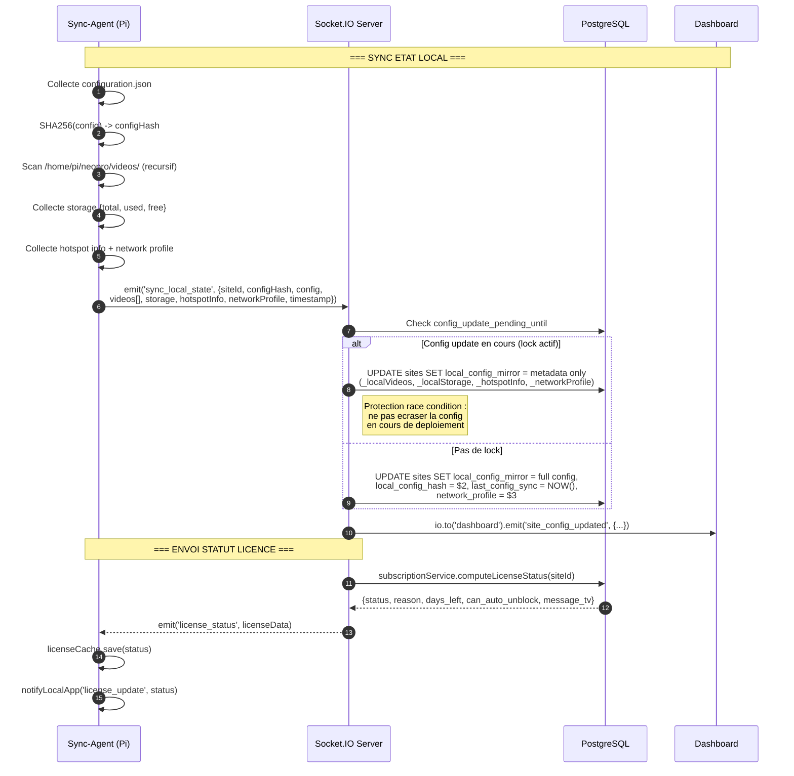
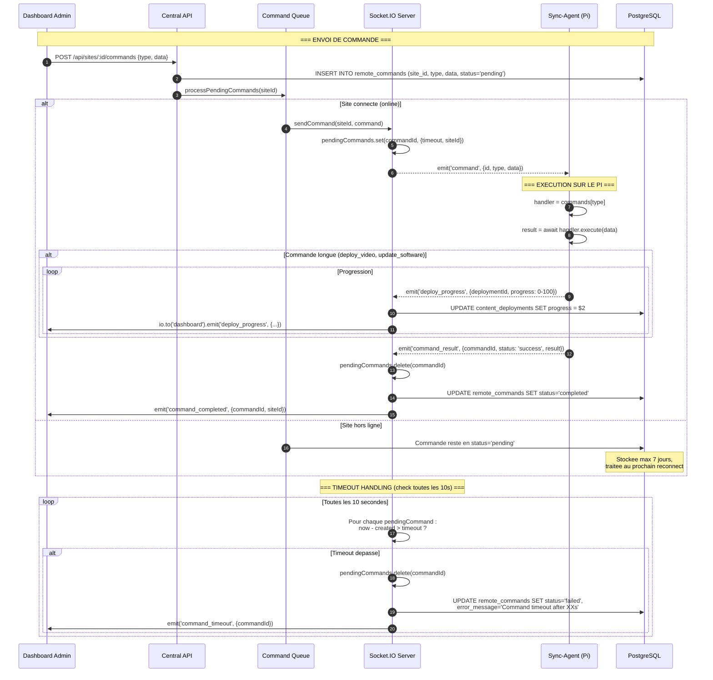
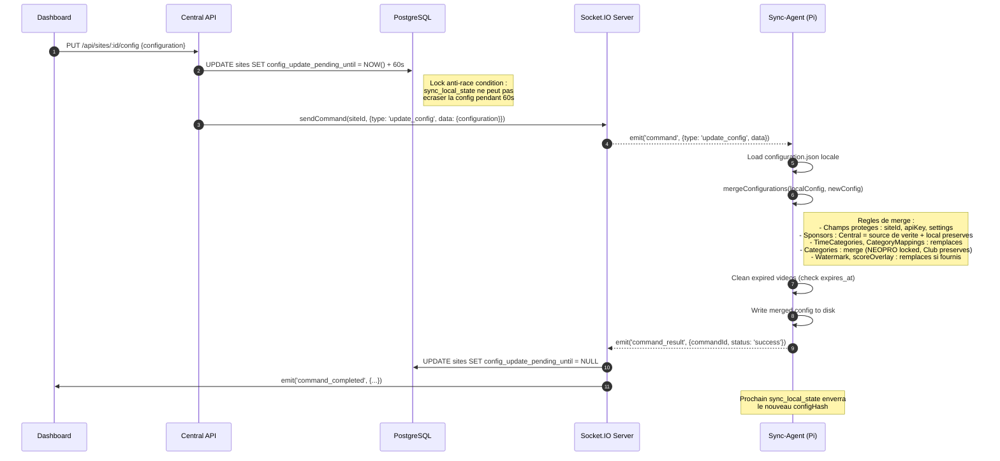
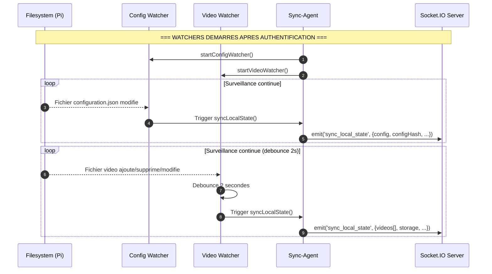

# Diagramme de Sequence : Sync Raspberry Pi <-> Cloud

> Flux complet : Connexion -> Heartbeat -> Sync Etat -> Commandes -> Resilience

## Connexion et Authentification

## Echange Initial d'Etat

## Heartbeat (toutes les 30 secondes)

```mermaid
sequenceDiagram
    autonumber
    participant Pi as Sync-Agent (Pi)
    participant WS as Socket.IO Server
    participant DB as PostgreSQL
    participant Alert as Alerting Service
    participant Dash as Dashboard

    Note over Pi,Dash: === BOUCLE HEARTBEAT (30s) ===

    loop Toutes les 30 secondes
        Pi->>Pi: metricsCollector.collectAll()
        Note right of Pi: CPU %, RAM %, Temp C,<br/>Disk %, Uptime, IP, Version

        Pi->>WS: emit('heartbeat', {siteId, timestamp, metrics, softwareVersion})

        WS->>DB: INSERT INTO metrics (site_id, cpu_usage, memory_usage,<br/>temperature, disk_usage, uptime, recorded_at)
        WS->>DB: UPDATE sites SET last_seen_at=NOW(), status='online',<br/>local_ip=$2, software_version=$3

        WS->>Alert: checkAlerts(siteId, metrics)
        alt Temperature > 75C ou Disk > 90% ou RAM > 90%
            Alert->>DB: INSERT INTO alerts (site_id, type, severity, message)
            Alert->>Alert: Slack notification (si critique)
        end

        WS->>WS: lastPongReceived.set(siteId, Date.now())
    end

    Note over Pi,Dash: === PING/PONG HEALTH CHECK ===

    loop Toutes les 30 secondes (serveur)
        WS->>Pi: emit('ping_check', {timestamp})
        Pi-->>WS: emit('pong_check')
        WS->>WS: lastPongReceived.set(siteId, Date.now())
    end

    Note over WS: Socket.IO natif: pingInterval=25s, pingTimeout=60s

    loop Toutes les 30 secondes (health check)
        WS->>WS: Pour chaque site connecte :<br/>now - lastPong > 60s ?
        alt Connexion zombie detectee
            WS->>WS: socket.disconnect(true)
            WS->>DB: UPDATE sites SET status='offline'
            WS->>Dash: emit('site_disconnected', {siteId})
        end
    end

    loop Toutes les 60 secondes (DB sync)
        WS->>DB: SELECT id FROM sites WHERE status='online'<br/>AND last_seen_at < NOW() - 90s
        WS->>DB: UPDATE sites SET status='offline'<br/>WHERE id IN (stale sites not in connectedSites map)
    end
```

## Commandes Distantes (Central -> Pi)

## Mise a Jour de Configuration (avec merge)

## Surveillance Locale (Watchers)

## Resume des Evenements WebSocket

| Evenement                     | Direction             | Frequence           | Donnees                          |
| ----------------------------- | --------------------- | ------------------- | -------------------------------- |
| `authenticate`                | Pi -> Central         | 1x (connexion)      | siteId, apiKey                   |
| `authenticated`               | Central -> Pi         | 1x (reponse)        | message, siteId                  |
| `auth_error`                  | Central -> Pi         | Si echec            | message                          |
| `sync_local_state`            | Pi -> Central         | Connexion + changes | config, videos, storage, network |
| `heartbeat`                   | Pi -> Central         | 30s                 | metrics, timestamp, version      |
| `license_status`              | Central -> Pi         | Apres sync          | status, reason, days_left        |
| `command`                     | Central -> Pi         | A la demande        | id, type, data                   |
| `command_result`              | Pi -> Central         | Apres execution     | commandId, status, result/error  |
| `deploy_progress`             | Pi -> Central         | Pendant deploy      | deploymentId, progress 0-100     |
| `ping_check` / `pong_check`   | Bidirectionnel        | 30s                 | timestamp                        |
| `score-update`, `score-reset` | Central -> Pi (relay) | Live events         | donnees specifiques              |
| `network_alert`               | Pi -> Central         | Sur probleme        | type, severity, issues           |
