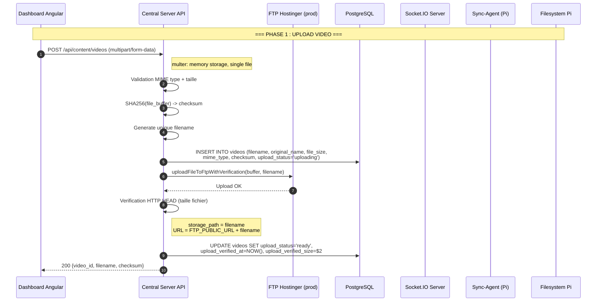
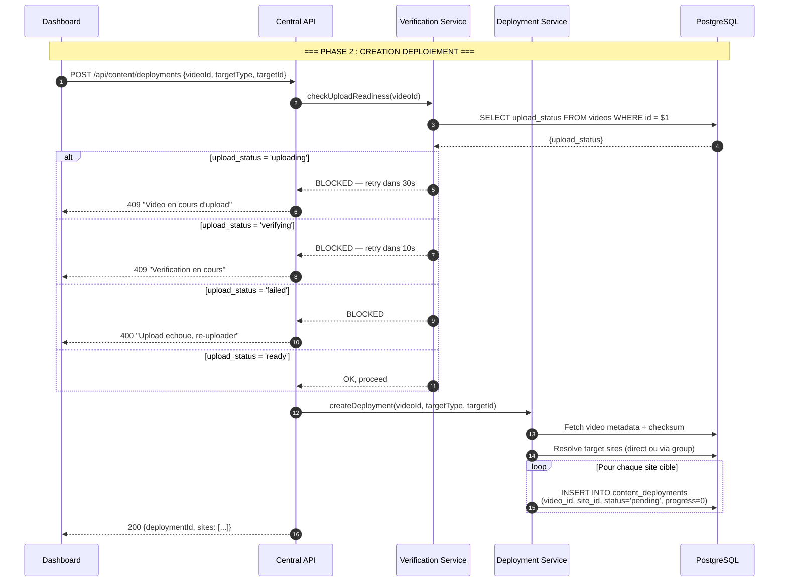
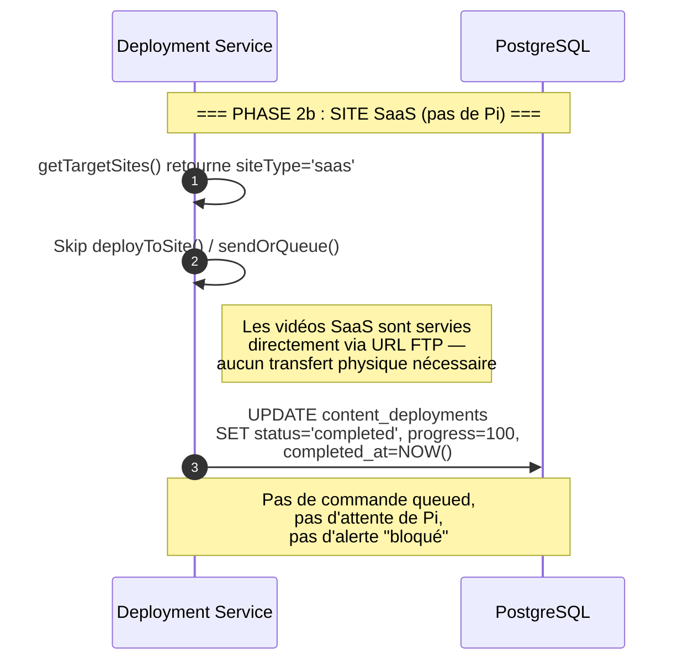
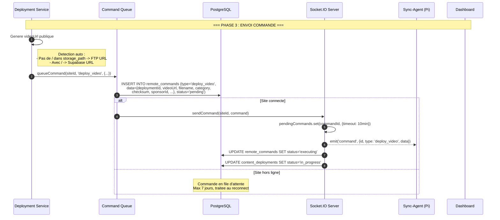
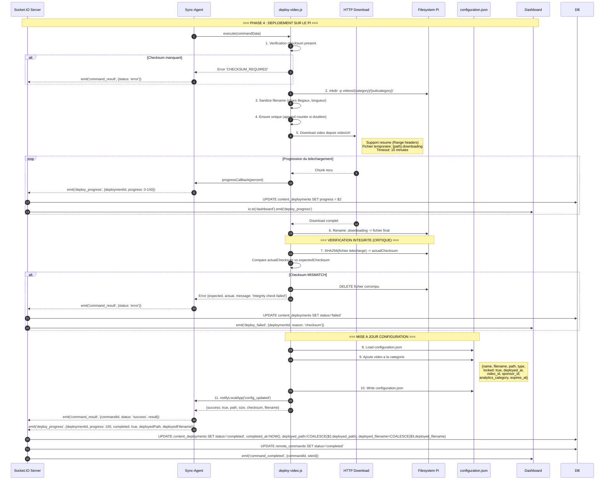
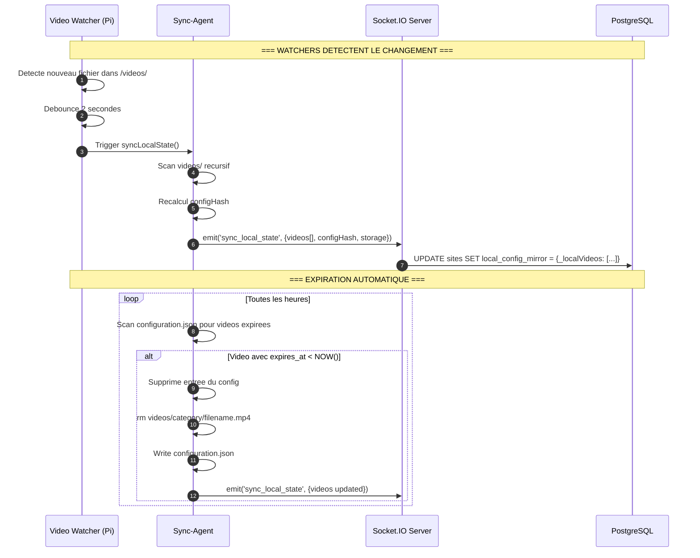

# Diagramme de Sequence : Deploiement Video

> Flux complet : Upload Dashboard -> FTP/Supabase -> Deploy -> Pi -> Checksum

## Flux Complet End-to-End



## Phase 2 : Creation du Deploiement



## Phase 2b : Short-circuit SaaS (v3.127.5+)



## Phase 3 : Envoi vers le Raspberry Pi



## Phase 4 : Execution sur le Raspberry Pi



## Surveillance Post-Deploiement



## Chemins de Stockage

```
UPLOAD (Central)                    DOWNLOAD (Pi)
================                    ==============

Dashboard                           Sync-Agent
    |                                   |
    v                                   v
Central API                         HTTP GET videoUrl
    |                                   |
    +--> FTP Hostinger (PROD)           +--> /home/pi/neopro/
         path: filename.mp4                  videos/
         URL: https://kalonpartners            {category}/
              .bzh/neopro-video/                 {subcategory}/
              filename.mp4                         filename.mp4
                                            |
                                            +--> configuration.json
                                                 (video ajoutee)
```

## Resume Securite et Integrite

| Etape                    | Mecanisme       | Detail                                         |
| ------------------------ | --------------- | ---------------------------------------------- |
| Upload                   | SHA256          | Calcule sur le buffer avant stockage           |
| Stockage DB              | checksum column | SHA256 hex stocke dans `videos.checksum`       |
| Verification post-upload | HTTP HEAD       | Taille fichier verifiee apres FTP upload       |
| Gate de deploiement      | upload_status   | Bloque deploy si status != 'ready'             |
| Telechargement Pi        | Range headers   | Support resume si interruption                 |
| Verification Pi          | SHA256          | Recalcul complet, comparaison avec attendu     |
| Echec integrite          | Auto-delete     | Fichier corrompu supprime automatiquement      |
| Expiration               | Cron horaire    | Videos expirees supprimees du disque et config |
