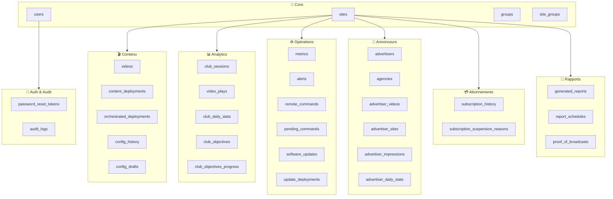
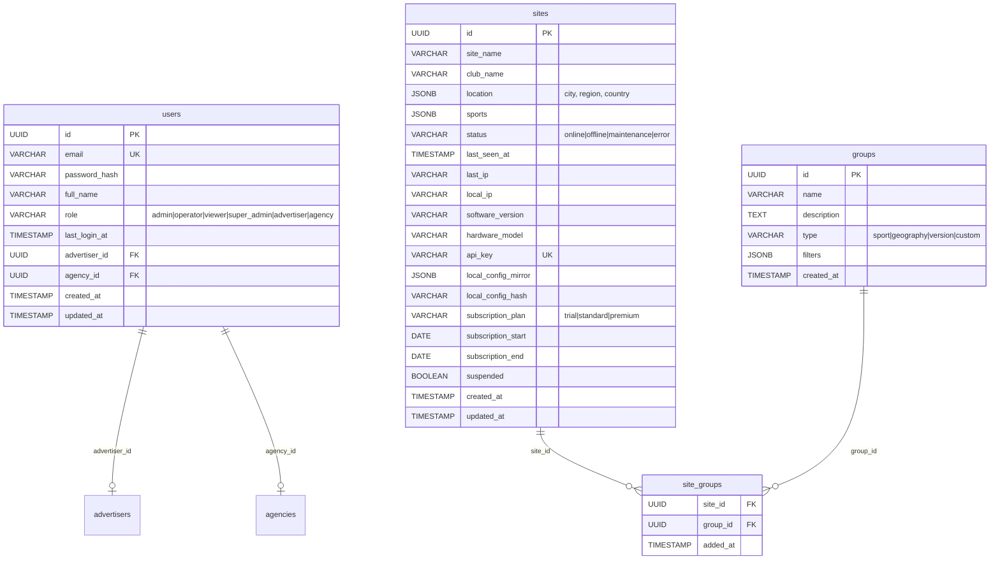
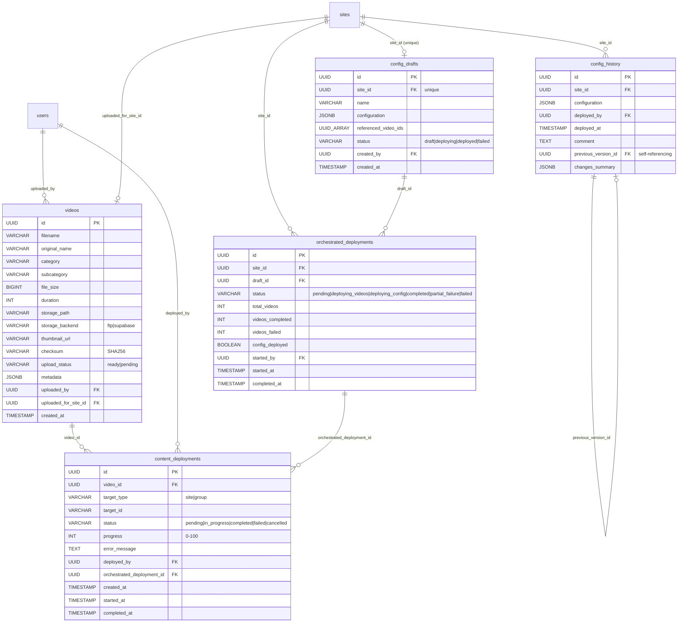
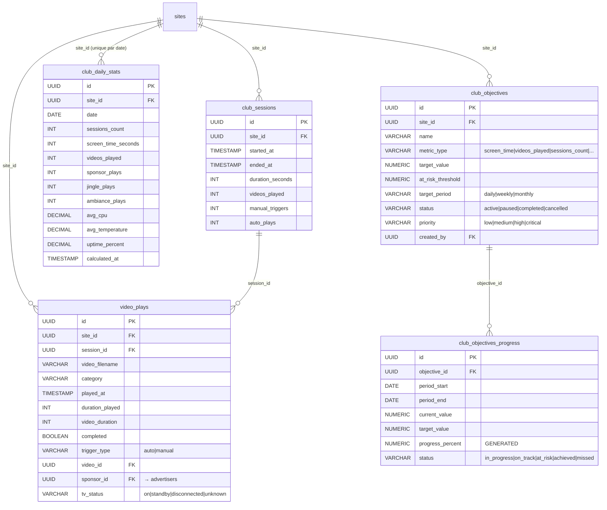
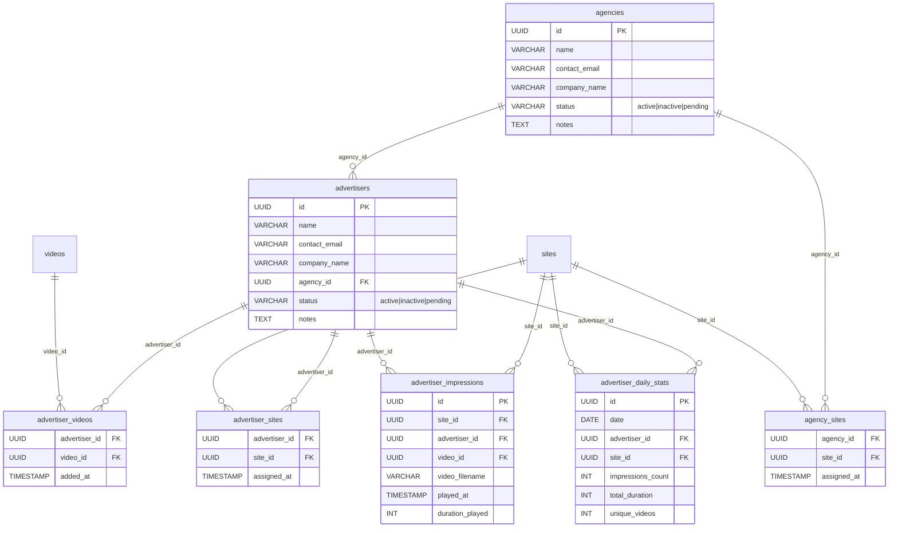
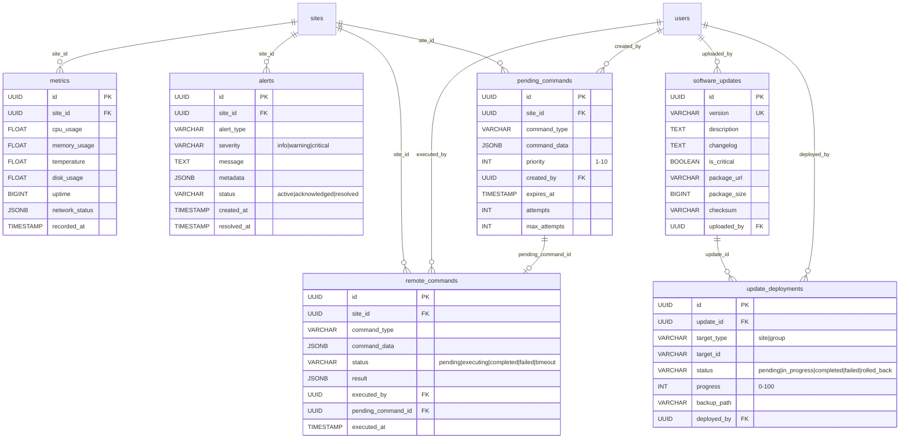
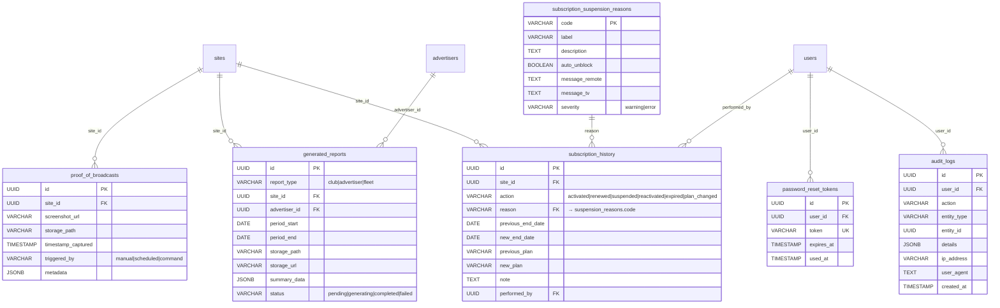

# Diagramme Entités-Relations (ERD)

> Vue complète du schéma de base de données Neopro — 30+ tables organisées par domaine métier.

## Vue d'ensemble des domaines

---

## 1. Domaine Core — Utilisateurs & Sites

---

## 2. Domaine Contenu — Vidéos & Déploiements

---

## 3. Domaine Analytics — Sessions & Lectures

---

## 4. Domaine Annonceurs — Advertisers & Agencies

---

## 5. Domaine Opérations — Métriques, Alertes, Commandes

---

## 6. Domaine Abonnements & Audit

---

## Résumé des relations clés

| Table centrale  | Relations sortantes | Description                                       |
| --------------- | ------------------- | ------------------------------------------------- |
| **sites**       | 20+ FK entrantes    | Hub principal — chaque boîtier Pi = 1 site        |
| **users**       | 10+ FK entrantes    | Tous les acteurs (admin, operator, advertiser...) |
| **videos**      | 4 FK entrantes      | Bibliothèque de contenu partagée                  |
| **advertisers** | 6 FK entrantes      | Annonceurs avec vidéos, sites, impressions        |
| **agencies**    | 3 FK entrantes      | Regroupent plusieurs annonceurs                   |

---

## Index critiques pour les performances

| Index                           | Table               | Colonnes               | Usage                       |
| ------------------------------- | ------------------- | ---------------------- | --------------------------- |
| `idx_metrics_site_time`         | metrics             | (site_id, recorded_at) | Dashboard temps réel        |
| `idx_video_plays_site`          | video_plays         | (site_id)              | Analytics par site          |
| `idx_video_plays_date`          | video_plays         | (played_at)            | Analytics par période       |
| `idx_deployments_status`        | content_deployments | (status)               | File d'attente déploiements |
| `idx_alerts_status`             | alerts              | (status)               | Alertes actives             |
| `idx_pending_commands_priority` | pending_commands    | (priority)             | Queue de commandes          |
| `idx_club_daily_stats_site`     | club_daily_stats    | (site_id, date)        | Stats journalières          |

---

_Dernière mise à jour : 10 février 2026_
