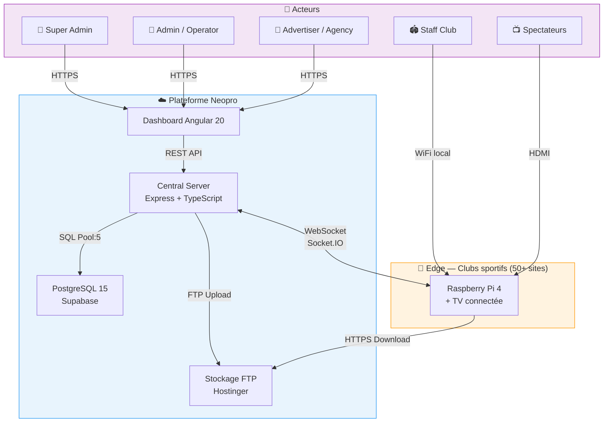
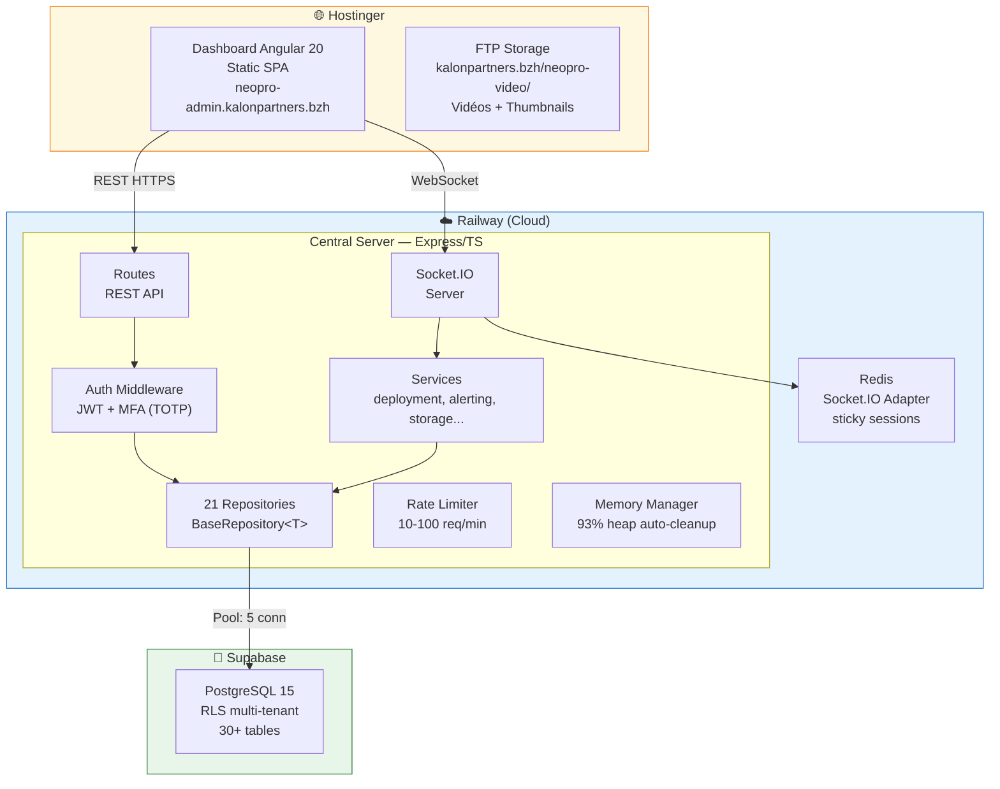
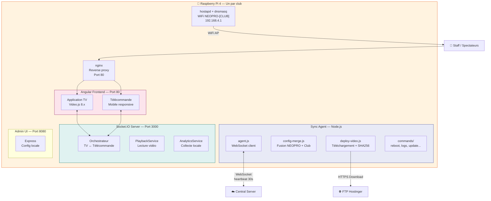
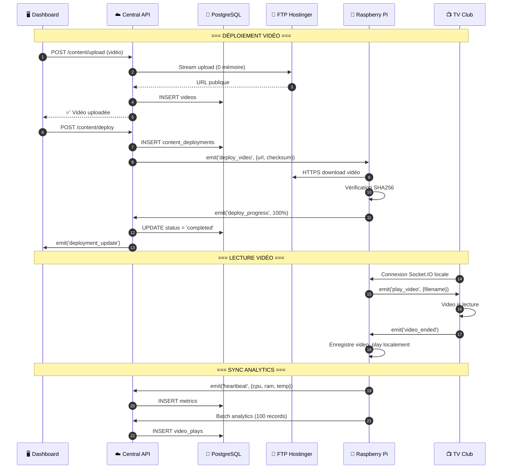
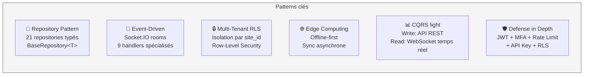

# Architecture Système — Vue C4

> Vue d'ensemble de l'architecture 3-tiers Neopro : Cloud ↔ Edge ↔ Utilisateurs.

## 1. Vue Contexte — Acteurs & Systèmes

---

## 2. Vue Conteneur — Composants Cloud

---

## 3. Vue Conteneur — Composants Edge (Raspberry Pi)

---

## 4. Flux de données — Vue séquence simplifiée

---

## 5. Patterns architecturaux

---

## 6. Capacités & Limites

| Composant           | Capacité                     | Limite actuelle            |
| ------------------- | ---------------------------- | -------------------------- |
| **Central Server**  | Multi-instance (Railway)     | 256 MB RAM / instance      |
| **PostgreSQL Pool** | 5 connexions (Railway)       | Adapté pour ~50 sites      |
| **Redis**           | Socket.IO adapter uniquement | Pas de cache général       |
| **FTP Storage**     | Illimité (Hostinger)         | Bande passante partagée    |
| **Raspberry Pi 4**  | 4 GB RAM, 32 GB SD min       | ~100 vidéos en cache local |
| **WebSocket**       | 50+ connexions simultanées   | heartbeat 30s, timeout 90s |
| **Analytics batch** | 100 records / batch          | Insertion asynchrone       |
| **Rate limiting**   | Auth: 10/15min, API: 100/min | Upload: 10/heure           |

---

_Dernière mise à jour : 10 février 2026_
