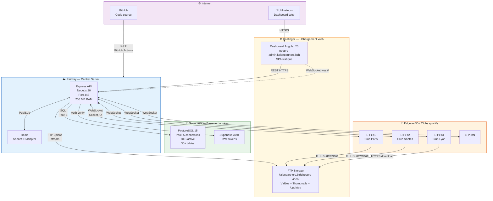
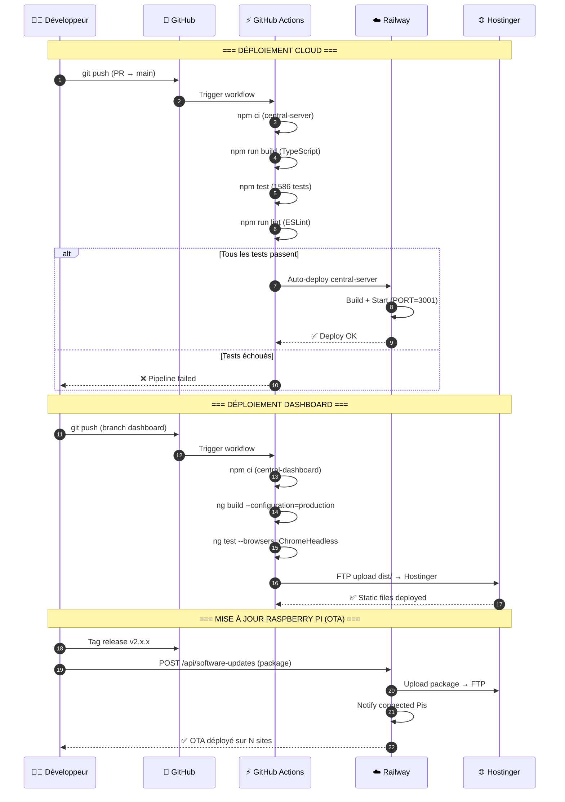
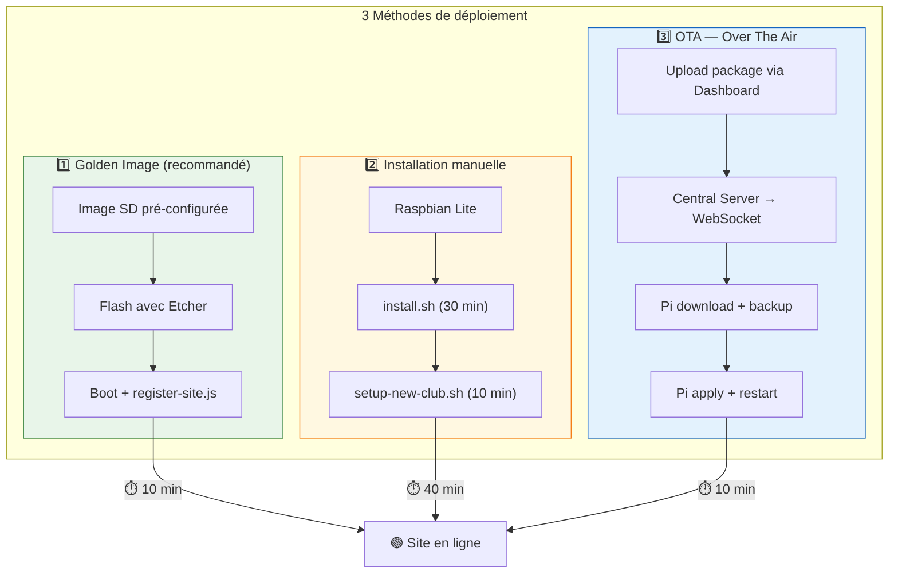
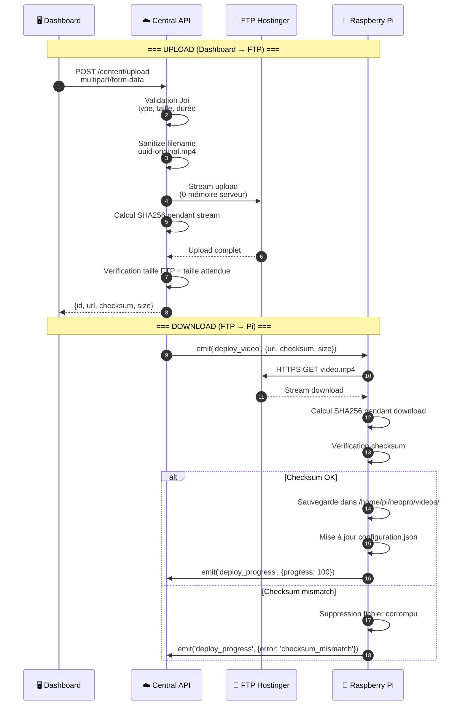
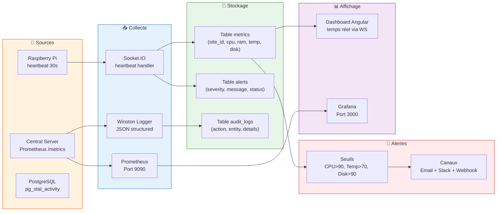

# Infrastructure & Déploiement

> Topologie des services, hébergement, et flux de déploiement Neopro.

## 1. Carte d'infrastructure

---

## 2. Pipeline CI/CD

---

## 3. Stratégies de déploiement Raspberry Pi

---

## 4. Flux de stockage vidéo

---

## 5. Monitoring & Observabilité

---

## 6. Dimensionnement actuel

| Ressource       | Service            | Configuration                      | Coût estimé       |
| --------------- | ------------------ | ---------------------------------- | ----------------- |
| **Compute**     | Railway            | 1 instance, 256 MB RAM, auto-scale | ~$5/mois          |
| **Database**    | Supabase Free      | 500 MB, 5 connexions Pool          | Gratuit           |
| **Hébergement** | Hostinger Premium  | SPA + FTP illimité                 | ~$3/mois          |
| **Redis**       | Railway addon      | Socket.IO adapter uniquement       | ~$3/mois          |
| **Edge**        | 50× Raspberry Pi 4 | 4 GB RAM, 32 GB SD                 | Hardware one-time |
| **Domain**      | kalonpartners.bzh  | DNS Hostinger                      | ~$10/an           |
| **SSL**         | Let's Encrypt      | Auto-renew                         | Gratuit           |

---

_Dernière mise à jour : 10 février 2026_
