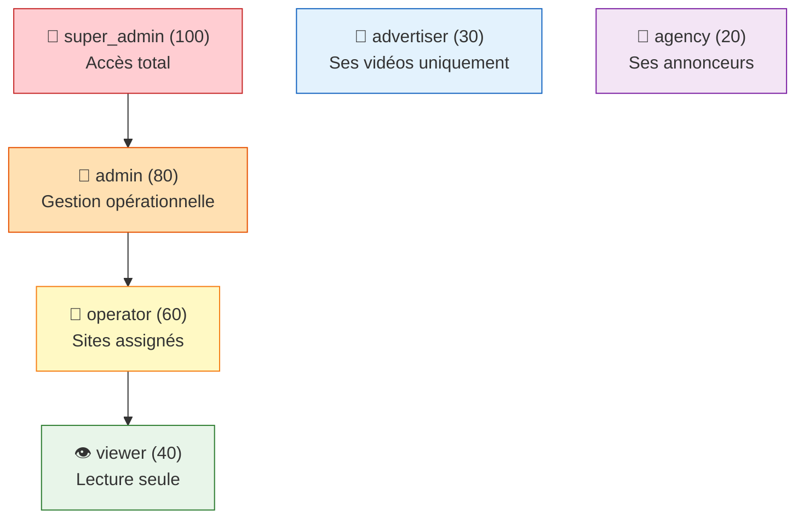
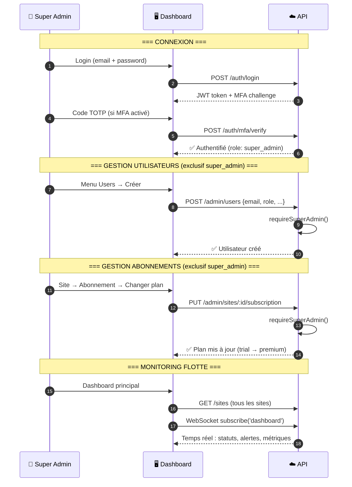
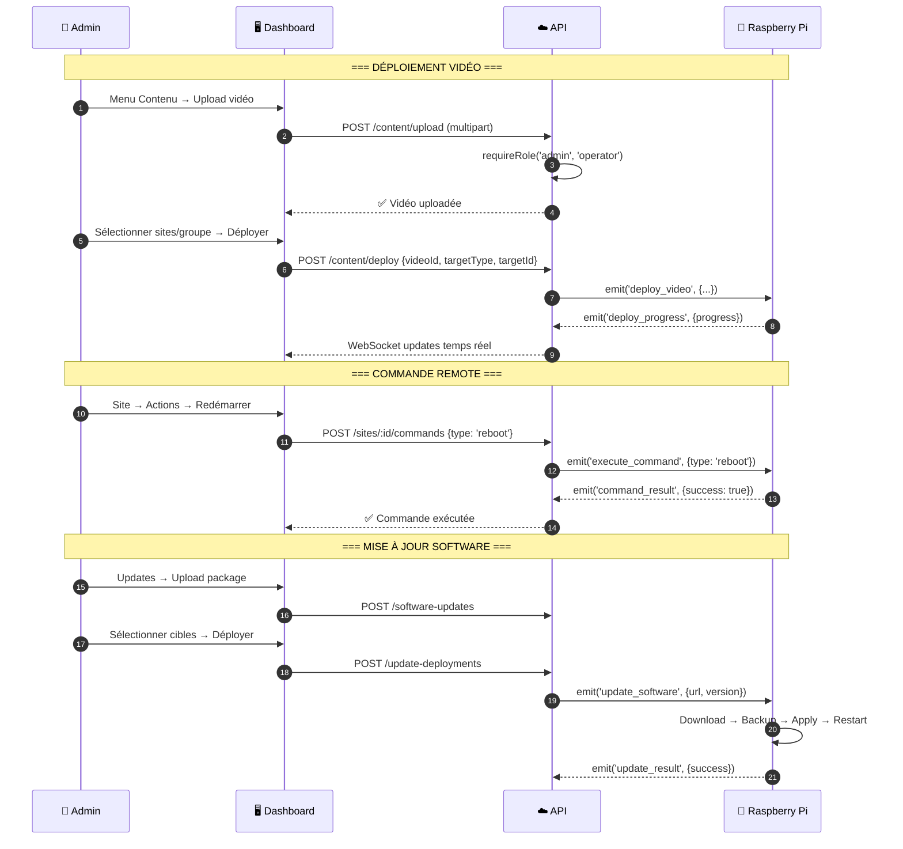
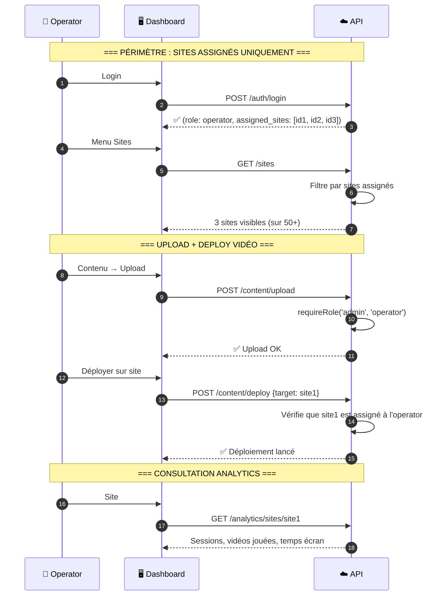
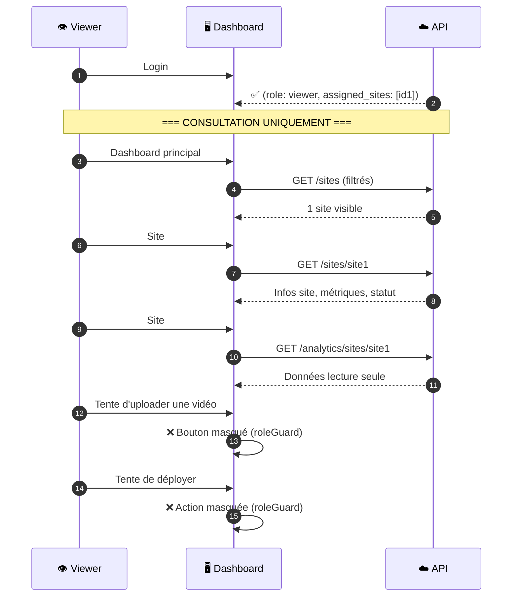
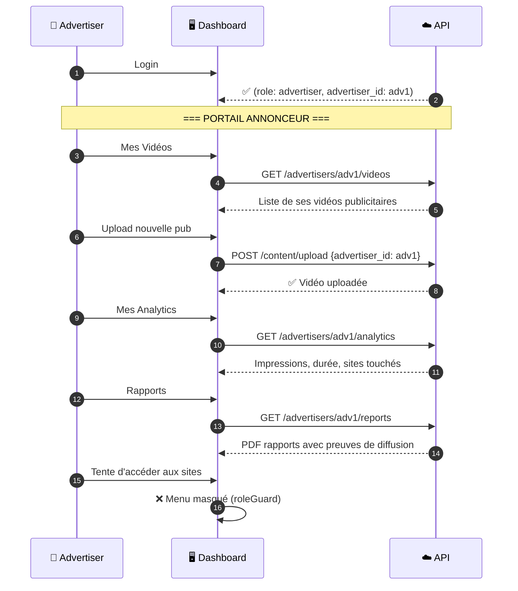
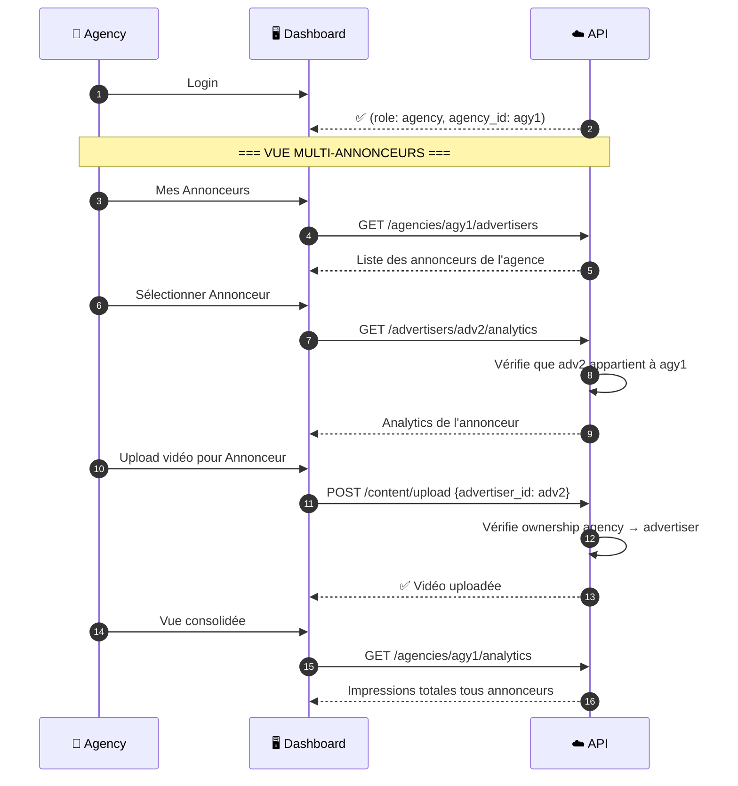
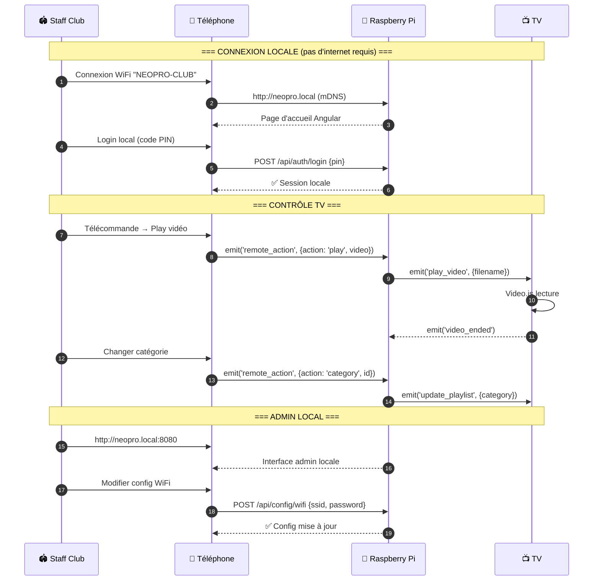
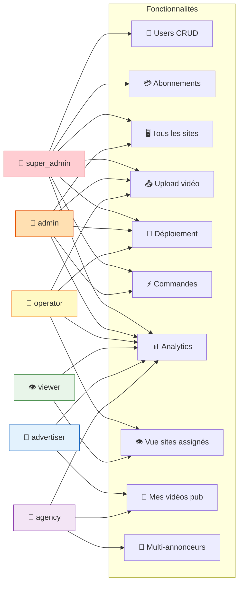

# Parcours Utilisateurs par Rôle

> User journeys pour chaque rôle Neopro — du login à l'action métier principale.

## 1. Hiérarchie des rôles

---

## 2. Super Admin — Gestion complète

---

## 3. Admin — Opérations quotidiennes

---

## 4. Operator — Gestion de ses sites assignés

---

## 5. Viewer — Lecture seule

---

## 6. Advertiser — Gestion de ses publicités

---

## 7. Agency — Gestion multi-annonceurs

---

## 8. Staff Club — Utilisation locale

---

## 9. Matrice des accès — Vue synthétique

---

_Dernière mise à jour : 10 février 2026_
