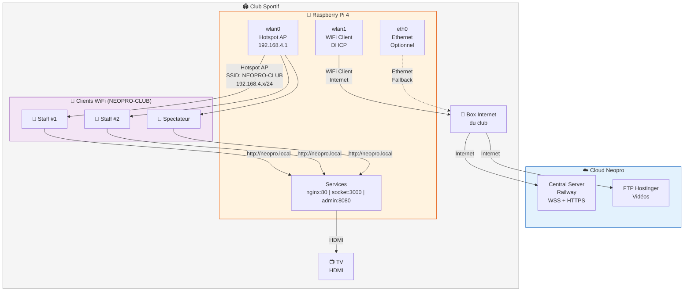
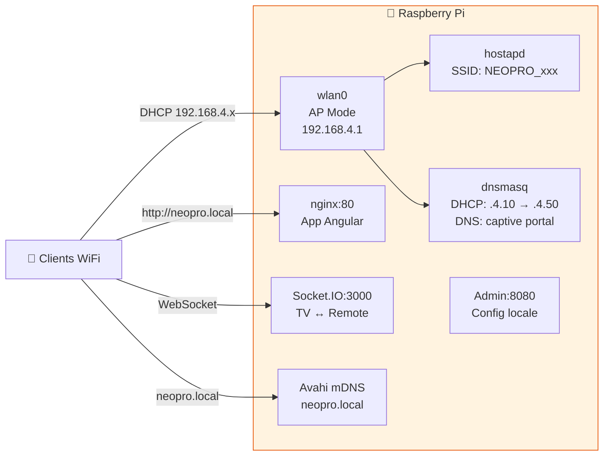
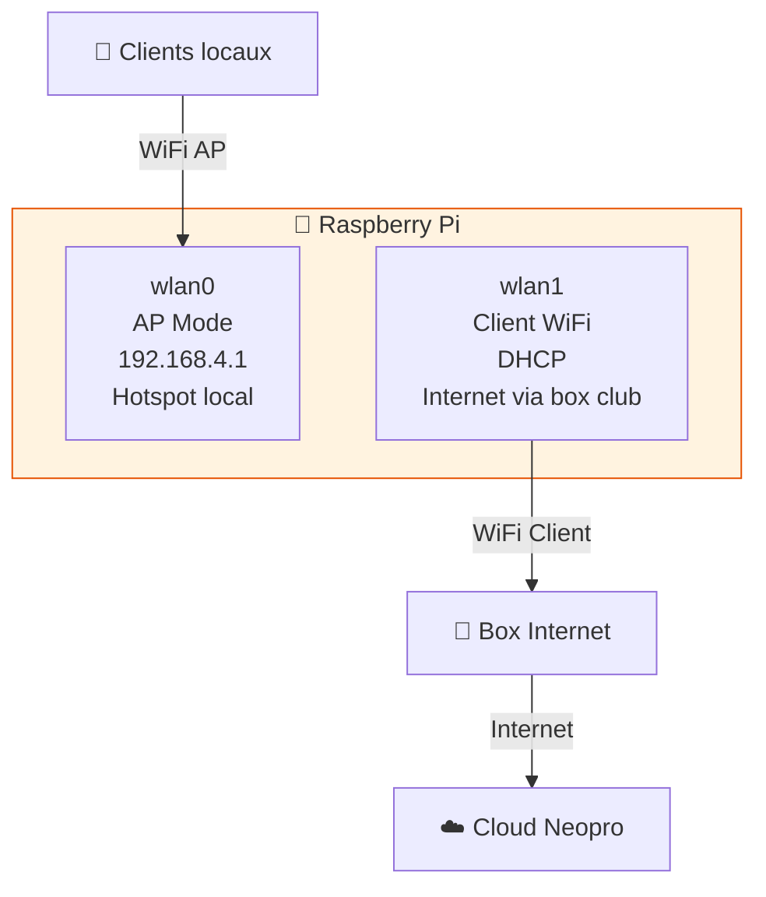
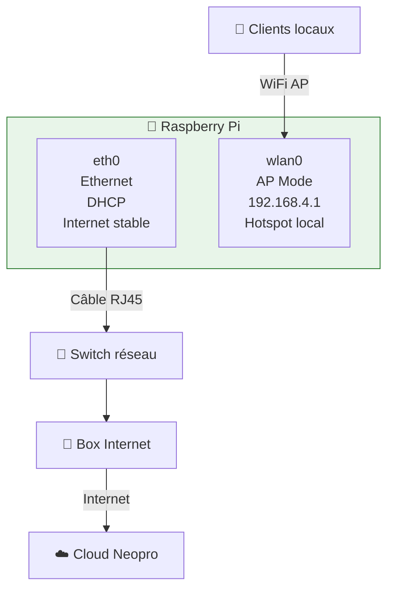
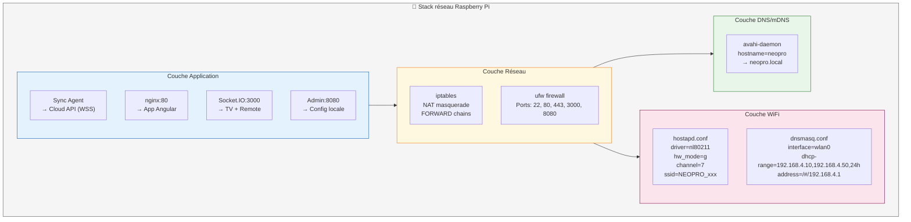
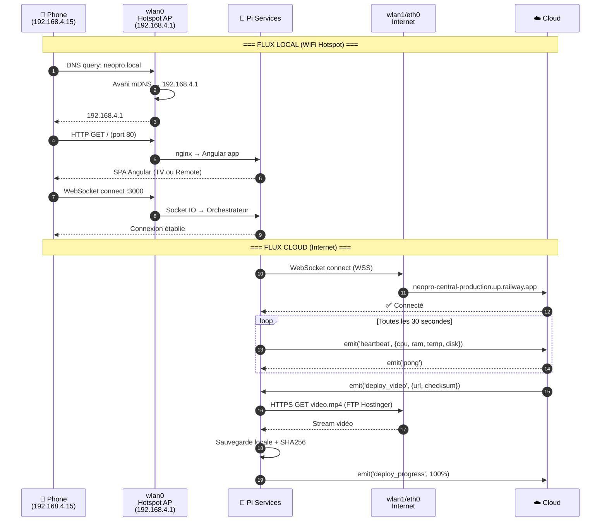
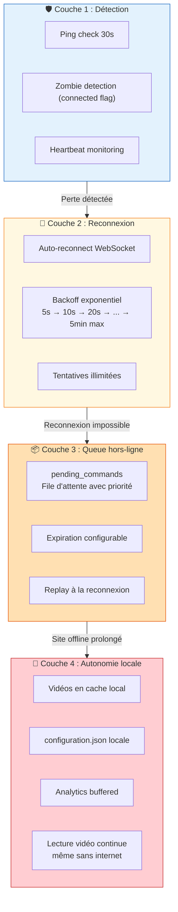
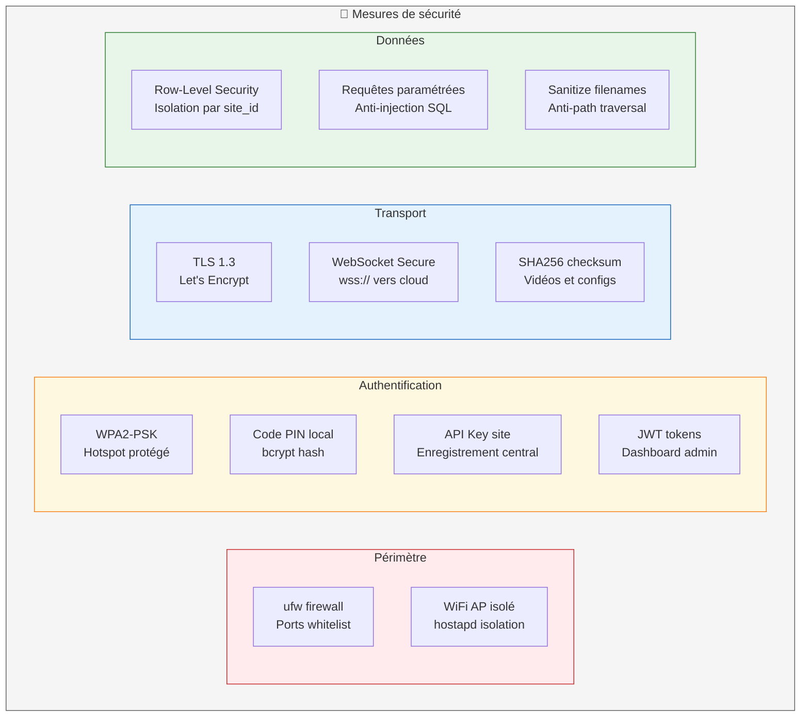

# Topologie Réseau — Raspberry Pi & Cloud

> Architecture réseau du boîtier Raspberry Pi dans un club sportif — modes connecté et autonome.

## 1. Vue d'ensemble — Réseau club

---

## 2. Modes réseau du Raspberry Pi

### Mode 1 — Hotspot Only (100% Autonome)

**Caractéristiques :**

- ❌ Pas d'accès internet
- ✅ Lecture vidéo locale
- ✅ Télécommande via WiFi
- ✅ Interface admin locale
- ❌ Pas de sync cloud, pas de métriques, pas de commandes remote

---

### Mode 2 — Hotspot + WiFi Client (Hybride)

**Caractéristiques :**

- ✅ Accès internet via wlan1
- ✅ Hotspot local via wlan0
- ✅ Sync cloud (heartbeat 30s, analytics, configs)
- ✅ Commandes remote (reboot, logs, update)
- ✅ Déploiement vidéo OTA
- ✅ Métriques temps réel sur dashboard

---

### Mode 3 — Ethernet + Hotspot (Optimal)

**Caractéristiques :**

- ✅ Connexion internet la plus stable
- ✅ Pas de conflit WiFi AP / Client
- ✅ Toutes les fonctionnalités cloud
- ⭐ Mode recommandé quand Ethernet disponible

---

## 3. Configuration réseau détaillée

---

## 4. Flux de données réseau

---

## 5. Résilience réseau — 4 couches

---

## 6. Ports & Services

| Port     | Service             | Interface       | Accès                   |
| -------- | ------------------- | --------------- | ----------------------- |
| **22**   | SSH (OpenSSH)       | Toutes          | Admin système           |
| **80**   | nginx (Angular app) | wlan0 (hotspot) | Staff club, spectateurs |
| **443**  | HTTPS sortant       | wlan1/eth0      | API Cloud + FTP         |
| **3000** | Socket.IO server    | wlan0 (hotspot) | TV + Télécommande       |
| **8080** | Admin Express       | wlan0 (hotspot) | Configuration locale    |
| **5353** | Avahi mDNS          | wlan0 (hotspot) | Résolution neopro.local |

---

## 7. Sécurité réseau

---

_Dernière mise à jour : 10 février 2026_
